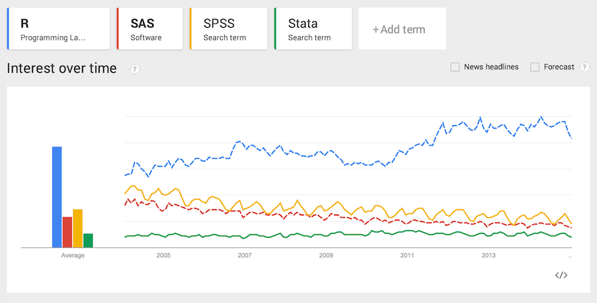

# O czym jest ten odcinek

Jest wiele powodów, dla których warto poznać język R do analizy danych.

W tym odcinku pokażemy dlaczego warto poznać R, co można w tym języku zrobić oraz powiemy jak się tego języka nauczyć. 
Powiemy też jakie umiejętności są potrzebne by efektywnie pracować z danymi w tym czy innym narzędziu oraz powiemy jak te umiejętności nabyć.

Czy ten język i ten kurs jest dla Ciebie?

Być może jesteś zaawansowanym w boju badaczem danych z doskonałą znajomością SPSS / SAS / Statistica czy Stata.

Być może jesteś analitykiem biznesowym z niezłą znajomością Excela lub Tableau.

Być może Twoje dotychczasowe doświadczenia to programowanie w językach takich jak Python, Java czy C++.

Być może masz za sobą pierwsze przymiarki do R czy to na zajęciach czy w ramach dokształcania się.

A może jeszcze nie trafiłeś na rynek pracy i z czysto poznawczej ciekawości zajrzałeś na stronę tego kursu.

R jest dla Ciebie. Tak czy inaczej aby analizować dane potrzebujesz dobrego narzędzia i umiejętności pracy z danymi. 

Ten odcinek ma na celu zachęcenie Cię do dokładniejszego poznania języka R.

---

# Dlaczego R?

*R jest dojrzałym językiem programowania zaprojektowanym z myślą o analizie danych oraz wizualizacji danych dostępnym bezpłatnie na otwartej licencji GPL.*

Przyjrzyjmy się temu zdaniu dokładniej.

*R jest językiem programowania.* Oznacza to, że nie jest ograniczony do kilku algorytmów, które przewidzieli twórcy, ale każdy może napisać w nim własny algorytm Co więcej wiele osób korzysta z tej opcji i tworzy nowe algorytmy które inni użytkownicy R mogą wykorzystywać. Dzięki temu liczba algorytmów i funkcji dostępnych w R bardzo szybko się zwiększa.

*Jest dojrzałym jezykiem.* Jest rozwijany od ponad 21 lat, co oznacza, dzięki czemu zdążył nabrać masy krytycznej. Pewne usterki projektowe wczesnych wersji R (ograniczenie do 4GB RAM) zostały dostrzeżone i wyeliminowane. Dziś jest to narzędzie rozwijane i przez dużą grupę statystyków i inżynierów oprogramowania, co jest gwarancją stabilnego rozwoju.

*Zaprojektowanym z myślą o analizie danych.* Dojrzałych języków programowania jest wiele, ale niewiele z nich nadaje się do interaktywnej pracy z danymi. W języku R połączono wybrane cechy języków funkcyjnych oraz obiektowych, nacisk położono na pracę interaktywną z danymi. Dodatkowe biblioteki wspierają łatwe tworzenie raportów z wynikami. Dzięki tym cechom R jest stworzony do analizy danych.

*Wizualizacji danych.* W języku R można wykonać grafiki statystyczne o publikacyjnej jakości. Oznacza to, że bez dodatkowych narzędzi można stworzyć profesjonalny wykres. Co więcej, jest wiele pakietów, dzięki czemu tworzenie takich wykresów jest proste. Omówimy je w drugim sezonie tego kursu.

*Dostępny bezpłatnie na otwartej licencji GPL.* Program R jest dostępny bezpłatnie do każdych zastosowań. Czy to na uczelni, czy w działalności komercyjnej, możemy go wykorzystywać bez żadnych opłat. Co więcej, jest otwarty na otwartej licencji, co oznacza, że każdy ma dostęp do źródeł, każdy element można zobaczyć jak funkcjonuje, można sprawdzić czy nie zawiera błędów i ewentualnie usprawnić. 

---

# Dlaczego R?

Początkowo R zyskał popularność na uczelniach. Był i jest wykorzystywany do nauczania analizy danych jak i do prowadzenia badań naukowych. Można śmiało powiedzieć, że obecnie R jest głównym narzędziem używanym w dydaktyce na dobrych uczelniach. Zdominował prowadzenie badań naukowych w wielu dziedzinach, takich jak bioinformatyka czy genetyka. Jest bardzo popularny w zastosowaniach medycznych, finansowych i wielu innych.

Od kilkunastu lat rośnie popularność R w przemyśle. Zarówno dlatego, że jest to bezpłatne narzędzie, również dlatego, że jest w nim dostępnych bardzo wiele funkcji ale również dlatego, że coraz więcej analityków zostało wykształconych na programie R oraz ten program zna. Rośnie liczba ofert pracy dla osób znających program R.

Małe firmy często wybierają R by ciąć koszty, ale R jest też używany przez gigantów. Zarówno przez firmy analityczne jak (jako silnik analityczny) jak i przez media, jest używany przez Googla, Facebooka, NY Times, New Scientist i wiele innych firm.

R doskonale też integruje się z innymi rozwiązaniami informatycznymi, takimi jak Python, Java, C, C++, Hadoop, bazy danych. 

---

# Dlaczego R?

Zgodnie z wynikami Google Trends, zainteresowanie R rośnie (wzrosło dwukrotnie w czasie ostatnich dziesięciu lat), podczas gdy zainteresowanie innymi pakietami do analizy danych, takimi jak SPSS, SAS czy Stata maleje. 

---

# Czy warto uczyć się programować, czy nie lepiej wybrać klikane?

Praca w R wymaga umiejętności programowania. Dla osób przyzwyczajonych do klikanych narzędzi oznacza to trudne początku. Gdy muszą porzucić stare i złe nawyki oraz nauczyć się składni i nowych nazw funkcji. To jest trudne i wymaga czasu, ale warto ponieważ:

Jeżeli raz opracujemy skrypt wykonujący pewną pracę, możemy następnie ją łatwo powtórzyć. Wystarczy cały skrypt skopiować. Dzięki temu w miarę nabywania doświadczenia zwiększamy nasz potencjał.

Mamy zapisane komendy, które użyliśmy do analiz. Jeżeli po roku chcemy je odtworzyć jest to prostsze niż w przypadku klikanych narzędzi.

Jeżeli otrzymujemy dziwne wyniki, to całą ścieżkę analizy, która prowadzi do tych wyników możemy przeanalizować. Jest ona zapisana krok po kroku jako skrypt. Nie musimy jej przywoływać z pamięci.

---

# A co o tym myślą inni?

Moje przekonanie, że R jest doskonałym narzędziem do analizy danych utrzymuje się od kilkunastu lat. Osiem lat temu napisałem ,,Przewodnik po pakiecie R'', dostępny na stronie http://biecek.pl/R, który do dzisiaj doczekał się trzeciego wydania. Nie jestem z pewnością bezstronnym obserwatorem.

Dlatego warto przyjrzeć się temu co o R mówią analitycy z firm, szpitali czy uczelni. 

Kilka takich cytatów umieszczam poniżej.

*One of the greatest advantages of R: getting your work done better and in less time.*

  Frank Harrell, Biostatistics, Vanderbilt University

*R has really become the second language for people coming out of grad school now, and there’s an amazing amount of code being written for it,* 

  Max Kuhn, associate director of nonclinical statistics at Pfizer.

*R is really important to the point that it’s hard to overvalue it. It allows statisticians to do very intricate and complicated analyses without knowing the blood and guts of computing systems.* 

  Google research scientist, quoted in the New York Times

*The great beauty of R is that you can modify it to do all sorts of things, and you have a lot of prepackaged stuff that’s already available, so you’re standing on the shoulders of giants.* 

  Google chief economist, quoted in the New York Times

