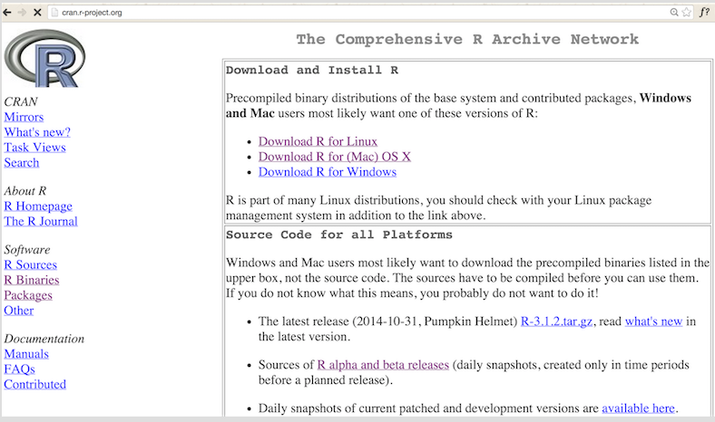
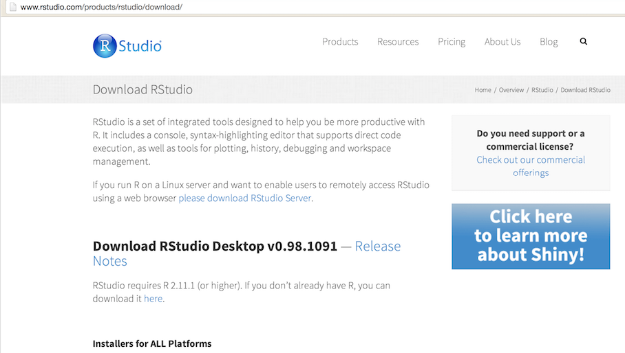
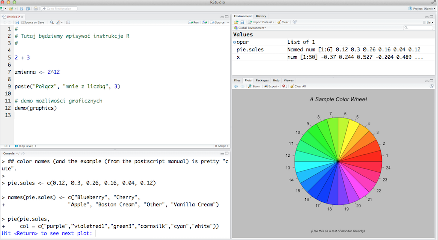

# O czym jest ten odcinek

Aby wygodnie pracować z programem R potrzebujemy zainstalować silnik obliczeniowy R, wygodny edytor dzięki któremu praca z R będzie bardziej wygodna, taki jak RStudio, oraz dodatkowe biblioteki z danymi i funkcjami. Wszystkie te elementy można pobrać z Internetu bezpłatnie.

W tym odcinku pokażemy:

- Jak zainstalować program R?
- Jak zainstalować program RStudio?
- Jak zainstalować dodatkowe biblioteki / pakiety do programy R?

Do instalacji tych elementów potrzebny jest dostęp do Internetu.

---

# Instalacja R

Najnowszą wersję programu R (na dzień dzisiejszy jest to wersja 3.1.2) można pobrać ze strony
http://cran.r-project.org/.
Nie musimy pamiętać tego adresu, wystarczy wpisać w google ‘R GNU’ a powyższy adres będzie pierwszym linkiem.

Na stronie w zakładce *Download* znaleźć można źródła do pobrania oraz program skompilowany dla popularnych systemów operacyjnych. Instalacja sprowadza się do klikania *dalej, dalej*. 




---

# Instalacja R

Program R można bez problemu zainstalować i używać na systemach operacyjnych Windows, OSX, większości dystrybucji Linuxa.

Program R możemy zainstalować również na przenośnym nośniku USB, dzięki czemu, będziemy mogli uruchamiać to środowisko na różnych komputerach.

Nie potrzebujemy specjalnych uprawnień administracyjnych aby zainstalować program R. Jeżeli korzystamy z komputera do którego nie mamy pełni dostępu, można zainstalować program R w swoim lokalnym katalogu. 

Program R jest całkowicie bezpłatny do wszelkich zastosowań, edukacyjnych, przemysłowych, biznesowych, komercyjnych i hobbystycznych. Program R jest dostępny na licencji GPL 2.

Co roku oddawana jest do użycia nowa wersja R, tak więc w trakcie kursu może się okazać, że wersja 3.2 stanie się oficjalną (teraz jest tzw. wersją deweloperską). Zdecydowana większość funkcji działa identycznie pomiędzy wersjami, więc nie musimy obawiać się, że coś nie działa, jeżeli zainstalowaną mamy starszą wersję R. Wersja 3.1.2 lub nowsza wystarczy aby zrealizować ten kurs.

Praca z programem R jest interaktywna, co oznacza, że wpisując polecenia do konsoli R otrzymujemy natychmiast wyniki wykonanych poleceń.

---

# Instalacja RStudio Desktop

Najnowszą wersję RStudio Desktop (na dzień dzisiejszy jest to wersja 0.98) można pobrać ze strony
http://www.rstudio.com/products/rstudio/download/.

Nie musimy pamiętać tego adresu, wystarczy wpisać w google ‘R Studio download’ a powyższy adres będzie pierwszym linkiem.

RStudio jest komercyjnym produktem rozwijanym przez firmę RStudio. Ten program jest dostępny bezpłatnie do większości zastosowań na licencji AGPL 3. Odpłatnie, można również korzystać z tego programu na licencjach komercyjnych.



---

# Instalacja RStudio Desktop

Instalacja sprawdza się do klikania *dalej, dalej*. Po zainstalowaniu należy uruchomić program RStudio.

* Przy domyślnych ustawieniach, w programie RStudio wyświetlane są cztery panele. Lewy górny róg to miejsce w którym pisze się instrukcje. Ten instrukcje można zaznaczyć i wysłać do wykonania poleceniem CTRL+Enter. 
* Lewy dolny panel to konsola programu R, tutaj wyświetlane są instrukcje wprowadzone do R oraz ich wyniki.
* Prawy dolny panel przedstawia wykresy wyprodukowane przez instrukcje w R. W tym panelu jest też wyświetlana pomoc dla funkcji.
* Prawy górny panel pokazuje jakie obiekty znajdują się obecnie w pamięci R, oraz jak są one duże.  Klikając na wybrane obiekty możemy podejrzeć ich zawartość. Każdy wiersz to obiekt. Ale po pierwszym uruchomieniu to okno będzie puste, nic jeszcze nie wczytaliśmy do pamięci.





---

# Instalacja dodatkowych pakietów

Program R po instalacji posiada setki przydatnych funkcji.

Ale olbrzymia siła kryje się w dodatkowych pakietach, które można w każdej chwili dodać. 
Dodatkowych pakietów, oficjalnie dostępnych w repozytorium pakietów CRAN jest na dziś dzień ponad 6000. 
Są to pakiety specjalistyczne, dla bioinformatyków, botaników, historyków, lingwistów, osób zainteresowanych obliczeniami rozproszonymi i dla wielu innych specjalistycznych zastosowań.

My, na potrzeby tego kursu, będziemy korzystać z pakietu `SmarterPoland`, w którym umieszczone są dodatkowe zbiory danych na których będziemy pracować. Instalacja tego pakietu automatycznie wywoła również instalacje wszystkich pakietów zależnych, dzięki czemu jedną linijką możemy zainstalować wszystko, co nam będzie potrzebne w tym kursie.

Instalacje nowego pakietu wykonuje się funkcją `install.packages("nazwa_pakietu")`, którą należy uruchomić w linii poleceń programu R.
Tak więc po instalacji R i RStudio, powinniśmy uruchomić program RStudio. Następnie w konsoli (oknie z nazwą `Console`) wpisać polecenie i zakończyć je klawiszem ENTER.

```{r, eval=FALSE}
install.packages("SmarterPoland")
```

Pobierze i zainstaluje ono z Internetu wszelkie niezbędne pakiety i zbiory danych z których będziemy korzystać w tym kursie.

---

# Gotowi do pracy

Zainstalowaliśmy program R, RStudio i pakiet SmarterPoland?

Jeżeli tak to jesteśmy gotowi do rozpoczęcia pracy z R!

Jeżeli chcemy sprawdzić czy wszystko poprawnie się zainstalowało, to po uruchomieniu programu RStudio w okienku o tytule `Console` należy wpisać 

```{r, eval=FALSE}
demo(graphics)
```

i nacisnąć ENTER. Funkcja `demo()` wyświetla pokazowe wykresy programu R. Aby przejść do kolejnego należy w konsoli nacisnąć przycisk ENTER. Aby przerwać działanie funkcji `demo()` należy nacisnąć przycisk ESC.


