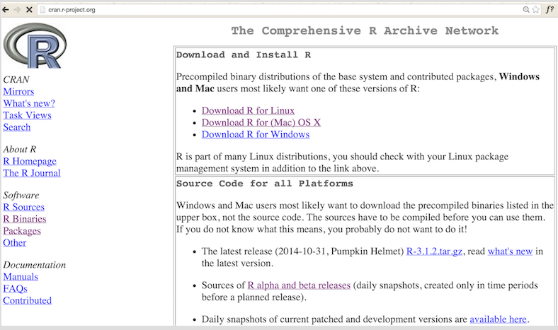

# What is the topic of this episode?

In order to work comfortably with program R you need to preinstall compute engine R, some editor facilitating work with R such as for example RStudio and additional libraries with databases and functions. All of these elements can be downloaded from the Internet free of charge. 

In this episode you will learn:

- How to install program R ?
-	How to install program RStudio?
-	How to install additional libraries /packages for R?

You need access to the Internet to install these elements. 

---

# Installation of R

The latest version of R (at present it is version 3.1.2) can be downloaded from http://cran.r-project.org/. However, you do not need to remember that address. When you type R GNU into Google the first link that will appear is the link given above.  

Go to that webpage and under the *Download* tab find subdirections for download and the program compiled for popular operating systems. The installation process comes down to clicking *next, next, next...* 



---

# Installation of R

R can be installed and used on operating systems such as Windows, OSX and most Linux distributions without any problems.

You can install R also on a portable USB flash drive and in this way use the environment on many computers. 
No administrative privileges are required for installation of R. If you are using a computer to which you do not have full access you can install R in your local folder. 

You can use R program free of charge for any purposes – educational, industrial, business, commercial, or for hobby research. R is available under GPL 2 license. 

A new version of R is released every year so it may turn out that during this course 3.2 version will become an official version (now it is the so-called development version). A vast majority of functions works identically in both versions. You do not need to be afraid that something will not work properly if you have installed an older version of R. 3.1.2 version or a newer one are definitely enough for the purposes of this course. 

R is a very interactive program. Once you enter commands into R console, you immediately see the output  of your work. 

---

# Installation of RStudio Desktop

The latest version of RStudio Desktop (at present it is version 0.98) can be downloaded from http://www.rstudio.com/products/rstudio/download/.

You do not need to remember that address. Type R Studio download into Google and the first link that will appear is the link given above.  

RStudio is a commercial product developed by RStudio company. It is available free of charge for most uses under AGPL 3 license. You can also use the program under commercial licenses for a fee. 


---

# Installation of RStudio Desktop

Installation comes down to clicking next, next. After installation start RStudio program. 

- By default, the program displays four panels. You enter commands in the left upper corner. You can select these commands and run them by pressing CTRL+Enter.
-	The left bottom panel is R’s console. It displays commands entered into R and their results. 
-	The right bottom panel presents diagrams created according to the commands in R. It also displays help for functions. 
-	The right upper panel shows the elements stored in R’s memory and gives information about their size. You can preview their content by clicking on chosen objects. Each line stands for one object. However, when you launch the program for the first time this window will be empty as there is nothing loaded into the program’s memory as yet. 


---

# Installation of the additional packages. 

Newly installed R has got countless useful functions. Yet its real strength lies in the additional packages which can be added to it at any moment. The CRAN repository currently contains over 6000 officially available additional packages. They are specialist packages designed for bioinformaticians, botanists, historians, linguists, people dealing with distributed computing and for many other specialist purposes.

For the purposes of this course we will employ package PogromcyDanych and work on additional datasets included in that package. Installation of this package automatically activates installation of all dependent packages. Using only one link we can install all the elements necessary for this course. 

New package installation is activated by the function `install.packages("name_of_the_package")` which has to be run in R’s command line. Thus, after installation of R program you should start RStudio. Then you should write the command in the window called Console and press Enter. 

```{r, eval=FALSE}
install.packages("PogromcyDanych")
library(PogromcyDanych)
```

All the necessary packages and datasets which we will use during this course will be downloaded from the Internet and installed. 

*Note:* Check whether the command `install.packages()` results in installation of the right package. Start the packages with the command `library()` every time you want to use them.


---

# Ready for work

Have you installed R program, RStudio and PogromcyDanych package? 

If the answer is `yes` you are ready to start working with R!

If you want to check if the installation was successful, enter the command...

```{r, eval=FALSE}
demo(graphics)
```

in the window entitled Console and press ENTER. The `demo()` function displays examples of diagrams created by R. Click Enter to move to the next diagram. Click ESC  to stop the `demo()` function. 

