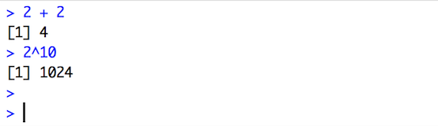
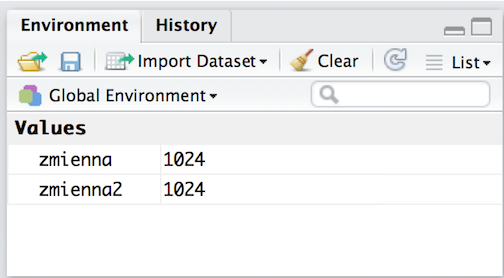

# O czym jest ten odcinek

Najtrudniejsze są początki. Aby dojść do miejsca w którym nasza praca stanie się przyjemnością i będzie efektywna, musimy nauczyć się nowego języka. A nauka, czy to języka, czy czegokolwiek innego, to seria prób, czasem niepowodzeń, kolejnych prób i tak nieustannie.

Prawdziwa nauka rozpocznie się z odcinkiem 4, a więc kolejnym. Ale zanim będziemy gotowi rozpocząć naukę musimy oswoić się z narzędziem, z którym przyjdzie nam pracować.

W tym odcinku nauczymy się:

* w jaki sposób wprowadzać instrukcje do programu R,
* w jaki sposób definiować nowe zmienne w programie R,
* jak szukać pomocy dla funkcji.

Do tego odcinka jest dołączony film wideo, ilustrujący wszystkie przedstawiane operacje.

Pracując ze slajdami, możemy w każdej chwili nacisnąć przycisk `T`, rozwinie on spis treści, dzięki czemu łatwo nam będzie przejść do pożądanego slajdu. Możemy również w każdej chwili nacisnąć przycisk `A`, aby zamienić slajdy na ciągły dokument.

---

# Jak pracować z RStudio

Zacznijmy naszą przygodę od krótkiego omówienia programu RStudio. Będziemy z nim pracować przez większość czasu, warto go bliżej poznać.

Po zainstalowaniu przy pierwszym otwarciu program RStudio będzie wyglądał w poniżej przedstawiony sposób.

Po lewej stronie jest interaktywna konsola, po prawej stronie są panele pomocnicze, 
które omówimy za kilka minut.

Konsolę otwiera zbiór informacji o wersji zainstalowanego programu R, oraz znak zachęty `>`.
Ten znak, oznacza, że program R jest gotowy do dalszej pracy i możemy wpisywać mu polecenia.


# Interaktywna praca z konsolą 

Zazwyczaj, praca z programem R przebiega w sposób interaktywny.

Jeżeli wpiszemy komendę do konsoli i zatwierdzimy ją klawiszem Enter, to R wykona polecenie i jego wynik wyświetli w konsoli.

Przećwiczmy to na kilku prostych operacjach arytmetycznych.

```{r, warning=FALSE}
2 + 2
2^10
```

Na slajdach wyniki instrukcji wprowadzanych do programu R przedstawimy poprzedziwszy je znakami `##`. Poniżej znajduje się obraz pokazujący jak wygląda konsola.



# Zmienne i ich wartości w pamięci programu RStudio

Wyniki operacji możemy przypisać do zmiennych. 
Dzięki temu, zamiast wyświetlać się na ekranie, zostaną one zapamiętane w pamięci programu R,
oraz będziemy mogli je wykorzystywać w przyszłości.

Przypisać wartość do zmiennej można z użyciem operatorów `=` lub `<-`.
Możemy je stosować zamiennie, ale stosowanie strzałki `<-` pozwoli nam zachować większą czytelność w przyszłości przy bardziej złożonych poleceniach.

```{r, warning=FALSE}
zmienna  =  2^10
zmienna2 <- 2^10 
```

Zauważmy, że w oknie po prawej górnej stronie wyświetliły się nowo zdefiniowane zmienne oraz ich wartości.

Okno to pozwala w każdej chwili sprawdzić, jakie zmienne program R aktualnie pamięta, oraz jakie są wartości tych zmiennych. 




# Funkcje

Prawdziwa siła programu R tkwi w dużym zbiorze funkcji, którymi możemy wykonywać najróżniejsze operacje.
Funkcjami możemy analizować dane, rysować dane, odsłuchiwać dane, wykonywać obliczenia, wysyłać maile, robić najróżniejsze rzeczy.

Oczywiście musimy znać nazwy funkcji, które to wszystko robią.

Przypuśćmy, że chcemy zbudować sekwencje liczb od 0 do 10 z krokiem co 0,1. 
Jak się wkrótce okaże, takie sekwencje są bardzo przydatne.

Operatorem `??` możemy wyszukać funkcje, która w opisie ma określone słowo lub zwrot.

```{r, warning=FALSE}
??"sequence"
```

Okazuje się, że jest kilka funkcji, które mają związek z sekwencjami. 
Ta która nas interesuje to `seq()`. Znajduje się ona w pakiecie `base`.
Wszystkie funkcje są pogrupowane w pakiety, a pakiet `base` zawiera funkcje do podstawowych operacji.

Aby wyświetlić opis dla zadanej funkcji wystarczy wykorzystać operator `?`.

```{r, warning=FALSE}
?seq
```

Opis każdej funkcji składa się z opisu jej argumentów, szczegółowego opisu działania funkcji oraz przykładów jej użycia.
Te przykłady można skopiować i wkleić do konsoli, aby zobaczyć co jest ich wynikiem.

# Jak wykonać sekwencję liczb?

Dla funkcji `seq()`, aby podać początek, koniec i krok dla sekwencji, należy wskazać argumenty `from`, `to` i `by`.
Możemy więc stworzyć sekwencję za pomocą następującej instrukcji.

```{r, warning=FALSE}
sekwencja <- seq(from = 0, to = 10, by = 0.1)
sekwencja
```

Zauważmy, że wartości do argumentów przypisujemy znakiem `=`. To przypisanie ma jednak inne znaczenie. Nie tworzymy nowej zmiennej o nazwie `from` ale wskazujemy, że argument funkcji ‘from’ ma mieć wartość 0.
Dla większej czytelności, do przypisania, które tworzy zmienną w pamięci R, będziemy używać operatora `<-`, a do przypisania wartości do argumentu funkcji będziemy używać operatora `=`.

Argumenty do funkcji możemy podać w dowolnej kolejności. Możemy najpierw określić argument `by` a następnie `from` i `to`.

```{r, warning=FALSE}
sekwencja <- seq(by = 0.1, from = 0, to = 10)
```

Jeżeli podajemy argumenty w domyślnej kolejności, opisanej w pliku pomocy, wtedy możemy pominąć podawanie ich nazw.
Program R z kolejności argumentów odczyta, który co opisuje.

```{r, warning=FALSE}
sekwencja <- seq(0, 10, 0.1)
```

Mamy już sekwencję liczb. Zróbmy z nią coś ciekawego.

# Wykres z morałem

Funkcją `exp()` policzmy eksponentę (*eksponenta, inaczej funkcja wykładnicza, to bardzo szybko rosnąca funkcja matematyczna*) z sekwencji, a następnie - wykorzystując funkcję `plot()` - narysujmy i sekwencję, i jej eksponentę.

Poniższy wykres, to bardzo ważny wykres, ponieważ przedstawia bardzo ważną informację dotyczącą uczenie się.
Pierwsze godziny poznawania R poświęcimy na zbudowanie bazy funkcji R. 
Będzie to okres pierwszych frustracji, gdy efekty będą relatywnie małe, a wysiłek z naszej strony będzie duży.
Ale po kilku pierwszych godzinach, jeżeli tylko wytrwamy, okaże się, że nasze możliwości rosną wykładniczo.

```{r, warning=FALSE}
poziom <- exp(sekwencja)

plot(x = sekwencja, y = poziom,
     xlab="czas spędzony z R", ylab="poziom Data Science we krwi")
```

# Zadanie

Pod koniec większości odcinków przygotowaliśmy kilka zadań do wykonania.

Pierwsze zadania są proste, kolejne coraz trudniejsze. Warto zmierzyć się z nimi, gdyż najlepszym sposobem by nauczyć się języka programowania jest ćwiczenie, ćwiczenie i jeszcze raz ćwiczenie.

Odpowiedzi do zadań umieszczone są na stronie kursu, można je w każdej chwili sprawdzić.

Zadanie do tego odcinek polega na uruchomieniu wszystkich przedstawionych instrukcji w programie RStudio i sprawdzeniu czy otrzymuje się te same wyniki.


