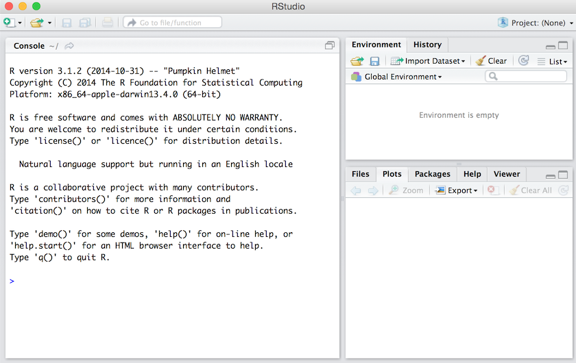
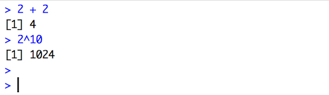
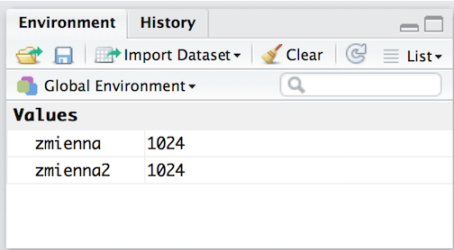

# What is the topic of this episode?

Beginnings are always the hardest. You need to learn a new language to get to the point where your job becomes pleasant and effective. Whatever you learn, a new language or something completely different, you always employ a trial-and-error method,; you have to be prepared for occasional failures and starting anew. 

You will start to learn really useful things in the next episode, that is in the episode no 4. Yet you will be ready to start the training once you get well acquainted with the tool that you will use in the curse.

In this episode you will learn:

- How to enter commands into R?
-	How to define new variables in R?
-	How to find help for functions?

This episode includes also a movie which illustrates all the described operations. 

When you work on the slide mode you can always press T to see the table of contents and easily find the slide that you need at the moment. You may also press A and switch to the continuous text mode. 

---

# How to work with RStudio

Let us start our adventure with a short description of RStudio. We will use this program during most of the course so we should get better acquainted with it. 

When you launch RStudio for the first time after installation the program will look in the following way.

On the left-hand side you will see an interactive console and on the right-hand side a secondary panel which we will discuss in more detail in a moment. 

During the first activation the console will display information about the installed version of R program and a prompt `>`. This sign means that R is ready for further work and that it can receive your commands.



# Interactive work with the console

We usually work with R in an interactive manner.  

Once you enter a command into the console and press Enter to confirm it, R will perform your command and display its result in the console’s window. 

Let us practice this on a several simple arithmetic operations. 

```{r, warning=FALSE}
2 + 2
2^10
```

On the slides signs ## will precede results of commands entered into R. The picture below presents the console. 



# Variables and their values in RStudio’s program memory

Results of operations can be assigned to the variables. Consequently, they will be stored in the program memory instead of being only displayed on the screen. It will also allow us to use them in the future. 

You may assign values to variables with the use of operators = or <-. They can be used interchangeably, yet the arrow <- is a far more distinct sign and allows for maintenance of legibility in case of more complex commands. 

```{r, warning=FALSE}
zmienna  =  2^10
zmienna2 <- 2^10 
```

Notice that newly defined variables and their values are now displayed in the upper right window. 

You can check what variables are currently stored in R’s memory and what are the values of these variables at any moment. 



# Functions 

R’s real strength lies in a wide range of functions which allow us to perform the most diverse operations. Functions allow us to analyze, view and listen to the data, perform calculations, send mails and generally do all sorts of different things. 

We obviously need to know names of the functions which will perform these operations for us.

Let us assume that we want to create a sequences of numbers from 0 to 10 with increments of 0.1. Such sequence will soon turn out to be very useful. 

Operator `??` allows us to find functions with a certain word or phrase in its name. 

```{r, warning=FALSE}
??"sequence"
```

It turns out that there are several functions which we can use to create sequences. The one we need right now is `seq()`. You may find it is the base package. All the functions are grouped into packages and the base package contains functions for basic operations.

If you want to display description of a given function, just use the operator `?`.

```{r, warning=FALSE}
?seq
```

Description of each function defines its arguments, describes its functioning in detail and provides examples of its use. You may copy these examples and paste them into the console to find out what is their outcome. 

# How to create a sequence of numbers? 

In order to determine beginning and endings of the `seq()` function you need to specify arguments called `from`, `to` and `by`. The commands presented below allow for creation of a sequence of numbers. 

```{r, warning=FALSE}
sekwencja <- seq(from = 0, to = 10, by = 0.1)
```

Notice that we assign values to arguments with the sign `=`. However, this assignment is different in nature. It does not create a new variable called from. It just specifies that the value of the argument of the `from` function is 0. In order to increase legibility we will use the operator `<-` to form assignments creating variables in R’s memory and operator `=` to assign arguments to functions. 

You can write the arguments of the function in any order you like. You may start by specifying the by argument and then move to from and to arguments. 

```{r, warning=FALSE}
sekwencja <- seq(by = 0.1, from = 0, to = 10)
```

If you write the arguments in the default order described in the help file, you may skip their names altogether. R will determine what these arguments refer to from the default order of arguments. 

```{r, warning=FALSE}
sekwencja <- seq(0, 10, 0.1)
```

We have created a sequence of numbers. Let us do something interesting with it. 

# A moral diagram

We can calculate a sequence exponent using a function `exp()`. Then we will use the `plot()` function to draw a sequence and its exponent. 

The diagram you can see below is very important because it presents very important information about the process of learning. We will devote the first hours of the training to construction of the base of R functions. You will start to feel frustrated for the first time as your effort will seem incomparably bigger than the results of your work. Yet if you make it through the first phase, you will soon discover that your skills increase exponentially.

```{r, warning=FALSE}
poziom <- exp(sekwencja)

plot(x = sekwencja, y = poziom,
     xlab="Time devoted to R", ylab="Level of Data Science in the blood")
```

# Exercise

You will find exercises at the end of most episodes.  

First exercises are quite simple but their level of difficulty will grow with time. You will really benefit from doing them because the best way to learn the programming language is by practice, practice and practice. 

You can find the key to the tasks on the course’s website. You can check your performance at any time. 

Your task at the end of this episode is to activate in R all the presented commands and to check whether your results are correct. 
