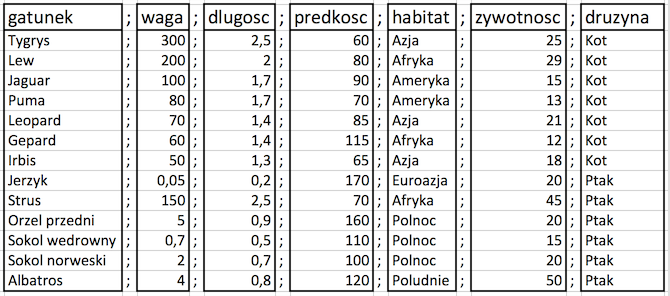
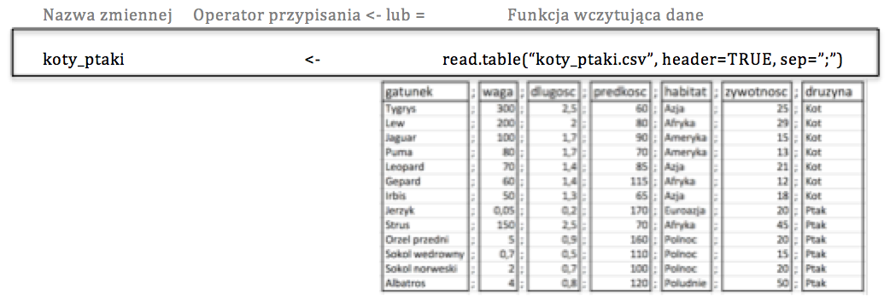
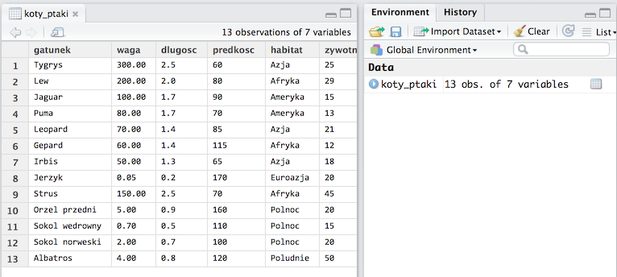
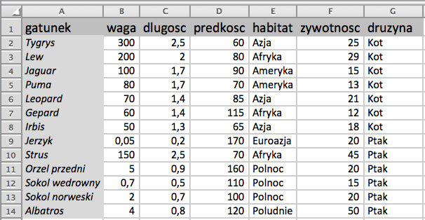
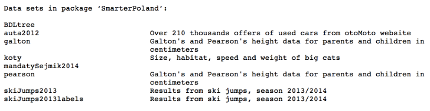

# O czym jest ten odcinek

Zanim rozpoczniemy analizę danych, musimy najpierw wczytać dane do programu R.

Dane mogą być przechowywane  w najróżniejszych formatach, takich jak baza danych, plik tekstowy, plik w formacie programu Excel (nowszym .xslx lub starszym .xls) lub plik w formacie innego programu do analizy danych (SAS, SPSS, itp). 

W tym odcinku odpowiemy na pytania:

- Jak wczytywać dane tabelaryczne z plików tekstowych?
- Jak wczytywać dane tabelaryczne z plików Excela [xls lub xlsx]?
- Jak wczytywać dane z pakietów R?
- Gdzie szukać informacji o tym jak wczytać dane z innych formatów / programów?

---

# Dane tabelaryczne w plikach tekstowych

Jednym z częstszych formatów używanych do przechowywania i wymiany danych są pliki tekstowe.

Nazwa 'plik tekstowy' bierze się stąd, że treść tego pliku możemy otworzyć w standardowym edytorze takim jak Notepad/Notatnik w Windowsie lub vim w Linuxie/OSX. Pliki tekstowe można również otwierać z użyciem programu RStudio (uwaga, duże pliki mogą się długo otwierać). Jeżeli często pracujemy z dużymi lub wieloma plikami tekstowymi to warto wyposażyć się w dobre narzędzie do pracy z nimi, np. edytor [Sublime Text](http://www.sublimetext.com/3).

Przyjrzymy się tabeli z danymi zapisanymi w pliku
http://biecek.pl/MOOC/dane/koty_ptaki.csv

Zawartość tego pliku wygląda następująco:

```{}
gatunek;waga;dlugosc;predkosc;habitat;zywotnosc;druzyna
Tygrys;300;2,5;60;Azja;25;Kot
Lew;200;2;80;Afryka;29;Kot
Jaguar;100;1,7;90;Ameryka;15;Kot
Puma;80;1,7;70;Ameryka;13;Kot
Leopard;70;1,4;85;Azja;21;Kot
Gepard;60;1,4;115;Afryka;12;Kot
Irbis;50;1,3;65;Azja;18;Kot
Jerzyk;0,05;0,2;170;Euroazja;20;Ptak
Strus;150;2,5;70;Afryka;45;Ptak
Orzel przedni;5;0,9;160;Polnoc;20;Ptak
Sokol wedrowny;0,7;0,5;110;Polnoc;15;Ptak
Sokol norweski;2;0,7;100;Polnoc;20;Ptak
Albatros;4;0,8;120;Poludnie;50;Ptak
```
---

# Dane tabelaryczne w plikach tekstowych

W jaki sposób dane tabelaryczne zapisane są w tym pliku?

Wyrównując wartości, zauważymy, że logiczna struktura tego pliku to tabela wartości rozdzielonych średnikami.



Zauważmy, że:

- pierwszy wiersz to nagłówek - zawiera nazwy kolumn rozdzielane średnikiem (gatunek;waga;dlugosc;predkosc;habitat;zywotnosc;druzyna),
- kolejne wiersze przedstawiają dane w postaci wektora wartości, które są rozdzielane znakiem `;` (średnik), 
- w pliku występują liczby, które nie są liczbami całkowitymi - separatorem dziesiętnym jest znak `,` (przecinek).

---

# Wczytywanie danych do R

Instrukcja wczytująca dane do R składa się zazwyczaj z trzech członów.

Ostatnim (po prawej stronie na poniższym schemacie) jest funkcja, która odczytuje dane, przetwarza i zamienia na postać zrozumiałą dla programu R (na poniższym schemacie ta funkcja to `read.table()`).

Aby móc na tych danych operować, należy nadać im jakąś nazwę (lewy człon na poniższym schemacie). Tę nazwę określa się zazwyczaj terminem *zmienna*.

Operację przypisania wartości odczytanych przez funkcję do zmiennej można wykonać operatorem `<-`, `=` lub `->` (patrz poprzedni odcinek).

W programie R wynik funkcji, o ile nie jest przypisany do zmiennej, jest wyświetlany na ekranie. Jeżeli chcemy wynik działania funkcji wykorzystać w przyszłości, to należy go do zmiennej przypisać.



Więcej informacji o tym jak przypisywać wartości do zmiennych przedstawionych jest w odcinku 4 *Interaktywna praca z R*.

---

# Dane tabelaryczne w plikach tekstowych

Zajmijmy się na razie prawą stroną przedstawionego schematu, a więc funkcją wczytującą dane.

Funkcja `read.table()` ma wiele argumentów (patrz kolejny slajd), ale nie musimy ich wszystkich określać. Wystarczy wskazać nazwę pliku oraz te argumenty, które powinny mieć inne wartości niż domyślne. 

W przypadku rozważanego pliku musimy określić argumenty `file = "http://biecek.pl/MOOC/dane/koty_ptaki.csv"` (ścieżka do pliku tekstowego, w tym przypadku czytamy dane bezpośrednio z internetowego adresu), `sep=";"` (separatorem kolejnych pól będzie średnik), `dec=","` (separatorem dziesiętnym jest przecinek), `header=TRUE` (pierwszy wiersz ma nagłówek). Ponieważ wynik tej funkcji nie jest do niczego przypisany, dlatego wczytany zbiór danych jest wyświetlany na ekranie.

```{r, message=FALSE}
read.table(file = "http://biecek.pl/MOOC/dane/koty_ptaki.csv", 
          sep=";", dec=",", header=TRUE)
```

---

# Dane tabelaryczne w plikach tekstowych

Do wczytywania danych z pliku tekstowego posłużyć może funkcja `read.table()`. Ponieważ pliki tekstowe mogą mieć bardzo różną postać, funkcja ta ma wiele argumentów. Wybrane argumenty przedstawia poniższa deklaracja (jest ich więcej, ale część pominiemy by nie zaciemniać obrazu).

```{}
read.table(file, header = FALSE, sep = "", dec = ".",  nrows = -1,
           skip = 0, comment.char = "#",
           stringsAsFactors = default.stringsAsFactors(), ...)
```

Ponieważ dane mogą być zapisane z użyciem różnych formatów, argumenty tej funkcji określają format danych do wczytania. Znaczenie kolejnych argumentów podane jest poniżej.

- `file` - ścieżka do pliku z danymi, może być też adres URL. Jeżeli wartości argumentów podajemy w ich domyślnej kolejności, to możemy pominąć nazwy argumentów (dlatego w kolejnych przykładach nie będziemy podawać nazwy tego argumentu).
- `header` - flaga określająca, czy pierwszy wiersz należy traktować jako nagłówek. W naszym przypadku `header=TRUE`.
- `sep` - znak rozdzielający kolumny. W naszym przypadku `sep=";"`, ale popularnymi separatorami są również znak tabulacji (oznaczany `\t`), przecinek lub spacja. Separatorem może być dowolny, ale tylko jeden znak.
- `dec` - separator dziesiętny. Zazwyczaj jest to `.` lub `,`. W naszym przypadku `dec=","`.
- `nrows` - maksymalna liczba wierszy do wczytania. Domyślnie ten argument przyjmuje wartość `-1`, czyli wczytaj wszystkie wiersze.
- `skip` - liczba pierwszych wierszy do pominięcia przy wczytywaniu danych, domyślnie 0, czyli nie pomijaj żadnego wiersza.
- `comment.char` - znak komentarza. Jeżeli w danych wystąpi ten znak to treść od tego znaku do końca linii będzie zignorowana.
- `stringsAsFactors` - czy napisy powinny być domyślnie przekształcone w zmienne jakościowe. Domyślnie `TRUE`, o konsekwencjach tego przekształcenia napiszemy w odcinku 11 *Cechy jakościowe*.

---

# Dane tabelaryczne w plikach tekstowych

Wynikiem funkcji `read.table()` jest tabelaryczny zbiór danych, który w R nazywa się _ramką danych_ (ang. data.frame).

Aby na nim pracować, musimy wynik funkcji `read.table()` zapamiętać w zmiennej. Na przykład w zmiennej o nazwie `koty_ptaki`.

```{r, message=FALSE}
koty_ptaki <- read.table("http://biecek.pl/MOOC/dane/koty_ptaki.csv", 
                        sep=";", dec=",", header=TRUE)
# po wpisaniu nazwy zmiennej, jako wynik wyświetlona zostanie jej wartość
koty_ptaki
```

---

# Dane tabelaryczne w plikach tekstowych

W programie R Studio w prawym górnym oknie, zatytułowanym *Environment* wyświetlane są wszystkie zdefiniowane zmienne. Po poprawnym wczytaniu danych, powinniśmy je widzieć właśnie w tym oknie.

Dwukrotne kliknięcie na wskazaną zmienną powoduje otwarcie okna prezentującego zawartość zmiennej. W ten sposób możemy szybko podejrzeć co wczytało się do zmiennej `koty_ptaki`.

Z przyczyn wydajnościowych wyświetlanych jest tylko pierwsze 1000 wierszy i kilkaset kolumn. Tak więc dla dużych zbiorów danych wyświetlony będzie tylko fragment całego zbioru.



---
# Dane tabelaryczne w plikach tekstowych

Instrukcją `?read.table` możemy otworzyć plik pomocy dla funkcji `read.table`. 
Znajdziemy w niej wiele innych argumentów, pomocnych, gdy trzeba wczytać bardziej złożone dane.

Wybrane przydatne argumenty funkcji `read.table()`

- `skip` - ile pierwszych linii należy pominąć, domyślnie 0
- `nrows` - ile maksymalnie linii należy wczytać, domyślnie -1, czyli bez limitu
- `comment.char` - jaki znak oznacza komentarz, domyślnie `#`, znaki występujące po nim do końca linii są ignorowane. 
- `na.strings` - jaki napis oznacza brakujące wartości. Domyślnie jest to `"NA"`.
- `row.names` - wektor określający nazwy wierszy lub liczba wskazująca kolumnę w której znajdują się nazwy wierszy.
- `stringsAsFactors` - domyślnie `TRUE` a więc napisy wczytywane jako zmienne jakościowe, typu `factor`. 

Dla dużych plików wczytywanie funkcją `read.table()` może być czasochłonne, w takich sytuacjach warto rozważyć również funkcję  `fread {data.table}`.

---

# Dane w formacie programu Excel

Innym popularnym formatem przechowywania danych są pliki w formacie Excela [rozszerzenia xls lub xlsx]. 

W programie R dostępnych jest kilka pakietów pozwalających na odczytywanie danych w formacie Excela. Najpopularniejsze pakiety to `gdata`, `xlsReadWrite`, `XLConnect`, `xlsx`. Różnią się one zewnętrznymi bibliotekami, które wykorzystują, przez co z niektórych może być łatwiej skorzystać pod Windowsem z innych pod Linuxem. 

W tym odcinku wykorzystamy funkcję `read.xls()` z pakietu `gdata`. Wymaga ona zainstalowanego programu `perl` (jeżeli nie jest on jeszcze zainstalowany, należy go doinstalować). Pakiet `gdata` nie jest instalowany z podstawową dystrybucją R, dlatego przed pierwszym użyciem należy go zainstalować poleceniem `install.packages("gdata")`.

Dane, które chcemy wczytać, w Excelu są dostępne pod adresem http://biecek.pl/MOOC/dane/koty_ptaki.xls i wyglądają następująco.



---

# Dane w formacie programu Excel

Funkcja `read.xls()` oczekuje dwóch argumentów: ścieżki do pliku i argumentu `sheet`, którym wskazuje, którą zakładkę z pliku Excela należy odczytać.

```{r, warning=FALSE, message=FALSE}
library(gdata)
read.xls("http://biecek.pl/MOOC/dane/koty_ptaki.xls", sheet = 1)
```


---

# Dane w formacie programu Excel

Dlaczego dostępnych jest tak wiele pakietów do wczytywania danych z Excela do R?
Otóż, żadne z rozwiązań nie jest wyraźnie lepsze od pozostałych. Jedne są szybsze, inne lepiej radzą sobie z dużymi danymi. 

Zestawienie silnych i słabych stron poszczególnych pakietów znajduje się na stronie http://www.thertrader.com/2014/02/11/a-million-ways-to-connect-r-and-excel/. Wybrane fragmenty porównania wymieniamy poniżej.

- `XLConnect` ma dużo możliwości, szczególnie dotyczących konwersji typów, ale jest wolniejszy niż inne rozwiązania i wymagający jeżeli chodzi o RAM, przez co może nie poradzić sobie z dużymi zbiorami danych.

- `gdata` ma kilka użytecznych funkcji, pozwalających na nawigację po skoroszytach, np. 
`sheetCount()` i `sheetNames()`

Wczytując dane z plików, które zostały stworzone na innym systemie operacyjnym lub w innej lokalizacji, trzeba liczyć się z różnicami dotyczącymi kodowania polskich znaków lub np. kropek dziesiętnych w liczbach rzeczywistych. Jeżeli ten problem może nas dotyczyć, to warto zapoznać się z kartą ,,Dobrych Praktyk'' dostępnych na stronie 
http://withr.me/blog/2013/11/15/configure-character-encoding-for-r-under-linux-and-windows/

Zestawienie najpopularniejszych pakietów wczytujących dane z Excela prezentuje poniższa tabela.

pakiet | funkcja_odczyt | funkcja_zapis  | formaty | funkcjonalność | szybkość | wymaga_programu
---           | ---    | ---    | --- | --- | --- | ---
xlsx      | read.xlsx() | write.xlsx() | .xlsx, .xls | średnia  |mała | Java
openxlsx      | read.xlsx() | write.xlsx() | .xlsx | średnia  |duża | 
gdata         | read.xls() | -- | .xlsx, .xls | mała | średnia | Perl
WriteXLS      | -- | WriteXLS() | .xlsx, .xls | mała | średnia | Perl
XLConnect     | readWorksheet() | writeWorksheet() | .xlsx, .xls | duża  | mała | Java


---

# Dane binarne programu R

Natywnym formatem dla programu R są pliki binarne o rozszerzeniu `rda` lub `RData`. 

Dane w tym formacie są skompresowane, przez co zajmują mniej miejsca na dysku niż w pliku tekstowym lub formacie Excela. Wadą jest to, że niewiele programów poza programem R potrafi je odczytać.

Dane w tym formacie można wczytać do programu R poleceniem `load()`. Pierwszym argumentem tej funkcji jest ścieżka do pliku z danymi. Jeżeli chcemy dane odczytać z internetu, należy dodatkowo użyć funkcji `url()`. 

*Uwaga!* W przeciwieństwie do wcześniej poznanych funkcji, funkcja `load()` nie zwraca zbioru danych jako wynik, ale ładuje zbiór danych bezpośrednio do przestrzeni nazw (dane zapisane są wraz z nazwą zmiennej). Dlatego w poniższym przykładzie nie ma instrukcji przypisania do zmiennej `koty_ptaki`. Nazwa tej zmiennej jest pamiętana wewnątrz pliku `rda`.

```{r, warning=FALSE, message=FALSE}
load(url("http://biecek.pl/MOOC/dane/koty_ptaki.rda"))
koty_ptaki
```

---

# Wczytywanie danych z pakietów R

Przygotowując ten kurs musiałem zmierzyć się z następującym problemem. Jak w najprostszy sposób udostępnić uczestnikom kursu kilka zbiorów danych? Rozważając różne opcje, stwierdziłem że najłatwiejsza to udpostępnienie danych z użyciem pakietu dla programu R.

Pakiety to zbiory funkcji oraz zbiorów danych. Można takie pakiety wygodnie przygotowywać oraz udostępniać innym osobom. Istnieją pakiety zawierające tylko funkcje, wyłącznie zbiory danych lub oba te zestawy.

Aby sprawdzić jakie zbiory danych są dostępne w określonym pakiecie, można wykorzystać funkcję `data()` z argumentem `package`. 
Zobaczmy jakie zbiory danych udostępnione są w pakiecie `PogromcyDanych`.

```{r, warning=FALSE, message=FALSE}
data(package="PogromcyDanych")
```

*Uwaga!* Pakiet `PogromcyDanych` nie jest dostępny w podstawowej dystrybucji programu R i trzeba go wcześniej zainstalować poleceniem `install.packages()`. Szczegółowa instrukcja, jak to zrobić jest przedstawiona w odcinku 3 *Jak zainstalować R, RStudio oraz dodatkowe pakiety?*.


---

# Wczytywanie danych z pakietów R

Jednym ze zbiorów danych udostępnionych w tym pakiecie jest zbiór danych `koty_ptaki`.

Po wczytaniu pakietu, ten zbiór danych jest dostępny bez potrzeby stosowania dodatkowych instrukcji. Można go wyświetlić na ekranie wpisując do konsoli jego nazwę.

```{r, warning=FALSE, message=FALSE}
library(PogromcyDanych)
koty_ptaki
```

---

# Wczytywanie danych poprzez web API


Pewne dane dostępne są przez serwisy z danymi poprzez API (ang. Application Programming Interface).
Oznacza to, że nie możemy pobrać wszystkich danych z bazy danych, ale możemy tą bazę odpytywać o określone informacje.

W ten sposób można dostać się do danych takich gigantów jak WorldBank, Eurostat czy osatnio GUS.

Przykładem niech będzie baza Eurostat, do której można sięgać używając funkcji `getEurostatRCV()` z pakietu `SmarterPoland`. W bazie Eurostat tabela `tsdtr210` zawiera dane o ilości pasażero-kilometrów dla różnych krajów i środków transportu. Ta tabela jest dostępna w pliku 
http://ec.europa.eu/eurostat/tgm/table.do?tab=table&init=1&language=en&pcode=tsdtr210&plugin=1

Używając API udostępnionego przez pakiet `SmarterPoland` pokażmy jak pobierać te dane bezpośrednio do R.

*Uwaga!* Pakiet `SmarterPoland` nie jest dostępny w podstawowej dystrybucji programu R i trzeba go wcześniej zainstalować poleceniem `install.packages()`. Szczegółowa instrukcja, jak to zrobić jest przedstawiona w odcinku 3 *Jak zainstalować R, RStudio oraz dodatkowe pakiety?*.

```{r, warning=FALSE, message=FALSE}
library(SmarterPoland)
tsdtr210 <- getEurostatRCV("tsdtr210")
head(tsdtr210, 3)
summary(tsdtr210)
```

Funkcja `head()` wyświetla kilka pierwszych wierszy ze zbioru danych. Funkcja `summary()` wyświetla podsumowanie zbioru danych, więcej o tej funckji napiszemy w odcinakch 11-14.

---

# Podsumowanie instrukcji R

W tym odcinku omawialiśmy funkcje służące do wczytywania danych z różnych formatów: tekstowych, Excelowych, binarnych. Poniżej znajduje się zestawienie wszystkich wykorzystanych w tym odcinku instrukcji.

```{r, eval=FALSE}
# wczytywanie danych z plików tekstowych i przypisanie tej wartości do zmiennej `koty_ptaki`
koty_ptaki <- read.table("http://biecek.pl/MOOC/dane/koty_ptaki.csv", 
                        sep=";", dec=",", header=TRUE)
# wyświetlanie wartości zmiennej
koty_ptaki

# wczytywanie danych w formacie Excela za pomocą funkcji `read.xls()` z pakietu `gdata`
library(gdata)
koty_ptaki_excel <- read.xls("http://biecek.pl/MOOC/dane/koty_ptaki.xls", sheet = 1)

# wczytywanie danych w formacie binarnym za pomocą funkcji load()
load(url("http://biecek.pl/MOOC/dane/koty_ptaki.rda"))

# wyświetlenie zbiorów danych dostępnych w pakiecie `PogromcyDanych`
data(package="PogromcyDanych")

# wczytanie danych koty_ptaki z pakietu `PogromcyDanych`
library(PogromcyDanych)
koty_ptaki

# wczytanie danych z Eurostatu o wykorzystaniu różnych środków transportu w różnych krajach
library(SmarterPoland)
tsdtr210 <- getEurostatRCV("tsdtr210")
head(tsdtr210, 3)
summary(tsdtr210)
```

---

# Zadanie

W kolejnych odcinkach będziemy korzystać ze zbioru danych o cenach aut. 
Ten zbiór danych można pobrać ze strony kursu w różnych formatach pod następującymi linkami:

- dane Excelowe, http://biecek.pl/MOOC/dane/auta2012mini.xls

- dane tekstowe, http://biecek.pl/MOOC/dane/auta2012mini.csv

- dane binarne, http://biecek.pl/MOOC/dane/auta2012mini.rda

- w pakiecie `PogromcyDanych` w zmiennej `auta2012`.

*Zadanie:* 

Wczytać do programu R dane wykorzystując każdy z tych formatów.

*Uwaga!* Wskazane pliki mają do 3.5 MB wielkości. Ich pobieranie może trochę potrwać jeżeli połączenie internetowe nie jest dobre lub wiele osób jednocześnie z niego korzysta.

Przykładowe odpowiedzi znajdują się na stronie http://pogromcydanych.icm.edu.pl/materials/1_przetwarzanie/9_zadania.html
