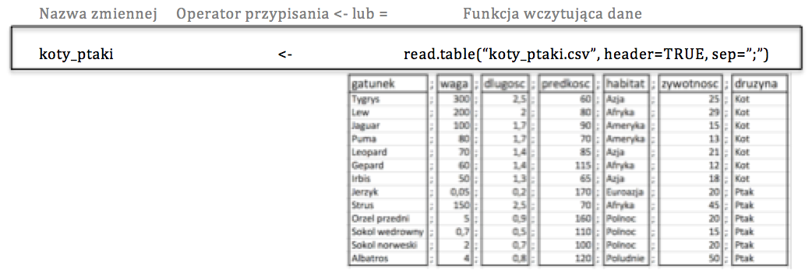
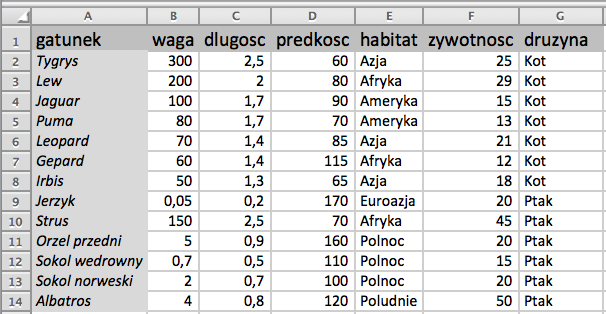
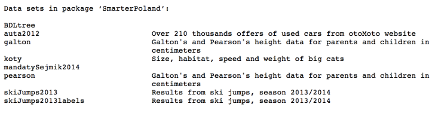

# What is the topic of this episode?

Before we can start the data analysis we must first load data into R.

Data can be stored in many different formats such as a database, a text file, an Excel file (newer .xslx or older .xls) or as files in format of any program for data analysis (SAS, SPSS, etc.).

This episode will try to answer the following questions:

- How to load tabular data from text files?
-	How to load tabular data from Excel files [xls or xlsx]?
-	How to load data from R’s packages?
-	Where can we look for help in loading data from files in other formats/prepared in other programs?

---

# Tabular data in text files

The name *text file* comes from the fact that the content of such file can be opened with a standard editor such as Notepad in Windows or vim in Linux/OSX. Text files can be also opened with RStudio program. If you plan to work often on big text files or on many files at the same time, you should equip yourself with a good tool like *Sublime Text*, for example. 

Let us take a look at a table with data saved in the file `http://biecek.pl/MOOC/dane/cats_birds.csv`. 

This is the content of that file:

```{}
species;weight;length;speed;habitat;lifespan;group
Tiger;300.00;2.5; 60;Asia;25;Cat 
Lion;200.00;2.0; 80;Africa;29;Cat 
Cheetah;100.00;1.7; 90;America;15;Cat 
Jaguar; 80.00;1.7; 70;America;13;Cat 
Puma; 70.00;1.4; 85;Asia;21;Cat 
Leopard; 60.00;1.4;115;Africa;12;Cat 
Irbis; 50.00;1.3; 65;Asia;18;Cat 
Swift;  0.05;0.2;170;Eurasia;20;Bird 
Ostrich;150.00;2.5; 70;Africa;45;Bird 
Golden Eagle;5.00;0.9;160;North;20;Bird 
Peregrine Falcon;0.70;0.5;110;North;15;Bird 
Falcon Norwegian;2.00;0.7;100;North;20;Bird 
Albatros;4.00;0.8;120;South;50;Bird 
```
---

# Tabular data in text files

How is this tabular data stored in the file?

Once we put the values in columns we notice that the logical structure of the file is a table with values separated by semicolons. 


Notice that:

- the first row is a subject line – it contains names of columns separated by semicolons (species;weight;length;speed;habitat;lifespan;group),
-	next rows are formed by data in the form of columns separated by the sign `;` (semicolon),
-	the file contains numbers other than integers – a sign used as a decimal separator is `,` (comma).

---

# Loading data into R

The command loading data into R usually consists of three modules.  

The last module (located on the right side on the model below) is a function which reads, processes and transforms the data so that it could be processed by R (on the model below this function is `read.table()`).

The data needs to be given some name before it is processed (the left module of the model below). That name is often referred to as a *variable*. 

You can use either `<-` or `=` operator to attribute values read by the function to the variable.

Unless the result of the function is attributed to the variable, it is displayed on the screen in R. If you want to use the result in the future, you should attribute it to the variable. 



More information about attributing values to variables is presented in the episode no 4 entitled *Interactive work with R*. 

---

# Tabular data in text files 

Let us consider first the right side of the presented model, that is, the function loading the data. 

Function `read.table()` has got many arguments (see the next slide) but we do not need to define all of them here. It is enough to specify the name of the file and the arguments whose values should be other than default. 

In case of the file discussed here we need to specify the arguments: 

- `file = http://biecek.pl/MOOC/dane/koty_ptaki.csv` (path to the text file; in this case we read the data directly from the Internet address), 
- `sep=";"` (semicolons will separate subsequent columns), 
- `dec=","` (commas will be decimal separators), 
- `header=TRUE` (the first row has a title).

The loaded data set  is displayed on the computer screen because result of the function is not attributed to any variable. 

```{r, message=FALSE}
read.table(file = "http://biecek.pl/MOOC/dane/koty_ptaki.csv", 
          sep=";", dec=",", header=TRUE)
```

---

# Tabular data in text files

Function `read.table()` can be used to load data from text files. This function has many arguments because text files can be very diverse. The following declaration presents chosen arguments (some of them were skipped to avoid obscuring the image).

```{r, eval=FALSE}
read.table(file, header = FALSE, sep = "", dec = ".",  nrows = -1,
           skip = 0, comment.char = "#",
           stringsAsFactors = default.stringsAsFactors(), ...)
```

Data can be saved in many formats and for this reason the function’s arguments describe the format of the loaded data. The following list explains the meaning of the subsequent arguments.

- `file` – a path to the file with data; it can also be an URL address. If we give values of arguments in the default order, we can skip names of arguments (this is why I will not write names of arguments in the following examples).
-	`header` – a flag specifying whether the first row should be treated as a header. In our case `header=TRUE`.
-	`sep` – a sign separating the columns. In our case `sep=";"` but there are other popular separators such as tab, comma or space.
-	`dec` – decimal separator. It is usually ``. or `,`. In our case `dec=","`.
-	`nrows` – a maximum number of rows to be loaded. The default value of this argument is -1, that is, load all the rows. 
-	`skip` – number of the first rows to be skipped in the process of loading data. The default value is 0, that is, do not skip any rows.
- `comment.char` – comment sign. If the data contains that sign, then the content from that sign up to the end of the line will be ignored. 
-	`stringsAsFactors` – this argument states whether the text should be transformed into quality variables. Its default value is TRUE. Episode 11 entitled *Qualitative variables* will broaden your knowledge about the consequences of such transformation. 


---

# Tabular data in text files

The outcome of `read.table()` function is a tabular data set called a *data frame* in R. 

We need to save the result of `read.table()` function in variable to be able to work on it. We can save it for example in the variable `cats_birds`. 

```{r, message=FALSE}
cats_birds <- read.table("http://biecek.pl/MOOC/dane/cats_birds.csv", 
                        sep=";", dec=",", header=TRUE)
# write the variable name and it's content will be listed
cats_birds
```

---

# Tabular data in text files

In RStudio all the available data is displayed in the right upper window entitled *Environment*. You should see the data in that window if you loaded it correctly. 

If you double click on the chosen variable, you will open a window presenting the content of that variable. In this way you can quickly check what has been loaded into the variable `cats_birds`. 

For reasons of efficiency only the first 1000 rows and several hundred columns are displayed. In case of huge data sets only small fragment of the whole will be displayed. 


---

# Data in Excel format

Another popular format used to store data is Excel format [`xls` or `xlsx` files].

There are several R packages allowing for reading data saved in Excel format. The most popular ones are `gdata`, `xlsReadWrite`, `XLConnect` and `xlsx`. They use different external libraries and for this reason some of them may be more efficient on Windows and some of them on Linux. 

In this episode we will use `read.xls()` function from gdata package. It requires an installed version of perl program. Gdata package is not installed with the basic distribution of R so before you use it for the first time you need to install it using the command `install.packages("gdata")`. 

The data that we want to load are available as an Excel file at `http://biecek.pl/MOOC/dane/koty_ptaki.xls` and it looks in the following way:



---

# Data in Excel format

The function `read.xls()` requires two arguments: path to the file and the `sheet` argument, which says which Excel sheet should be read. 

```{r, warning=FALSE, message=FALSE}
library(gdata)
read.xls("http://biecek.pl/MOOC/dane/koty_ptaki.xls", sheet = 1)
```


---

# Data in Excel format

Why are there so many packages for loading data from Excel into R? Because none of the solutions that they propose is better than the others. Some of them are faster while other are better at coping with huge data sets. 

An overview of strengths and weaknesses is available at: http://www.thertrader.com/2014/02/11/a-million-ways-to-connect-r-and-excel/. Below you can find chosen fragments of that overview:

- `XLConnect` offers many possibilities, especially as far as conversion of files of various types is concerned. However, it is slower than other solutions and requires a lot of RAM. As a result it cannot manage extensive data sets. 
-	`gdata` has got several useful functions facilitating navigation through sheets such as `sheetCount()` and `sheetNames()`.

When you load data from the files created on a different operating system than the one you are using or in a different place, you have to be prepared for problems concerning Polish characters encoding for example decimal full stops in real numbers. If you suspect that you may have this problems you should read the charter of ‘Good Practice’ available at http://withr.me/blog/2013/11/15/configure-character-encoding-for-r-under-linux-and-windows/. 

The following table presents a comparison of most popular packages loading data from Excel.

package       | read_function | write_function  | formats | features | speed | language
---           | ---    | ---    | --- | --- | --- | ---
xlsx          | read.xlsx() | write.xlsx() | .xlsx, .xls | medium  | slow | Java
openxlsx      | read.xlsx() | write.xlsx() | .xlsx | medium  | fast | Rcpp
gdata         | read.xls() | -- | .xlsx, .xls | small | medium | Perl
WriteXLS      | -- | WriteXLS() | .xlsx, .xls | small | medium | Perl
XLConnect     | readWorksheet() | writeWorksheet() | .xlsx, .xls | a lot  | slow | Java


---

# R’s binary data

A native format for R are `rda` or `RData` binary files. 

Data saved in this format is compressed and it occupies less space on the disc than the same data saved as a text or an Excel file. The problem is that they can be opened only in R.

Data in that format can be loaded into R with a command `load()`. The first argument of this function is a path to the file with the data. If you want to load the data from the Internet, you should additionally use the function `url()`. 

*Note!* Unlike other functions that we have previously discussed, `load()` function does not process and then give the data set as a result but it loads the data set directly into the name space (the data is saved along with the name of the variable). This is why the example below does not include the command attributing the data to the variable `cats_birds`. The name of the variable is saved inside the `rda` file. 

```{r, warning=FALSE, message=FALSE}
load(url("http://biecek.pl/MOOC/dane/cats_birds.rda"))
cats_birds
```

---

# Loading data from R packages

When I was preparing this course I had to face the following problem. I did not know how to make available several data sets to the participants of this course. I considered various options and I finally decided that the easiest way would be to make the data sets available using a package for R. 

Packages are sets of functions and data sets. It is easy to prepare them and to disseminate them to other people. Some packages contain only functions, some packages are made composed of data sets only, while others include both elements. 

If you want to check which data sets are available in a given package, you may use a function `data()` with an argument `package`. Let us see what data sets were made available in the package called `PogromcyDanych`.

```{r, warning=FALSE, message=FALSE}
data(package="PogromcyDanych")
```

*Note!* The package `ProgromcyDanych` is not available in the basic distribution of R. It must be preinstalled with a command `install.packages()`. You may find detailed information on how to do that in the episode 3 entitled *How to install R, RStudio and additional packages?*

List of the available data sets


---

# Loading data from R packages

One of the data sets made available in that package is the data set called `cats_birds`. 

Once you load the package, the data set is available and you do not need to use any additional commands to activate it. You can display it on the screen by entering its name into the console. 

```{r, warning=FALSE, message=FALSE}
library(PogromcyDanych)
cats_birds
```

---

# Loading data through web API

Some data is available in the services with data through API (Application Programming Interface). It means that although you cannot download all the data from the database, you can ask that base about particular pieces of information.    

In this way you can access giants such as WorlBank, Eurostat or, quite recently, GUS. 


We shall use Eurostat as an example. You can access this database using `getEurostatRCV()` function from the package `SmarterPoland`. A table `tsdtr210` from Eurostat database contains information about the number of passenger kilometers for various countries and means of transport. The table is available in the file http://ec.europa.eu/eurostat/tgm/table.do?tab=table&init=1&language=en&pcode=tsdtr210&plugin=1 

I will show you how to load data directly into R using API from the package `SmarterPoland`. 

*Note!* The package `SmarterPoland` is not available in the basic distribution of R. It must be preinstalled with a command `install.packages()`. You may find detailed information on how to do that in the episode 3 entitled *How to install R, RStudio and additional packages?*

```{r, warning=FALSE, message=FALSE}
library(SmarterPoland)
tsdtr210 <- getEurostatRCV("tsdtr210")
head(tsdtr210, 3)
summary(tsdtr210)
```

---

# Summary of R instructions

In this episode we have discussed functions for loading data from files in various formats: text, Excel and binary files. Below you will find a list of all the functions used in this episode.

```{r, eval=FALSE}
# loading data from text files and attributing that value to the variable `cats_birds`
koty_ptaki <- read.table("http://biecek.pl/MOOC/dane/cats_birds.csv", 
                        sep=";", dec=",", header=TRUE)
# # displaying value of the variable
koty_ptaki

# loading data in Excel format with the function `read.xls()` from the package `gdata`
library(gdata)
koty_ptaki_excel <- read.xls("http://biecek.pl/MOOC/dane/koty_ptaki.xls", sheet = 1)

# loading data in binary format with the function `load()`
load(url("http://biecek.pl/MOOC/dane/koty_ptaki.rda"))

# displaying data sets available in the package `PogromcyDanych`
data(package="PogromcyDanych")

# loading data koty_ptaki from the package `PogromcyDanych`
library(PogromcyDanych)
koty_ptaki

# loading data from Eurostat on use of various means of transport in different countries
library(SmarterPoland)
tsdtr210 <- getEurostatRCV("tsdtr210")
head(tsdtr210, 3)
summary(tsdtr210)
```

---

# Exercise

In the next episodes we will use a data set with data on prices of cars. It can be downloaded from the webpage of the course in different formats at the following addresses:

- Excel data, http://biecek.pl/MOOC/dane/auta2012mini.xls

- text data, http://biecek.pl/MOOC/dane/auta2012mini.csv

- binary data, http://biecek.pl/MOOC/dane/auta2012mini.rda

- in the package `PogromcyDanych` in the variable `auta2012`.

*Exercise:* 

Load the data into R using all of the above formats.

*Note!* The files’ size is up to 3,5MB. If your Internet connection is not very efficient or if many people use it at the same time, downloading the files may take a long while. 

You may find the key to the exercises at http://pogromcydanych.icm.edu.pl/materials/1_przetwarzanie/9_zadania.html

