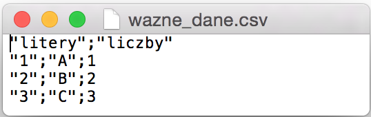

# What is this episode about?

R is an excellent tool for data processing. But once you have processed the data you need to save it for the future somehow.

Like in case of loading data saved in various formats: as text, binary or Excel files. We can also save data in many different formats. 

In this episode you will learn:

- How to save tabular data to text files?
-	How to save tabular data to Excel files (.xls or .xlsx)?
-	How to save data to the binary format of R?
-	Where to look for further information about saving data in other formats?

---

# Saving data to csv file

Let us start from an imaginary example. We have an artificial data set composed of three rows and two columns. We shall call it `two_cols` and then save it as a `csv` text file.

`csv` format files are text files but they are also correctly read by Excel. For that reason they are a popular medium for tabular data exchange. 

You can save data using the  function `write.table()`. The commands presented below create new data and save it to the file `important_data.csv` (in the current directory) using a semicolon as a column separator and sign `.` (full stop) as a decimal separator. In order to check which catalogue is the current working catalogue you can use function `getwd()`.

```{r, eval=FALSE}
# a new dataset
two_cols <- data.frame(letters  = c("A", "B", "C"),
                       numbers  = c(1,2,3))
two_cols
#   letters numbers
# 1       A       1
# 2       B       2
# 3       C       3

write.table(two_cols, file="important_data.csv", 
            sep = ";", dec = ".")

# where the file was written
getwd()
# /Users/pbiecek/Documents

# write with full path
write.table(two_cols, file="/Users/pbiecek/Documents/important_data.csv", 
            sep = ";", dec = ".")
```
---

# Saving data to csv file

As a result of calling the function `write.table()`

```{r, eval=FALSE}
write.table(two_cols, file="important_data.csv", 
            sep = ";", dec = ".")
```

a file `wazne_dane.csv` will be created on the current working directory.

The image below presents the content of that file. 



Notice that there are two values in the first line – they are titles of the columns.  

There are three values in each of the following lines. The first value is the title of the row, while the next two values are values of the second and the third column. 

---

# Saving tabular data to text files

Data available in R can be saved to a text file with the `write.table()` function. You can also use other functions such as `write.csv()` or `write.csv2()` which differ only in the default values of the parameters.

Formatting (specifying what sign is used as a column separator, decimal separator etc.) is done in the same way as in case of the function `read.table()`.

This is a formal function declaration (let us remember that values of most parameters are default and usually only few of them need to be changed).

```{r, eval=FALSE}
write.table(x, file = "", append = FALSE, quote = TRUE, sep = " ",
            eol = "\n", na = "NA", dec = ".", row.names = TRUE,
            col.names = TRUE, qmethod = c("escape", "double"),
            fileEncoding = "")
```

Most frequently used arguments:

- `x` – specifies which table/data is to be saved to the text file,
-	`file` – specifies the name of the text file to which the data will be saved,
-	`append` – default value `FALSE` means that if a file called file already exists, it will be deleted. If you change the argument’s value to `append=TRUE`, new data will be added at the end of the previously saved file. 
-	`sep` – specifies the sign used as a separator of subsequent values,
-	`dec` – specifies the sign used as a decimal separator (usually `.` or `,`),
-	`row.names` – states whether or not titles of rows are to be saved to the text file; default value `TRUE`,
-	`col.names` - states whether or not titles of columns are to be saved to the text file; default value `TRUE`. 


---

# Saving tabular data to Excel files

Data available in R can be also saved to an Excel file with the function `write.xls()`. 

This function is available in most packages including the function `read.xls()` such as for example the package `xlsx` (using Java library) and `dataframe2xls` (using external Python libraries). 

Another function which can be used to save data to Excel files is `WriteXLS()` from the package `WriteXLS` (using external Perl libraries). 

The basic functionality of these functions is the same – they allow for creation of new files and saving tables to it. 

The difference between these packages lies in additional possibilities. Some packages allow for saving data into Excel files with many sheets. Other packages are able to save data into Excel files along with formatting such as colors, font size, font type or table’s outline style. 

Personally I usually use the package `xlsx` because it allows for saving data in many sheets along with specified formatting. 


```{r, eval=FALSE}
library(xlsx)
write.xlsx(two_cols, file="/Users/pbiecek/Documents/important_data.xlsx", 
            sheetName="A Very Important Data")
```

*Note.* Before you activate `xlsx` package you need to install it using the command `install.packages("xlsx")`.

*Note 2*. Users of OSX Yosemite (the latest version at present) may encounter problems in launching the `xlsx` package if they have installed the wrong version of Java (or none at all). Install the latest version from the website http://osxdaily.com/2014/10/21/get-java-os-x-yosemite/.

*Note 3*. Users of Ubuntu may install necessary libraries using the command `sudo apt-get install r-cran-rjava`.
 
---

# Saving data to binary files

You can use the `save()` function to save data to binary files native to R. This function saves one or more objects of any structure  –not only tabular data but also vectors and even more complex structures. 

A disadvantage of this solution is the fact that this format is not read by other statistical packages. 

However, if you work mainly on R and you want to read your data also in R in the future, this is the most convenient option. It produces files of the smallest size which can be easily and quickly loaded with the command `load()`.

Example of use of the `save()` function. 

```{r, eval=FALSE}
# to working directory
save(two_cols, file="important_data.rda")
# a full path 
save(two_cols, file="/Users/pbiecek/Documents/important_data.rda")
```

If you want to save to the file more than one object, you only need to write them down separating them with comas. In the following example three objects will be saved to one file. 

```{r, eval=FALSE}
# let's create two vectors
v1 <- 1:10
l1 <- LETTERS[1:10]
# Saving all three objects to a single file: v1, l1, two_cols
save(v1, l1, two_cols, file="three_objs.rda")
```

When you load data into R with the function `load()`, you load objects along with their names (I wrote about this in the episode https://rawgithub.com/pbiecek/MOOC/master/1_przetwarzanieDanych/05_wczytywanie_eng.html).  This is why several object can be saved to one file without the risk of name collision.  

---

# Summary of R instructions

This episode was devoted to functions for saving data to files in the following formats: text, Excel and binary files. Below you may see a list of all the commands presented in this episode. 


```{r, eval=FALSE}
# a new dataset
two_cols <- data.frame(letters  = c("A", "B", "C"),
                       numbers  = c(1,2,3))
two_cols
#   letters numbers
# 1       A       1
# 2       B       2
# 3       C       3

write.table(two_cols, file="important_data.csv", 
            sep = ";", dec = ".")

# where the file was written
getwd()
# /Users/pbiecek/Documents

# write with full path
write.table(two_cols, file="/Users/pbiecek/Documents/important_data.csv", 
            sep = ";", dec = ".")


library(xlsx)
write.xlsx(two_cols, file="/Users/pbiecek/Documents/important_data.xlsx", 
            sheetName="A Very Important Data")

# to working directory
save(two_cols, file="important_data.rda")
# a full path 
save(two_cols, file="/Users/pbiecek/Documents/important_data.rda")

# let's create two vectors
v1 <- 1:10
l1 <- LETTERS[1:10]
# Saving all three objects to a single file: v1, l1, two_cols
save(v1, l1, two_cols, file="three_objs.rda")
```

---

# Exercise

- Save the data set `cats_birds` to a text file in which data is separated by comas and a full stop is a decimal separator. 

-	Save the data set `cats_birds` to an Excel file. Check if the data was correctly saved.

- Save the data set `cats_birds` to a binary file. Then load it with the function `load()` and check if the data was correctly saved. 

Sample answers are available at  http://pogromcydanych.icm.edu.pl/materials/1_przetwarzanie/9_zadania.html

---

# More information

Where you can look for  further information on saving and reading data in various formats?

You can load data to R and save data from R in formats of programs such as SAS, SPSS, Statistica, Stata and many other programs. 

- More information on loading data from other formats and databases can be found in chapter 2.2 of the book *,,Przewodnik po pakiecie R''* (Guide to R package). This chapter is available free of charge at http://biecek.pl/R.

-	More detailed data on loading and saving data from and to databases and files in more exotic formats can be found in the document *,,R Data Import/Export''* http://cran.r-project.org/doc/manuals/r-release/R-data.pdf https://github.com/pbiecek/MOOC/blob/master/materialyZewnetrzne/R-data.pdf?raw=true

-	While *,,R Data Import/Export''* is a ‘theoretic’ description, you may look at a very interesting compilation of examples of uses of functions for loading data in various formats in the form of a wikibook entitled *,,R programming''* available at http://en.wikibooks.org/wiki/R_Programming/Importing_and_exporting_data. 

-	An interesting list of tools for reading data from websites can be found on the sites of Gaston Sanchez containing educational materials at http://gastonsanchez.com/teaching/

*For Excel enthusiasts* 

- R functions can be also launched inside Excel, yet first you need to install an add-on RExcel  (http://www.statconn.com/products.html). The films available here will show you how to use this add-on and how to install it   https://www.youtube.com/watch?v=rigtfeeqnNs, https://www.youtube.com/watch?v=YH94AH6PVss, https://www.youtube.com/watch?v=wqgO9rrmQVY.

