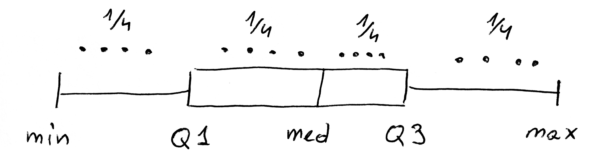

# O czym jest ten odcinek

Analizując dane spotkamy się z różnymi rodzajami zmiennych. W klasycznej statystyce najbardziej popularne są zmienne ilościowe, którym poświęcony jest ten odcinek.

W tym odcinku nauczymy się:

- jakie zmienne / cechy określa się terminem *cechy ilościowe*,
- jakie podstawowe operacje można wykonywać na cechach ilościowych,
- jak podsumowywać / opisywać cechy ilościowe.

Do ilustracji tych zagadnień wykorzystamy dwa zbiory danych. Pierwszy, mały zbiór danych, to `koty_ptaki` a drugi, znacznie większy, to `auta2012`, oba dostępne w pakiecie `PogromcyDanych`.

---

# Co to znaczy: cecha ilościowa

Najbliższe cztery odcinki przedstawią cztery podstawowe typy danych: ilościowe, jakościowe, napisy, wartości logiczne i daty. Nie wyczerpują one jeszcze listy wszystkich możliwych typów, można by wyróżnić jeszcze dane cenzorowane oraz inne bardziej specjalistyczne typy, ale te pięć występuje w 90% analiz, więc na nich się skupimy.

Słowo 'typ' ma w tym przypadku to samo znaczenie co słowo rodzaj, możemy więc mówić o typach danych jak i o rodzajach danych. W analizie danych częściej stosowane jest słowo ,,typ'', więc będziemy się nim posługiwać.

Cechy ilościowe to takie, które opisują ilości - wysokość, długość, wagę, prędkość, powierzchnię, wiek itp.
Często stosuje się też określenie cechy liczbowe ponieważ są one wyrażane za pomocą liczb. Jednak nie zawsze to co jest opisane liczbą jest cechą ilościową. Przykładowo PESEL lub kod pocztowy opisać można liczbą ale nie reprezentują one ilości czy wielkości.

Cechy ilościowe mogą być fizyczne (masa, długość, prędkość) lub nie (iloraz inteligencji, wielkość długu publicznego, procentowy poziom zgodności z poglądami jakiejś partii). 

Mogą przyjmować bardzo wiele różnych wartości (np. wzrost w milimetrach) lub tylko kilka (np. liczba rąk).

Ponieważ jednak są opisane za pomocą liczb, można na nich wykonywać kilka wspólnych operacji. Przyjrzyjmy się im.

---

# Wczytanie danych

Dane od których rozpoczniemy przykłady to `koty_ptaki` z pakietu `PogromcyDanych`. Aby te dane wczytać, wystarczy włączyć pakiet, instrukcja jak to zrobić znajduje się w odcinku 2.

Włączmy pakiet i użyjmy funkcji `head()` by wyświetlić pierwsze sześć wierszy. Które z tych zmiennych to zmienne ilościowe?

```{r, warning=FALSE, message=FALSE}
library(PogromcyDanych)
head(koty_ptaki)
```

Każdy wiersz opisuje jeden gatunek. Zmienne ilościowe opisane są liczbami. W tym przypadku nie ma niespodzianek - zmiennymi ilościowymi są: waga, długość, prędkość i żywotność.

---

# Statystyki opisowe

Zbiór danych `koty_ptaki` składa się z 13 wierszy, więc każda zmienna ilościowa to 13 liczb. 

Aby coś powiedzieć o każdej ze zmiennych wygodnie jest scharakteryzować je jedną lub kilkoma wskaźnikami, takimi jak średnia czy mediana (mediana to wartość która pojawi się w środku gdyby te 13 liczb posortować).

Jak sprawdzić ile wynosi średnia lub mediana dla wagi? Aby policzyć średnią możemy wykorzystać funkcję `mean()`, a do wyznaczenia mediany funkcję `median()`.

```{r}
mean(koty_ptaki$waga)
median(koty_ptaki$waga)
sort(koty_ptaki$waga)
```

W ostatnim wierszu wyświetliliśmy wszystkie wagi po ich posortowaniu. Funkcja `sort()` domyślnie sortuje liczby rosnąco. Możemy zatem przy okazji sprawdzić, że rzeczywiście środkową wartością jest 60.

Przy okazji warto zauważyć że średnia i mediana znacznie się różnią - o prawie 20 kilogramów. Jest to wynikiem tego, że najmniejsze i największe wartości różnią się od siebie o ponad dwa rzędy wielkości. W takich sytuacjach średnia często jest odległa od mediany.

---

# Wczytanie danych

Zbiór danych `koty_ptaki` składa się z 13 wierszy. Można cały ten zbiór danych wyświetlić na ekranie. Nie zawsze potrzebujemy więc specjalnych statystyk opisowych by zrozumieć co się dzieje w takich małych zbiorach danych.

Dlatego, dalsze ćwiczenia ze zmiennymi ilościowymi przeprowadzimy na znacznie większym zbiorze danych z ponad 200 tysiącami wartości, o nazwie `auta2012`, który znajduje się również w pakiecie `PogromcyDanych`.

Opis tego zbioru danych znaleźć można w odcinku https://rawgit.com/pbiecek/MOOC/master/0_dane/0_dane.html

Wczytajmy ten zbiór danych i przyjrzyjmy się trzem pierwszym wierszom. 

```{r, warning=FALSE, message=FALSE}
library(PogromcyDanych)
head(auta2012, 3)
```

Które z tych zmiennych to zmienne ilościowe?

---

# Statystyki opisowe

Przyjrzyjmy się takim cechom jak _Cena.w.PLN_ lub _Przebieg.w.km_.  Cechy te są opisane przez liczby oraz przedstawiają ilości. 

Pierwsza z nich przedstawia _ilość_ pieniędzy, za którą sprzedawca chce sprzedać samochód, druga opisuje _ilość_ kilometrów, którą przejechał wystawiony na aukcji samochód. 

Na zmiennych ilościowych wykonać możemy kilka operacji. 
Używając funkcji `mean()` możemy policzyć średnią cenę wystawionych aut, a funkcją `median()` policzymy medianę, podobnie jak dla poprzedniego zbioru danych.

```{r, warning=FALSE}
mean(auta2012$Cena.w.PLN)
median(auta2012$Cena.w.PLN)
```

Średnia cena aut to ponad 35 tysięcy, ale ponad połowa aut jest tańsza niż 20 tysięcy.

Jak to możliwe? Widoczne jest kilka bardzo drogich aut, które przesuwają średnią do góry.

---

# Statystyki opisowe

Wczytując dane ze zbioru, którego sami nie tworzyliśmy, często chcemy zobaczyć skrajne wartości dla poszczególnych zmiennych. Skrajne czyli najmniejsze i największe.

Używając funkcji `min()` i `max()` możemy wyznaczyć minimalną i maksymalną cenę w tym zbiorze danych.

```{r, warning=FALSE}
min(auta2012$Cena.w.PLN)
max(auta2012$Cena.w.PLN)
```

Najniższa cena to 400 złotych, w co jestem w stanie uwierzyć tym bardziej, że część tych cen dotyczy aut uszkodzonych.

Ale najwyższa to już 11 milionów 111 tysięcy 111. Być może ktoś wpisał taką cenę, ale to chyba bardziej żart niż rzeczywista wartość auta.

Obie te wartości, minimum i maksimum, jako dwuelementowy wektor zwraca funkcja `range()`.

```{r, warning=FALSE}
range(auta2012$Cena.w.PLN)
```

---

# Statystyki opisowe

Używając funkcji `summary()` możemy wyznaczyć sześć podstawowych charakterystyk, czyli: minimum, 1. kwartyl, medianę (2. kwartyl), średnią, 3. kwartyl i maksimum.

Pięć z tych charakterystyk, tj. minimum, 1., 2., 3. kwartyl i maksimum to tak zwana piątka Tukeya, a więc pięć liczb, które dzielą wartości na cztery równoliczne przedziały.

+ Jedna czwarta samochodów ma cenę niższą od 1. kwartyla.
+ Jedna czwarta samochodów ma cenę wyższą od 1. kwartyla ale niższą od mediany (2. kwartyla).
+ Jedna czwarta samochodów ma cenę wyższą od mediany (2. kwartyla) ale niższą od 3. kwartyla.
+ Jedna czwarta samochodów ma cenę wyższą od 3. kwartyla.

Opis cechy ilościowej za pomocą tych sześciu liczb bardzo wiele o danej cesze mówi. Przyjrzyjmy się tym charakterystykom na przykładzie cen aut 

```{r, warning=FALSE}
summary(auta2012$Cena.w.PLN)
```

Te pięć liczb, dzielących wszystkie obserwacje na czery równoliczne części ilustruje wykres pudełkowy.

<center></center>

---

# Statystyki opisowe

Opiszmy wyniki funkcji `sumamry()` na przykładzie

```{r, warning=FALSE}
summary(auta2012$Cena.w.PLN)
```

+ Minimalna oferta opiewa na kwotę na 400 pln.
+ Jedna czwarta ogłoszeń oferuje samochód w cenie niższej niż 10 900 (a ponieważ wszystkich aut jest ponad 200 tysięcy więc szybko możemy policzyć, że ponad 50 tysięcy ofert znajduje się w tym przedziale).
+ Połowa ogłoszeń oferuje samochód w cenie niższej niż 19 900.
+ Trzy czwarte ogłoszeń oferuje samochód w cenie niższej niż 37 470, tym samym jedna czwarta ofert jest na kwotę wyższą.
+ Maksymalna cena ofertowa to wspomniane ponad 11 milionów.
+ Również i w tym przykładzie średnia cena (35 760) jest znacznie - prawie dwukrotnie - wyższa od ceny środkowej. Dzieje się tak dlatego, że większość aut oferowanych jest w niższych cenach, ale niewielka część bardzo drogich aut znacznie podnosi wartość średniej. Jest to jeden z argumentów przeciwko używaniu średniej, która jest podatna na skrajne obserwacje.

Opisując zmienną ilościową przydatna może być funkcja `quantile()`, która wyznacza kwantyle określonego rzędu ze zbioru danych. Kwantyle rzędu `x` to taka liczba, że `100*x%` wartości jest mniejszych niż ten kwantyl.

Niezbyt jasne? Więc może na przykładzie.

```{r, warning=FALSE}
quantile(auta2012$Cena.w.PLN, c(0.01, 0.1, 0.25, 0.5, 0.75, 0.90, 0.99))
```

Kwantyl rzędu `1%` to 1500, czyli co setna oferta jest tańsza niż 1500 PLN. Kwantyle rzędu `10%` to 5500, czyli jedna dziesiąta ofert jest tańsza niż 5.5 tys. Kwantyl rzędu `90%` to 72.5 tys, czyli co dziesiąty samochód jest droższy niż 72 500 pln.


---

# Statystyki opisowe

Dotąd omówiliśmy statystyki opisowe dla jednej zmiennej. Czasem interesuje nas zależność dwóch zmiennych.

Najbardziej typową statystyką opisową dla pary zmiennych ilościowych jest korelacja. Można ją wyznaczyć używając funkcji `cor()`. Zobaczmy czy istnieje zależność pomiędzy rokiem produkcji a ceną.

```{r}
cor(auta2012$Rok.produkcji, auta2012$Cena.w.PLN)
```

Zależność jest dodatnia, a więc im rok produkcji auta wyższy (auto jest młodsze), tym jest ono droższe. Korelacja przyjmuje wartości od -1 do 1. Wartość 0.34 to przeciętna korelacja, pewnie część z nas mogłaby się spodziewać wyższej. Ale tak się składa, że mamy tutaj wymieszane różne marki i modele. Funkcja `cor()` domyślnie liczy korelację Pearsona, ale może też liczyć inne korelacje, np. Spearmana. Co to dokładnie znaczy i jak z niej korzystać, to omówimy w sezonie 3.

Inną przydatną funkcją, jest możliwość sprawdzenia ile aut (ile wierszy danych) ma określoną cechę większą lub mniejszą od jakiejś wartości. 

Na przykład, ile jest ofert sprzedaży aut tańszych niż 5 tysięcy? Lub ile jest ofert sprzedaży aut droższych niż milion?

```{r}
sum(auta2012$Cena.w.PLN < 5000)
sum(auta2012$Cena.w.PLN > 1000000)
```

Każda oferta, która spełnia warunek w nawiasie liczy się jako 1, a która nie spełnia jako 0. Suma tych wartości to suma aut spełniających dany warunek. 

Więcej o tym dlaczego i jak działa to sumowanie omówimy w odcinku 13 o cechach logicznych.

---

# Zadania

+ W zbiorze danych _auta2012_ aż 7 cech to cechy ilościowe. Wymień które.

+ Jedną z cech ilościowych jest _Rok.produkcji_. Jaki jest medianowy/połówkowy rok produkcji oferowanych aut? Wszystkie te oferty były złożone w roku 2012, jaki był medianowy/połówkowy wiek oferowanego auta?

Przykładowe odpowiedzi znajdują się na stronie https://rawgit.com/pbiecek/MOOC/master/0_dane/9_zadania.html

---

# Brakujące wartości

Może się tak zdarzyć, że oferta sprzedaży nie zawiera wszystkich informacji o aucie. Np. brakuje informacji o przebiegu. 
Takie braki danych trzeba jakoś oznaczyć. Nie można w ich miejsce wstawić np. 0, ponieważ czymś innym jest przebieg równy 0, a czymś innym jest brak informacji o przebiegu.

Potrzebna jest więc jakaś specjalna wartość, która będzie oznaczała brakujące wartości. W programie R taką wartością jest `NA` (skrót od _not available_, czyli _niedostępne_).

Jak zauważyć, że w danych występują wartości niedostępne? 
Ich liczba będzie wymieniona w wyniku funkcji `summary()`. Dla zmiennej `Przebieg.w.km` brakujących wartości jest prawie 40 tysięcy. Czyli dla znacznej części aut nie podano informacji o ich przebiegu.

Pozostałe charakterystyki, takie jak minimum, maksimum i mediana, są liczone oczywiście na pozostałych 160 tysiącach aut, dla których przebieg został podany.

```{r, warning=FALSE}
summary(auta2012$Przebieg.w.km)
```

---

# Brakujące wartości

Jakie są konsekwencje występowania brakujących wartości?

Najpoważniejszą jest taka, że części statystyk nie można policzyć.

Przykładowo, średnia z 1 i 3 to 2. Ale ile wynosi średnia z 1 i _nie wiadomo_? 

Dlatego gdy liczymy średnie lub inne statystyki z wektorów, które zawierają wartości nieokreślone to wynik też jest wartością nieokreśloną `NA`.

```{r, warning=FALSE}
mean(auta2012$Przebieg.w.km)
min(auta2012$Przebieg.w.km)
max(auta2012$Przebieg.w.km)
```

To logiczne. Jeżeli nie wszystkie wartości są znane, to nie można policzyć ani średniej, ani innej statystyki.
Logiczne ale też mało praktyczne. 
Często chcielibyśmy policzyć średnią, medianę, minimum tylko z tych wartości które są znane.

Aby to zrobić w programie R, do funkcji należy dodać argument `na.rm=TRUE`, gdzie `na.rm` to skrót od _remove NA_, czyli usuń wartości brakujące.

```{r, warning=FALSE}
mean(auta2012$Przebieg.w.km, na.rm=TRUE)
min(auta2012$Przebieg.w.km, na.rm=TRUE)
max(auta2012$Przebieg.w.km, na.rm=TRUE)
```

---

# Zadania:

+ Która cecha jest najmniej kompletna? Dla której cechy liczba brakujących wartości jest największa?

+ Jaka jest mediana/połówkowa wielkość silnika (`Pojemnosc.skokowa`)?

Przykładowe odpowiedzi znajdują się na stronie https://rawgit.com/pbiecek/MOOC/master/0_dane/9_zadania.html

---

# Graficzne statystyki opisowe - wykres słupkowy

Powyżej opisane statystyki liczbowe można przedstawić graficznie.
Prezentacja graficzna ma tę zaletę, że wyćwiczone oko potrafi szybko wiele dowiedzieć się z danych. 

Opisując zmienną ilościową mamy do wyboru różne sposoby prezentacji, w zależności od tego, ile informacji chcemy przedstawić.

Przypuśćmy, że chcemy pokazać wyłącznie średnią. Jedną liczbę. Zrobimy to za pomocą wykresu słupkowego.
Wykres słupkowy można w programie R wyznaczyć funkcją `barplot()`.

*Zauważmy, że jeżeli wynik przypisania obejmiemy w nawiasy, to wyświetli się on na ekranie*

```{r, warning=FALSE}
(srednia <- mean(auta2012$Przebieg.w.km, na.rm=TRUE))
barplot(srednia)
```

---

# Graficzne statystyki opisowe - wykres słupkowy

Jeden słupek wygląda dziwnie, mało czytelnie. To dlatego, że wykres przedstawia jedną liczbę, trudno więc do czegoś się na nim odnieść.

Zobaczmy jak wyglądają średnie ceny w grupach, na przykład w zależności od rodzaju paliwa. 

Do liczenia średniej w grupach wykorzystamy funkcję `tapply()`, jako pierwszy argument przyjmuje cechę ilościową, jako drugi informacje o grupach a jako trzeci nazwę funkcji, która ma w każdej grupie być wykonana (i następnie dodatkowe argumenty). 

Wynikiem będzie wektor ze średnimi. Możemy teraz użyć funkcji `barplot()`, argument `las=2` powoduje, że etykiety na osi OX pojawią się w pionie, co ułatwi ich odczytanie.

Więcej informacji o tym jak zrobić dobrze wyglądający wykres słupkowy przedstawimy w sezonie 2.

```{r}
(srednie <- tapply(auta2012$Przebieg.w.km,
                   auta2012$Rodzaj.paliwa,
                   mean, na.rm=TRUE))
barplot(srednie, las=2)
```

---

# Graficzne statystyki opisowe - wykres pudełkowy

Ciekawszy będzie wykres, przedstawiający więcej informacji. 

W statystykach opisowych pokazaliśmy funkcją `summary()`, prezentującą sześć charakterystycznych informacji o rozkładzie (min, max, kwartyle i średnią).
Pięć z nich, za wyjątkiem średniej, przedstawia wykres pudełko-wąsy, który w R można wykonać używając funkcji `boxplot()`.

W poniższym przykładzie przedstawiamy te pięć liczb dla zmiennej `Przebieg.w.km`. Argument `horizontal=TRUE` powoduje, że wykres rysowany jest poziomo, argument `range = 0` powoduje, że nie są wyznaczane wartości odstające (a nie mówiliśmy co to za wartości, więc ich nie wyznaczajmy - wrócimy do tego tematu później).

```{r, warning=FALSE, fig.height=4}
summary(auta2012$Przebieg.w.km)
boxplot(auta2012$Przebieg.w.km, 
        horizontal=TRUE, range = 0)
```

---

# Graficzne statystyki opisowe - wykres pudełkowy

Co za dziwny wykres. Co jest nie tak? Spójrzmy na oś na wykresie, rozciąga się do 10^9 = 1 000 000 000 km. Patrząc na wynik funkcji `summary()` widzimy że faktycznie, któryś wiersz zawiera tak dużą wartość.
Najprawdopodobniej te duże wartości to wynik błędu w danych. Mała jest szansa, że jakiekolwiek auto na świecie miało choćby zbliżony przebieg (gdyby jakieś auto jeździło non stop z prędkością 100 km na godzinę, to po 100 latach miałoby przebieg 8 000 000 km).

Dane bardzo często są zanieczyszczone a graficzne prezentacje pozwalają nam to łatwo zauważyć. 

Tak jest i w tym przypadku.
Oczyśćmy te dane, usuwając wszystkie wiersze, dla których cecha `Przebieg.w.km` przyjmuje wartości powyżej 1 000 000 km.
Użyjemy warunku logicznego, aby indeksować tylko te wiersze o sensownym przebiegu. Więcej o tym jak działa to indeksowanie znaleźć można w odcinku 7.

```{r, warning=FALSE, fig.height=4}
auta2012wybrane <- auta2012[auta2012$Przebieg.w.km < 1000000, ] 
summary(auta2012wybrane$Przebieg.w.km)
boxplot(auta2012wybrane$Przebieg.w.km, horizontal=TRUE, range=0)
```

---

# Graficzne statystyki opisowe - histogram

Każdy z elementów tego wykresu (lewy wąs, lewa część pudełka, prawa część pudełka, prawy wąs) przedstawia 1/4 danych.
Z wykresu tego możemy łatwo odczytać, że 3/4 danych dotyczy aut o przebiegu poniżej 200 tys. km. Jedynie 1/4 danych ma wyższe wartości i dla tych aut rozpiętość jest bardzo duża.

Jeżeli chcemy zaprezentować bardziej szczegółowe dane o przebiegu, możemy wykorzystać histogram.
Histogram przedstawia liczbę obserwacji o określonych przedziałach wartości. Domyślnie przedziały są równo szerokie, a ich liczbę wybiera algorytm uwzględniający zmienność cechy (zazwyczaj jest to od 6 do 10 przedziałów).

Aby wykonać w programie R histogram, można wykorzystać funkcję `hist()`. Pierwszy argument określa dane, które mają być pokazane. Na poniższym przykładzie słupki zamalowano na szaro by były bardziej widoczne. 

```{r, warning=FALSE}
hist(auta2012wybrane$Przebieg.w.km, col="grey")
```

---

# Graficzne statystyki opisowe - histogram

Argumentem `breaks` można określić liczbę przedziałów lub nawet granice przedziałów. Jeżeli mamy dużo obserwacji to często można więcej odczytać mając dużą liczbę przedziałów. W każdym przedziale histogram przedstawia liczbę obserwacji. Im wyższy słupek, tym więcej było aut o określonym przebiegu.

Na poniższym wykresie zauważyć można dwa ,,pagórki''. Jeden w pobliżu 0 oraz drugi w pobliżu 180 tys. km. 
Oznacza to, że w zbiorze danych jest jedna duża grupa aut o bardzo małym przebiegu, aut o przebiegu w okolicy 50 tys. km jest mniej, aut o przebiegu w okolicy 150 tys. km jest bardzo dużo, a aut o przebiegu ponad 300 tys. km jest już bardzo mało, pojedyncze sztuki.

Jak widzimy zmienną ilościową możemy opisać z różnym poziomem szczegółowości. Im większa szczegółowość tym więcej elementów na wykresie. 
Im więcej elementów tym więcej możemy odczytać, ale jest to też trudniejsze.

```{r, warning=FALSE}
hist(auta2012wybrane$Przebieg.w.km, breaks = 100, col="grey")
```

---

# Graficzne statystyki opisowe - wykres punktowy

A czy można przedstawić dwie zmienne ilościowe i ich wspólną relację?

Do tego służy zazwyczaj wykres punktowy. Funkcja `plot()` jeżeli otrzyma jako pierwsze dwa argumenty cechy ilościowe to narysuje taki wykres. Dodatkowe argumenty, takie jak `xlab` i `ylab` pozwalają na określenie nazw osi OX i OY.

Poniższy przykład pokazuje zależność pomiędzy wagą a prędkością gatunków ze zbioru `koty_ptaki`. Jak widać duża masa nie sprzyja wielkim prędkościom.

```{r, warning=FALSE}
plot(koty_ptaki$waga, koty_ptaki$predkosc, ylab="Predkość", xlab="Waga")
```

---

# Graficzne statystyki opisowe - wykres punktowy

Użyjmy funkcji `plot()` dla danych o autach, np. by pokazać zależność pomiędzy przebiegiem a ceną.
Okazuje się jednak, że ponieważ ofert sprzedaży aut jest bardzo wiele, lepiej nie rysować każdej oferty dużym kołem, ale pojedynczym punktem. Można to osiągnąć dodając argument `pch="."`, którym możemy zmieniać znak za pomocą którego rysowane są na wykresie punkty odpowiadające danym. Ponieważ i przebieg i cena auta zawierają pojedyncze bardzo duże wartości zamiast pokazywać je w standardowej skali, znacznie lepiej przedstawić je w skali logarytmicznej. Można to osiągnąć dodając do wykresu argument `log="xy"`. Wartość `"xy"` oznacza, że obie osie należy zlogarytmować. 

Więcej informacji o wykresach rozrzutu i innych sposobach przedstawienia cechy ilościowej przedstawionych jest w sezonie 3.

```{r, warning=FALSE}
plot(auta2012wybrane$Przebieg.w.km, auta2012wybrane$Cena.w.PLN, log="xy", pch=".")
```

---

# Zadania:
+ Przedstaw graficznie za pomocą wykresu pudełko-wąsy oraz histogramu rozkład cechy `Cena.w.PLN`. 

+ Zwróć uwagę, że pojedyncze auta o bardzo wysokich cenach, powodują że wykres jest mało czytelny. Oczyść te dane, pozostawiają tylko auta o cenie poniżej 100 tys. pln. Następnie przedstaw rozkład cen aut w segmencie aut do 100 tys. pln.

+ Aut w jakiej cenie jest najwięcej wśród zebranych ogłoszeń?

Przykładowe odpowiedzi znajdują się na stronie https://rawgit.com/pbiecek/MOOC/master/0_dane/9_zadania.html

