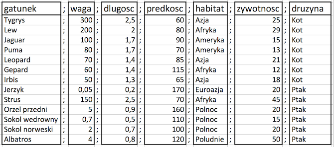

# O czym jest ten odcinek

Zanim rozpoczniemy analizę danych, musimy najpierw dane wczytać do programu R.

Dane mogą być przechowywane  w najróżniejszych formatach, takich jak baza danych, plik tekstowy, plik Excela lub innego programu do analiz danych (SAS, SPSS, itp). 

W tym odcinku dowiemy się

- Jak wczytywać dane tabelaryczne z plików tekstowych?
- Jak wczytywać dane tabelaryczne  z plików Excela [xls lub xlsx]?
- Jak wczytywać dane z pakietów R?

---

# Dane tabelaryczne w plikach tekstowych

Jednym z częstszych formatów wymiany danych są pliki tekstowe.

Nazwa 'plik tekstowy' bierze się stąd, że treść tego pliku możemy otworzyć w standardowym edytorze takim jak Notepad/Notatnik w Windowsie lub vim w Linuxie/OSX. Pliki tekstowe można również otwierać z użyciem programu RStudio. Jeżeli często pracujemy z dużymi lub wieloma plikami tekstowymi to warto wyposażyć się w dobre narzędzie do pracy z nimi, np. edytor [Sublime Text](http://www.sublimetext.com/3).

Przyjrzymy się tabeli liczb z pliku
http://biecek.pl/MOOC/dane/koty_ptaki.csv

Zawartość tego pliku wygląda tak

```{}
gatunek;waga;dlugosc;predkosc;habitat;zywotnosc;druzyna
Tygrys;300;2,5;60;Azja;25;Kot
Lew;200;2;80;Afryka;29;Kot
Jaguar;100;1,7;90;Ameryka;15;Kot
Puma;80;1,7;70;Ameryka;13;Kot
Leopard;70;1,4;85;Azja;21;Kot
Gepard;60;1,4;115;Afryka;12;Kot
Irbis;50;1,3;65;Azja;18;Kot
Jerzyk;0,05;0,2;170;Euroazja;20;Ptak
Strus;150;2,5;70;Afryka;45;Ptak
Orzel przedni;5;0,9;160;Polnoc;20;Ptak
Sokol wedrowny;0,7;0,5;110;Polnoc;15;Ptak
Sokol norweski;2;0,7;100;Polnoc;20;Ptak
Albatros;4;0,8;120;Poludnie;50;Ptak
```
---

# Dane tabelaryczne w plikach tekstowych

W jaki sposób dane tabelaryczne zapisane są w tym pliku?

Wyrównując wartości, zauważymy, że logiczna struktura tego pliku to tabela wartości rozdzialna średnikami.



Zauważmy, że:

- pierwszy wiersz to nagłówek, zawiera nazwy kolumn rozdzielane średnikiem (gatunek;waga;dlugosc;predkosc;habitat;zywotnosc;druzyna)
- kolejne wiersze to dane w postaci kolumn liczb, które są rozdzielane średnikiem `;`
- w pliku występują liczby niecałkowite, kropką dziesiętną jest przecinek `,`


---

# Dane tabelaryczne w plikach tekstowych

Do wczytywania danych z pliku tekstowego służy funkcja `read.table()`. 
Ponieważ dane mogą być zapisane z użyciem różnych formatów, argumenty tej funkcji określają format danych do wczytania.
W przypadku rozważanego pliku musimy określić następujące argumenty:

- `file` - ścieżka do pliku z danymi może być też adres URL (jeżeli wskażemy jako pierwszy argument, możemy pominąć jego nazwę)
- `sep` - znak rozdzielający kolumny. W naszym przypadku `sep=";"`
- `dec` - kropka dziesiętna, zazwyczaj `.` lub `,`. W naszym przypadku `dec=","`
- `header` - flaga określająca, czy pierwszy wiersz należy traktować jako nagłówek. W naszym przypadku `header=TRUE`.

```{r, message=FALSE}
read.table("http://biecek.pl/MOOC/dane/koty_ptaki.csv", 
          sep=";", dec=",", header=TRUE)
```

---

# Dane tabelaryczne w plikach tekstowych

Wynikiem funkcji `read.table()` jest tabelaryczny zbiór danych, który w R nazywa się _ramką danych_.

Aby na nim pracować, musimy wynik funkcji `read.table()` zapamiętać w zmiennej. Na przykład w zmiennej o nazwie `koty`.

```{r, message=FALSE}
koty <- read.table("http://biecek.pl/MOOC/dane/koty_ptaki.csv", 
                        sep=";", dec=",", header=TRUE)
# po wpisaniu nazwy zmiennej jako wynik wyświetlona zostanie jej wartość
koty
```

---

# Dane tabelaryczne w plikach tekstowych

W programie R Studio w prawym górnym oknie, zatytułowanym *Environment* wyświetlane są wszystkie dostępne dane. Po poprawnym wczytaniu danych, powinniśmy je widzieć właśnie w tym oknie

Dwukrotne kliknięcie na wskazaną zmienną powoduje otwarcie okna prezentującego zawartość zmiennej. W ten sposób możemy szybko podejrzeć co wczytało się do zmiennej `koty`.

Z przyczyn wydajnościowych wyświetlanych jest tylko pierwsze 1000 wierszy i kilkaset kolumn. Tak więc dla dużych zbiorów danych wyświetlony będzie tylko fragment całęgo zbioru.


---
# Dane tabelaryczne w plikach tekstowych

Instrukcją `?read.table` możemy otworzyć plik pomocy dla funkcji `read.table`. 
Znajdziemy w niej wiele innych argumentów, pomocnych, gdy trzeba wczytać bardziej złożone dane.

Wybrane przydatne argumenty funkcji `read.table()`

- `skip` - ile pierwszych linii należy pominąć, domyślnie 0
- `nrows` - ile maksymalnie linii należy wczytać, domyślnie -1, czyli bez limitu
- `comment.char` - jaki znak oznacza komentarz, domyślnie `#`, znaki występujące po nim do końca linii są ignorowane. 
- `na.strings` - jaki napis oznacza brakujące wartości. Domyślnie jest to `"NA"`.
- `row.names` - wektor określający nazwy wierszy lub liczba wskazująca kolumnę w której znajdują się nazwy wierszy.
- `stringsAsFactors` - domyślnie `TRUE` a więc napisy wczytywane jako zmienne jakościowe, typu `factor`. 

---

# Dane w formacie programu Excel

Innym popularnym formatem przechowywania danych są pliki w formacie Excela [rozszerzenia xls lub xlsx]. 

W R dostępnych jest kilka pakietów pozwalających na odczytywanie danych w formacie Excela. Najpopularnijesze pakiety to `gdata`, `xlsReadWrite`, `XLConnect`, `xlsx`. Różnią się one zewnętrznymi bibliotekami, które wykorzystują, przez co z niektórych może być łatwiej skorzystać pod Windowsem z innych pod Linuxem. 

W tym odcinku wykorzystamy funkcję `read.xls()` z pakietu `gdata`. Wymaga ona zainstalowanego programu `perl`. Pakiet `gdata` nie jest instalowany z podstawową dystrybucją R, dlatego przed pierwszym użyciem należy go zainstalować poleceniem `install.packages("gdata")`.

Dane, które chcemy wczytać, w Excelu wyglądają następująco.


---

# Dane w formacie programu Excel

Funkcja `read.xls()` oczekuje dwóch argumentów: ścieżki do pliku i argumentu `sheet`, którym wskazuje, którą zakładkę z pliku Excela należy odczytać.

```{r, warning=FALSE, message=FALSE}
library(gdata)
read.xls("http://biecek.pl/MOOC/dane/koty_ptaki.xls", sheet = 1)
```


---

# Dane w formacie programu Excel

Dlaczego dostępnych jest tak wiele pakietów do wczytywania danych z Excela do R?
Otóż, żadne z rozwiązań je jest lepsze od wszystkich pozostałych. Jedne są szybsze, inne lepiej radzą sobie z dużymi danymi. 

Zebranie silnych i słabych stron poszczególnych pakietów znajduje się na stronie http://www.thertrader.com/2014/02/11/a-million-ways-to-connect-r-and-excel/. Wybrane silne i słabe strony pakietów, to

- `XLConnect` ma dużo możliwości, szczególnie dotyczących konwersji typów, ale jest wolniejszy niż inne rozwiązania i wymagający jeżeli chodzi o RAM, przez co może nie poradzić sobie z dużymi zbiorami danych.

- `gdata` ma kilka użytecznych funkcji, pozwalających na nawigacji po skoroszytach, np. 
`sheetCount()` i `sheetNames()`

- Wczytując dane z plików, które zostały stworzone na innym systemie operacyjnym lub w innej lokalizacji, trzeba liczyć się z różnicami dotyczącymi kodowania polskich znaków lub np. kropek dziesiętnych w liczbach rzeczywistych. Jeżeli ten problem może nas dotyczyć, to warto zapoznać się z kartą ,,Dobrych Praktyk'' dostępnych na stronie 
http://withr.me/blog/2013/11/15/configure-character-encoding-for-r-under-linux-and-windows/


---

# Dane binarne programu R

Natywnym formatem dla programu R są pliki binarne o rozszerzeniu `rda` lub `Rdata`. 

Dane w tym formacie są skompresowane, przez co zajmują mniej miejsca na dysku niż w pliku tekstowym lub formacie Excela. Wadą jest to, że można je otworzyć tylko w programie R.

Dane w tym formacie, do programu R można je wczytać poleceniem `load()`. Pierwszym argumentem tej funkcji jest ścieżka do pliku z danymi. Jeżeli chcemy dane odczytać z internetu, należy dodatkowo użyć funkcji `url()`. 

*Uwaga!* W przeciwieństwie do wcześniej poznanych funkcji, funkcja `load()` nie zwraca zbioru danych jako wynik, ale ładuje zbiór danych bezpośrednio do przestrzeni nazw (dane zapisane są wraz z nazwą zmiennej).

```{r, warning=FALSE, message=FALSE}
load(url("http://biecek.pl/MOOC/dane/koty_ptaki.rda"))
koty_ptaki
```

---

# Wczytywanie danych z pakietów R

Przygotowując ten kurs miałem taki problem. 

Jak w najprostszy sposób udostępnić uczestnikom tego kursu kilka zbiorów danych?
Rozważając różne opcje, stwierdziłem że najłatwiejsza to z udpostępnienie danych z użyciem pakietu dla programu R.

Pakiety to zbiory funkcji oraz zbiorów danych. Można takie pakiety wygodnie przygotowywać oraz udostępniać innym osobom. Są pakiety, zawierające tylko funkcje, wyłącznie zbiory danych lub obie te rzeczy.

Aby sprawdzić jakie zbiory danych są dostępne w określonym pakiecie, można wykorzystać funkcję `data()` z argumentem `package`. 

Zobaczmy jakie zbiory danych udostępnione są w pakiecie `SmarterPoland`.

```{r, warning=FALSE, message=FALSE}
data(package="SmarterPoland")
```


---

# Wczytywanie danych z pakietów R

Jednym ze zbiorów danych udostępnionych w tym pakiecie jest zbiór danych `koty`.

Po wczytaniu pakietu, ten zbiór danych jest dostępny bez potrzeby stosowania dodatkowych instrukcji.

```{r, warning=FALSE, message=FALSE}
library(SmarterPoland)
koty_ptaki
```

---

# Wczytywanie danych poprzez web API


Pewne dane dostępne są poprzez API (application programming interface).
Oznacza to, że nie możemy pobrać wszystkich danych z bazy danych, ale możemy tą bazę odpytywać o określone informacje.

Przykładem niech będzie baza Eurostat, do której można sięgać używając funkcji getEurostatRCV() z pakietu SmarterPoland. W bazie Eurostat tabela ‘tsdtr210’ zawiera dane o ilości pasażero-kilometrów dla różnych krajów i środków transportu. 
http://ec.europa.eu/eurostat/tgm/table.do?tab=table&init=1&language=en&pcode=tsdtr210&plugin=1
Pobierzmy te dane używając API udostępnionego przez pakiet SmarterPoland.

```{r, warning=FALSE, message=FALSE}
tsdtr210 <- getEurostatRCV("tsdtr210")
head(tsdtr210, 3)
summary(tsdtr210)
```

---

# Zadanie

W kolejnych odcinkach będziemy korzystać ze zbioru danych o cenach aut. 
Ten zbiór danych można pobrać ze strony kursu w różnych formatach pod następującymi linkami:

- dane Excelowe, http://biecek.pl/MOOC/dane/auta2012mini.xls

- dane tekstowe, http://biecek.pl/MOOC/dane/auta2012mini.csv

- dane binarne, http://biecek.pl/MOOC/dane/auta2012mini.rda

- w pakiecie `SmarterPoland` w zmiennej `auta2012`.

*Zadanie na ćwiczenia:* 

Wczytać do programu R dane korzystając z każdego z tych formatów.

*Uwaga!* Wskazane pliki mają do 3.5 MB wielkości. Ich pobieranie może trochę potrwać jeżeli połączenie internetowe nie jest dobre lub wiele osób jednocześnie z niego korzysta.

