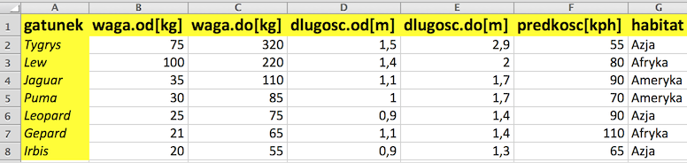

# O czym jest ten odcinek

Zanim rozpoczniemy analizę danych, musimy te dane wczytać do programu R.

Dane mogą być przechowywane  w najróżnijszych formatach, takich jak bazA danych, pliku tekstowy, pliku Excela lub innego programu do analiz danych (SAS, SPSS, itp). 

W tym odcinku nauczymy się

- Jak wczytywać dane tabelaryczne z plików tekstowych
- Jak wczytywać dane tabelaryczne  z plików Excela [xls lub xlsx]
- Jak wczytywać dane z pakietów R
- Gdzie szukać informacji o tym jak wczytać dane z innych źródeł.

---

# Dane tabelaryczne w plikach tekstowych

Jednym z częstszych formatów wymiany danych są pliki tekstowe.

Nazwa 'plik tekstowy' bierze się stąd, że treść tego pliku możemy otworzyć w standardowym edytorze takim jak Notepad/Notatnik w Windowsie lub vim w Linuxie.

Przyjrzymy się tabelarycznemy zbiorowi danych z pliku
http://biecek.pl/MOOC/dane/koty.csv

Zawartość tego pliku wygląda tak

```{}
gatunek;waga.od[kg];waga.do[kg];dlugosc.od[m];dlugosc.do[m];predkosc[kph];habitat
Tygrys;75;320;1,5;2,9;55;Azja
Lew;100;220;1,4;2;80;Afryka
Jaguar;35;110;1,1;1,7;90;Ameryka
Puma;30;85;1;1,7;70;Ameryka
Leopard;25;75;0,9;1,4;90;Azja
Gepard;21;65;1,1;1,4;110;Afryka
Irbis;20;55;0,9;1,3;65;Azja
```
---

# Dane tabelaryczne w plikach tekstowych
Jaki jest format zapisu tych danych?

Zauważmy, że 

- pierwszy wiersz to nagłówek, zawiera nazwy kolumn
- kolumny liczb są rozdzielane średnikiem `;`
- kropką dziesiętną jest przecinek `,`


```{}
gatunek;waga.od[kg];waga.do[kg];dlugosc.od[m];dlugosc.do[m];predkosc[kph];habitat
Tygrys;75;320;1,5;2,9;55;Azja
Lew;100;220;1,4;2;80;Afryka
Jaguar;35;110;1,1;1,7;90;Ameryka
Puma;30;85;1;1,7;70;Ameryka
Leopard;25;75;0,9;1,4;90;Azja
Gepard;21;65;1,1;1,4;110;Afryka
Irbis;20;55;0,9;1,3;65;Azja
```

---

# Dane tabelaryczne w plikach tekstowych

Do czytania danych z pliku tekstowego służy funkcja `read.table()`. 
Aby odczytać nasze dane musimy wskazać argumenty
- `file` - ścieżka do pliku z danymi tekstowego, może być też link URL
- `sep` - znak rozdzielający kolumny. W naszym przypadku `sep=";"`
- `dec` - kropka dziesiętna, zazwyczaj `.` lub `,`. W naszym przypadku `dec=","`
- `header` - flaga określająca, czy pierwszy wiersz należy traktować jako nagłówek. W naszym przypadku `header=TRUE`.

```{r, message=FALSE}
read.table(file = "http://biecek.pl/MOOC/dane/koty.csv",
 sep=";", dec=",", header=TRUE)
```

---
# Dane tabelaryczne w plikach tekstowych

Instrukcją `?read.table` możemy otworzyć plik pomocy dla funkcji `read.table`. 
Znajdziemy w niej wiele innych argumentów, pomocnych, gdy trzeba wczytać bardziej złożone dane.

Wybrane przydatne argumenty funkcji `read.table()`

- `skip` - ile pierwszych linii należy pominąć, domyślnie 0
- `nrows` - ile maksymalnie linii należy wczytać, domyślnie -1, czyli bez limitu
- `comment.char` - jaki znak oznacza komentarz, domślnie `#`, znaki występujące po nim do końca linii są ignorowane. 
- `na.strings` - jaki napis oznacza brakujące wartości. Domyślnie jest to `"NA"`.
- `row.names` - wektor określający nazwy wierszy lub liczba wskazująca kolumnę w której znajdują się nazwy wierszy.
- `stringsAsFactors` - domyślnie `TRUE` a więc napisy wczytywane jako zmienne jakościowe, typu `factor`. 


## Dane w pliku Excela



```{r, warning=FALSE}
read.table("http://biecek.pl/MOOC/dane/koty.csv",
  sep=";", dec=",", header=TRUE)
```

---

## Dane Excelowe xls

Dane w formacie xls to dane w formacie Excela. 
Można je wczytać poleceniem `read.xls()`, ale wcześniej trzeba wczytać pakiet `gdata`.
Jeżeli ten pakiet nie jest dostępny, to należy go wcześniej zainstalować poleceniem `install.packages("gdata")`.

```{r, warning=FALSE}
library(gdata)
read.xls("http://biecek.pl/MOOC/dane/koty.xls", sheet = 1)
# auta2012mini <- read.xls("http://biecek.pl/MOOC/dane/auta2012mini.xls", sheet = 1)
# head(auta2012mini, 2)
```

---

## Dane binarne rda

Dane w formacie rda to dane binarne w natywnym formacie R. 
Zajmują najmniej miejsca na dysku, ale można je otworzyć tylko w programie R.
Można je wczytać poleceniem `load()`.

```{r, warning=FALSE}
plik <- url("http://biecek.pl/MOOC/dane/auta2012mini.rda")
load(plik)
head(auta2012mini, 2)
```


---

## Wczytywanie danych z pakietów R

Przygotowując ten kurs miałem taki problem. 
Jak w najprostszy sposób udostępnić uczestnikom tego kursu kilka zbiorów danych?
Rozważając różne opcje, stwierdziłem że najłatwiejsza to z użyciem papkietu z danymi.

---

# Zadanie

Przedstawione poniżej dane można wczytać bezpośrednio z Internetu.
Można je też pobrać, dane są dostępne w różnych formatach pod następującymi linkami:

- dane Excelowe http://biecek.pl/MOOC/dane/auta2012mini.xls
- dane tekstowe http://biecek.pl/MOOC/dane/auta2012mini.csv
- dane binarne http://biecek.pl/MOOC/dane/auta2012mini.rda

*Uwaga!* Wczytywane pliki mają do 3.5 MB. Ich pobieranie może potrwać kilka minut, lub więcej jeżeli połączenie internetowe nie jest dobre lub wiele osób jednocześnie z niego korzysta.

---

---

### Część właściwa
Pakiety to zbiory funkcji oraz zbiorów danych.
Są takie pakiety, w których są tylko funkcje, takie które mają wyłącznie zbiory danych i zawierające i funkcje i dane.

Aby sprawdzić jakie zbiory danych są dostępne w określonym pakiecie, można wykorzystać funkcję `data()` z argumentem `package`. 
Zobaczmy na przykład jakie zbiory danych udostępnione są w pakiecie `SmarterPoland`.

```{r, warning=FALSE}
data(package="SmarterPoland")
```

---

Jednym ze zbiorów danych w tym pakiecie jest zbiór `auta2012`.
Aby z niego korzystać wystarczy załadować zbiór danych `SmarterPoland` i wszystkie zbiory danych są dostępne.
Zademonstrujmy to wyświetlając pierwsze trzy wiersze.

```{r, warning=FALSE}
library("SmarterPoland")
head(auta2012, 3)
```

---

## Więcej informacji 

Więcej informacji o tym jak wczytywać i zapisywać dane z i do baz danych lub plików w egzotycznych formatach znaleźć można w dokumencie *R Data Import/Export*
http://cran.r-project.org/doc/manuals/r-release/R-data.pdf
https://github.com/pbiecek/MOOC/blob/master/materialyZewnetrzne/R-data.pdf?raw=true
