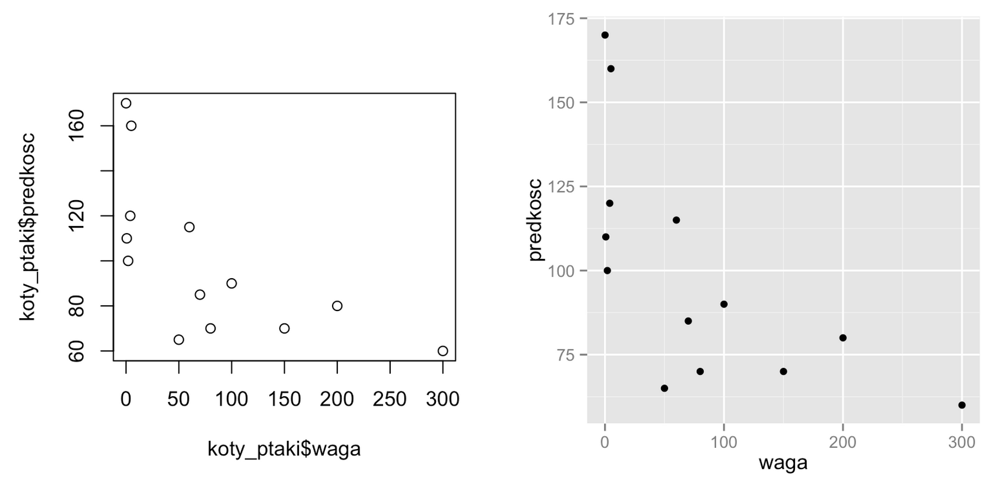
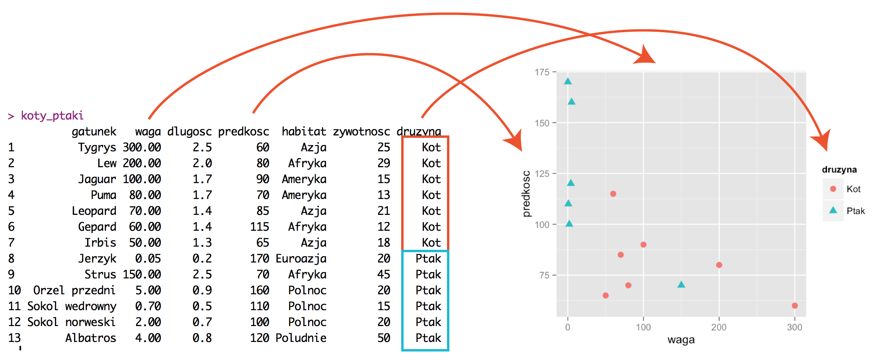
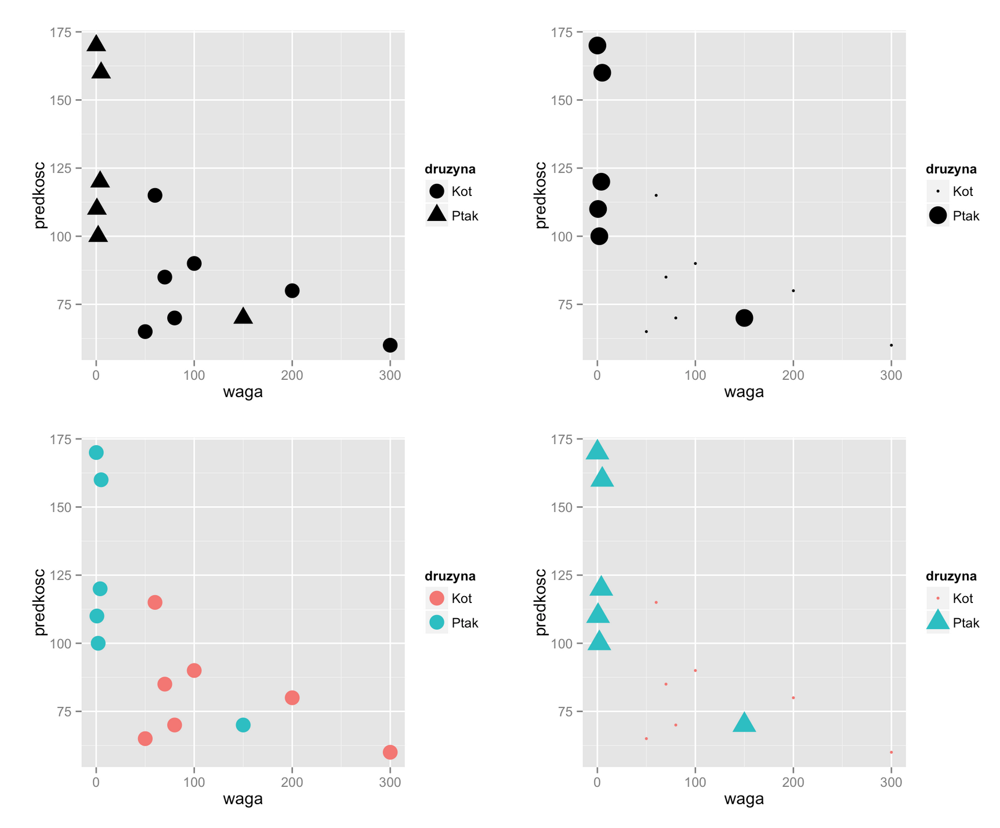

# O czym jest ten odcinek

Dane są czymś abstrakcyjnym i patrząc w tabele liczb często trudno zauwazyć zależności pomiędzy różnymi zmiennymi.

Ale znacznie łatwiej dostrzec lub zrozumieć te zależności, jeżeli dane przedstawi się graficznie w poprawny sposób.

Pierwsza połowa sezonu 2 poświęcona jest wizualizacji danych. W tym odcinku poznamy pakiet graficzny `ggplot2`, pozwalający na tworzenie dobrze wyglądających i czytelnych wykresów.

W tym odcinku dowiemy się:

- W programie R wykresy można tworzyć z użyciem najróżniejszych pakietów. Dowiemy się, dlaczego w pierwszej kolejności warto poznać i dlaczego warto używać pakietu `ggplot2`.
- Jednym z najpopularniejszych sposobów przedstawiania danych są wykresy punktowe. Pokażemy jak tworzyć takie wykresy.
- Jednym z kluczowych pomysłów w pakiecie `ggplot2` są mapowania zmiennych na właściwości wykresu. Dokładnie omówimy na czym polega ten pomysł.
- Poznamy kolejne rodzaje wykresów, takie jak wykres z etykietami lub wykres liniowy.
- Pokażemy też jak składać różne warstwy w jeden czytelny wykres.

---

# Zbiory danych

W tym odcinku będziemy pracować z dwoma zbiorami danych: `koty_ptaki` oraz `WIG`. Oba zbiory są dostępne w pakiecie `PogromcyDanych`.

Aby odtworzyć przykłady z tego odcinka potrzebny jest zainstalowany pakiet `PogromcyDanych`. Informacja o tym jak go zainstalować jest umieszczona w odcinku trzecim pierwszego sezonu *Jak zainstalować R, RStudio oraz dodatkowe pakiety?*.

Funkcją `library()` włączamy pakiet i możemy sprawdzić jak wyglądają pierwsze sześć wierszy z obu zbiorów danych.

```{r,  message=FALSE}
# jeżeli pakiet jeszcze nie jest zainstalowany należy odkomentować poniższą linijkę
# install.packages("PogromcyDanych")

# wczytujemy pakiet 
library(PogromcyDanych)
# wyświetlamy pierwsze wiersze z interesującego nas zbioru danych
head(koty_ptaki)

head(WIG)
```

---


# Dlaczego warto poznać pakiet `ggplot2`?

Coraz więcej osób dostrzega potencjał wizualizacji danych zarówno w zastosowaniach biznesowych, w nauce, mediach czy życiu codziennym.
Z tego powodu powstaje coraz więcej rozwiązań, programów i pakietów, pozwalających na prezentację danych.

My skupimy się na jednym, na pakiecie `ggplot2`. Dlaczego akurat nim? Jest ku temu kilka powodów.

- Zaawansowana analiza danych bardzo często ma miejsce w programie R. Wykorzystanie tego samego programu do analiz i do wizualizacji, ma tę zaletę, że nie musimy danych konwertować do nowego formatu, nie musimy poznawać dwóch języków opisu wizualizacji, możemy pracować w jednym spójnym środowisku. Z pakietów programu R, na dzień dzisiejszy, to właśnie `ggplot2` jest najbardziej dojrzałym rozwiązaniem.
- Pakiet `ggplot2` pozwala na tworzenie grafiki *publication ready*, czyli wystarczająco dobrej by pokazać ją innym osobom w prezentacjach czy raportach biznesowych lub publikacjach naukowych, bez dodatkowych zabiegów upiększających. 
- Pakiet `ggplot2` wymusza myślenie o wykresach danych w kategorii zmiennych, które chcemy przedstawić a nie w kategorii szablonu, który chcemy wypełnić. Krzywa uczenia jest bardziej stroma, niż w przypadku ,,klikadeł'', ale z czasem nasze możliwości niepomiernie rosną. 


---

# Dlaczego `ggplot2` a nie standardowe pakiety R?

Wykorzystując zbiór danych `koty_ptaki` przedstawmy zależność wagi od prędkości dla wybranych gatunków. Wykorzystamy w tym celu dwa pakiety graficzne dostępne w programie R, pakiet `graphics` z funkcją `plot()` oraz pakiet `ggplot2`  z funkcją `ggplot()`. 

Poniższe instrukcje tworzą wykres z domyślnymi ustawieniami.
To, w jaki sposób tworzą one wykres wyjaśnimy za cztery slajdy, na slajdzie o tytule *Elementy wykresu punktowego*. W tym miejscu, przyjrzyjmy się wyłącznie wynikom, które obie instrukcje produkują.

Bez wczytywania dodatkowych pakietów, możemy korzystać z funkcji plot()
```{r,  message=FALSE, eval=FALSE}
plot(koty_ptaki$waga, koty_ptaki$predkosc)
```

Funkcje graficzne, które będziemy omawiać, wymagają włączenia dodatkowego pakietu `ggplot2`. Keżeli ten pakiet nie jest zainstalowany, należy go zainstalować poleceniem `install.packages("ggplot2")`. W pakiecie ggplot2 wykresy wygodnie tworzy się funkcją `ggplot`.

```{r,  message=FALSE, eval=FALSE}
library(ggplot2)
ggplot(koty_ptaki, aes(x=waga, y=predkosc)) +
  geom_point()
```

---

# Co różni te dwa wykresy?

Dla kolejnych wierszy zbioru danych `koty_ptaki`, na wykresie przedstawiamy zależność pomiędzy zmiennymi `waga` a `predkosc`. Każdy wiersz opisany jest przez jeden punkt, przez co wykres ten nazywa się wykresem punktowym.

Na tym wykresie przedstawiane są duże koty i ptaki. Lżejsze gatunki to głównie ptaki, są one też zazwyczaj szybsze niż duże koty. Więc przedstawiany wykres pokazuje, że dla tych danych, im cięższy gatunek, tym niższa jego prędkość maksymalna.

Pomimo jednak tego, że oba wykresy przedstawiają te same dane, a więc zależność przedstawiona na obu wykresach jest ta sama, to jednak wykresy te wyglądają różnie.

Przyjrzymy się obu wykresom oraz postarajmy się znaleźć jak najwięcej różnic i zastanówmy się, który sposób prezentacji jest lepszy.

<center></center>

```{r, fig.height=4, fig.width=4, message=FALSE, echo=FALSE, eval=FALSE}
library(PogromcyDanych)
library(ggplot2)

plot(koty_ptaki$waga, koty_ptaki$predkosc)
ggplot(koty_ptaki, aes(x=waga, y=predkosc)) +
  geom_point()
```


---

# Co różni te dwa wykresy?

Oczywiście te wykresy różnią się wieloma elementami. 
Różnice, które zauważyłem i uznałem za najistotniejsze to:

1. Na prawym wykresie widoczne są pionowe i poziome linie pomocnicze, ułatwiają one dokładniejsze odczytanie współrzędnych punktów niż w przypadku lewego wykresu.
2. Na prawym wykresie linie pomocnicze są białe na szarym tle, przez co nie dominują wykresu i są delikatnie przesunięte na drugi plan.
3. Jeżeli wykres umieszczamy na białej stronie internetowej to szare tło umożliwia szybką lokalizację wykresu.
4. Oba wykresy wypełniają obszar 10 x 10 cm, ale lewy wykres ma duże marginesy, przez co mniej miejsca pozostaje na prezentacje danych. Prawy wykres ma małe marginesy, przez co jest więcej miejsca na zaprezentowanie danych.
5. Etykiety na osiach na prawym wykresie są poziome, nie trzeba obracać głowy by je odczytać.
6. Etykiety na prawym wykresie są pomniejszone i wyszarzane, przesunięte na drugi plan. Wciąż są widoczne ale mniej dominują wykres, pozwalając przesunąć dane na pierwszy plan.
7. Nazwy na osiach są krótsze i czytelniejsze, nie ma członu `koty_ptaki$`, który nie jest potrzebny.
8. Punkty zaznaczone są kropkami a nie pustymi okręgami, dzięki czemu zajmują mniej miejsca, więcej ich się zmieści na wykresie i łatwiej odczytać współrzędne punktu.

Używając pakietu `ggplot2` otrzymujemy przy fabrycznych ustawieniach czytelny wykres. Jeżeli chcemy go zmienić, możemy zmienić każdy jego element. Ale jeżeli nie chcemy, możemy skupić się na danych a nie upiększaniu wykresu.

<center></center>


---

# Kiedy należy używać wykresu punktowego?

Wykres punktowy stosuje się najczęściej w sytuacji gdy dla pewnego zbioru obiektów (najczęściej opisanego wiersz po wierszu), chcemy przedstawić zależność pomiędzy dwiema zmiennymi liczbowymi/ilościowymi. Np. dla państw to może być zależność pomiędzy PKB i średnią długością życia, dla osób to może być wzrost i waga, dla samochodów to może być przebieg i cena. Dodatkowo:

1. Nie wiemy czy i jakiej zależności się spodziewać (czy i jak długość życia jest związana z PKB).
2. Podejrzewamy, że dwie zmienne są zależne i chcemy przedstawić tę zależność (chcemy pokazać jak cena auta zmienia się z jego przebiegiem).
3. Podejrzewamy, że w jednej zmiennej występują nietypowe obserwacje (np. bardzo duże) i chcemy zobaczyć jakim wartościom stowarzyszonej zmiennej one odpowiadają (np. czy osoby o bardzo wysokiej wadze to osoby bardzo wysokie czy nie).

---

# Kiedy należy używać wykresu punktowego?

Na wykresie punktowym można również zaznaczać grupy wierszy. W tym celu można przynależność do grupy oznaczyć kolorem, kształtem lub wielkością. Pozwala to dodatkowo na porównanie grup pod względem przedstawianych zmiennych (patrz rysunek poniżej). Taki wykres punktowy z grupami warto stosować gdy:

1. Nie wiemy czy grupy różnią się pod kątem danej pary zmiennych i chcemy to sprawdzić (np. czy koty różnią się ptaków jeżeli chodzi o wagę i prędkość).
2. Wiemy, że grupy się różnią i chcemy pokazać w jaki sposób (np. aby pokazać, że kobiety są średnio niższe i znacznie lżejsze niż mężczyźni).

<center></center>

---

# Jak zrobić wykres punktowy?

Przyjrzyjmy się instrukcji, która tworzy wykres punktowy (na kolejnym slajdzie jest przedstawiony rozbiór na części pierwsze).

Przypomnijmy jak wyglądają dane. Oto pierwsze trzy wiersze ze zbioru `koty_ptaki`.

```{r, fig.height=4, fig.width=4}
head(koty_ptaki, 3)
```

Instrukcja rysująca wykres punktowy wygląda następująco.
```{r, fig.height=4, fig.width=4}
ggplot(koty_ptaki, aes(x=waga, y=predkosc)) +
  geom_point()
```

---

# Elementy wykresu punktowego

Przyjrzyjmy się instrukcji, która tworzy wykres punktowy.

```{r, eval=FALSE}
ggplot(koty_ptaki, aes(x=waga, y=predkosc)) +
  geom_point()
```

Trzy elementy są kluczowe w tej instrukcji.

- Funkcja `ggplot()` tworzy trzon wykresu. Opisuje ona jakie zmienne będą przedstawione na wykresie, ale nie określa w jaki sposób będą one przedstawione. Zazwyczaj przyjmuje ona dwa argumenty. Pierwszy to zbiór danych (w tym przypadku `koty_ptaki`). Drugi argument to lista par, określająca które zmienne i w jaki sposób mają być przedstawione na wykresie. Te pary nazywa się  ,,mapowaniami''. Mapowania określają, które zmienne mają być przedstawione za pomocą jakich cech wykresu. 
- Mapowania opisuje funkcja `aes()`. Argumenty tej funkcji to pary `cecha wykresu=zmienna`. Każda z tych par opisuje w jaki sposób określona zmienne ma być przedstawiona. W powyższym przypadku opis ten oznacza, że zmienna `waga` ma być przedstawiona przez współrzędną `x` a zmienna `predkosc` ma być przedstawiona przez współrzędną `y` wykresu.
- Trzon wykresu rozbudowuje się dodając kolejne funkcje z użyciem operatora `+`. W tym przypadku funkcja `geom_point()` dodaje do wykresu warstwę przedstawiającą dane za pomocą punktów. Funkcje, o nazwach rozpoczynających się od `geom_` nazywamy geometriami, określają one w jaki sposób dane są prezentowane. Czy jako punkty (`geom_point()`), linie (`geom_line()`), obszary (`geom_area()`) czy jeszcze inaczej. W tym sezonie poznamy kilka geometrii, zbiór wszystkich dostępnych geometrii znaleźć można na stronie http://docs.ggplot2.org.

---

# Dodajemy mapowania - kształt punktu - `shape`

Jak dotąd, nie widać jeszcze jak potężnym mechanizmem są mapowania. Zademonstrujmy to w kolejnym przykładzie, gdzie na wykresie zaznaczymy grupy punktów. Przyjmijmy, że chcemy przedstawić grupy opisane przez zmienną `druzyna`. Grupy punktów zaznaczymy różnymi kształtami, a więc cechą `shape`.

Zauważmy, że zmienne `waga`, `predkosc` i `druzyna` to kolumny występujące w zbiorze danych `koty_ptaki`. Zaś `x`, `y` i `shape` to cechy wykresu punktowego. Funkcja `aes()` wskazuje, które cechy wykresu przedstawiają które zmienne.

Przypomnijmy jakie zmienne są dostępne w zbiorze danych.

```{r, fig.height=4, fig.width=5}
head(koty_ptaki, 2)
```

Dodajemy do mapowań zmienną `druzyna`. Otrzymujemy wykres punktowy z grupami zaznaczonymi przez różne kształty punktów.
```{r, fig.height=4, fig.width=5}
ggplot(koty_ptaki, aes(x=waga, y=predkosc, shape=druzyna)) +
  geom_point(size=5) 
```

---

# Jak budować wykresy z `ggplot2`?

Spójrzmy raz jeszcze na polecenie tworzące wykres i przeanalizujemy jak wygląda sposób myślenia przy tworzeniu wykresu.

```{r, eval=FALSE}
ggplot(koty_ptaki, aes(x=waga, y=predkosc, shape=druzyna)) +
  geom_point(size=5) 
```

W pierwszym kroku wybieramy zmienne, które chcemy przedstawić na wykresie. W naszym przypadku te zmienne to `predkosc`, `waga` oraz `druzyna`.

W następnym kroku wybieramy geometrię, która przedstawi wybrane dane. Kierujemy się tutaj rodzajem zmiennych. Przedstawiając zależność pomiędzy dwoma ilościowymi zmiennymi (`waga` i `predkosc`), naturalnym wyborem jest geometria punktowa. Zmienną jakościową (`druzyna`) potraktujemy jako zmienną grupującą.

Kolejny krok to wybór cech geometrii, które mają przedstawić wybrane zmienne. W naszym przypadku zmienne `predkosc` i `waga` przedstawimy przez współrzędne `x` i `y` punktu. Zmienną punkt przedstawimy przez kształt punktu, a wiec cechę `shape`.

---

# Dodajemy mapowania - wielkość punktu - `size`

Jeżeli efekt oznaczania grup nam się nie podoba, możemy wykorzystać inną cechę do rozróżnienia grupy kotów od ptaków. 

Na przykład wielkość punktu, czyli cechę `size`.

```{r, fig.height=4, fig.width=5}
ggplot(koty_ptaki, aes(x=waga, y=predkosc, size=druzyna)) +
  geom_point() 
```

---

# Dodajemy mapowania - kolor punktu - `color`

Jeżeli wynik wciąż jest niezadawalający, możemy próbować zmieniać kolejne cechy.

Na przykład kolor, czyli cechę `color` (dopuszczalna jest też brytyjska pisownia `colour`).

```{r, fig.height=4, fig.width=5}
ggplot(koty_ptaki, aes(x=waga, y=predkosc, color=druzyna)) +
  geom_point(size=5) 
```

---

# Wiele mapowań dla tej samej zmiennej

Zależność `cecha wykresu=zmienna` to relacja jeden do wielu. Oznacza to, że w opisie mapowań jedna cecha może być powiązana z tylko jedną zmienną. Ale jedna zmienna, może być powiązana z kilkoma cechami. 

Czyli kolor punktów odpowiadać może tylko jednej kolumnie w zbiorze z danymi, kształt punktu też tylko jednej kolumnie w zbiorze z danymi i podobnie inne cechy. Ale jedna kolumna w zbiorze z danymi może być przedstawiana i przez kolor i przez kształt.

Na poniższym przykładzie jedna zmienna jest reprezentowana przez zarówno kolor, kształt jak i wielkość punktu.

Zauważmy, że bez względu na to, jakie mapowania wybierzemy, legenda automatycznie dopasowuje się do treści wykresu.

```{r, fig.height=4, fig.width=5}
ggplot(koty_ptaki, aes(x=waga, y=predkosc, color=druzyna, 
                       shape=druzyna, size=druzyna)) +
  geom_point() 
```

---

# Na jaką cechę mapować?

Zmieniając argumenty funkcji `aes()`, możemy wybierać sposób reprezentacji określonych zmiennych. Jak dotąd pokazaliśmy cztery z nich. Która jest najlepsza?

<center></center>

```{r, fig.height=4, fig.width=5, echo=FALSE, eval=FALSE}
ggplot(koty_ptaki, aes(x=waga, y=predkosc, shape=druzyna)) +
  geom_point(size=5) 
ggplot(koty_ptaki, aes(x=waga, y=predkosc, size=druzyna)) +
  geom_point() 
ggplot(koty_ptaki, aes(x=waga, y=predkosc, color=druzyna)) +
  geom_point(size=5) 
ggplot(koty_ptaki, aes(x=waga, y=predkosc, color=druzyna, 
                       shape=druzyna, size=druzyna)) +
  geom_point() 
```

---

# Geometria `geom_text()` - etykiety tekstowe na wykresie

Zobaczmy teraz, jak korzystać z innych geometrii. Za przykład posłuży nam wykres z napisami, który można wykonać używając geometrii `geom_text()`. Szczegółowy jej opis, wraz z przykładami użycia, znajduje się na stronie http://docs.ggplot2.org/current/geom_text.html. W sekcji `Aesthetics` znaleźć można listę cech, które można modyfikować. Aby skorzystać z tej geometrii należy określić przynajmniej trzy cechy: `x`, `y` i `label`. 

A tak wygląda przykładowe wywołanie:

```{r, fig.height=4, fig.width=5}
ggplot(koty_ptaki, aes(x= waga, y=predkosc, label=gatunek)) +
  geom_text()
```

---

# Geometria `geom_text()` - pozycjonowanie napisu

Zauważmy, że niektóre napisy wychodzą poza wykres. Nie wygląda to najlepiej. Można ten problem naprawić na dwa sposoby. Jeden to rozszerzenie zakresu wartości na osi OX (dodanie marginesów), drugi to pozycjonowanie napisów względem ich lewego brzegu a nie środka (współrzędne `x` i `y` to domyślnie współrzędne środka napisu).

Spróbujmy tego drugiego rozwiązania. Czytając stronę z dokumentacją dla geometrii `geom_text()` można zauważyć, że za pozycjonowanie odpowiadają cechy `hjust` (w poziomie) i `vjust` (w pionie). Zobaczmy jak wyglądać będzie użycie tych argumentów.

```{r, fig.height=4, fig.width=5, eval=FALSE}
ggplot(koty_ptaki, aes(x= waga, y=predkosc, label=gatunek)) +
  geom_text(hjust=0) + xlim(0,350)
```

Zauważmy, że argument `hjust` definiujemy wewnątrz funkcji `geom_text()` ale poza blokiem `aes()`. Nie mapuje on żadnej zmiennej na cechy wykresu ale przypisuje określonej cesze stałą wartość (w tym przypadku `0`). 

Dodatkowo, aby na wykresie zmieściła się też etykieta `Tygrys` zmieniamy funkcją `xlim()` zakres prezentowany na osi OX dodając trochę pustego miejsca po prawej stronie.

```{r, fig.height=4, fig.width=5, echo=FALSE}
ggplot(koty_ptaki, aes(x= waga, y=predkosc, label=gatunek)) +
  geom_text(hjust=0) + xlim(0,350)
```

---

# Składanie dwóch geometrii

Jedną z ciekawszych cech pakietu `ggplot2` jest to, że możemy dodawać kolejne warstwy z danymi dodając kolejne geometrie. Dzięki temu, można osiągnąć bardzo ciekawe efekty.

Na poniższym przykładzie do warstwy z napisami (`geom_text()`) dodajemy warstwę z punktami (`geom_point()`).

```{r, fig.height=4, fig.width=5}
ggplot(koty_ptaki, aes(x= waga, y=predkosc, label=gatunek)) +
  geom_text(hjust=-0.1) + 
  geom_point() + xlim(0,350)
```

---

# Kiedy stosować etykiety na wykresie?

Wykres z etykietami stosować można w podobnych sytuacjach co wykres punktowy.
Również w tym przypadku przedstawiamy zależność pomiędzy dwoma zmiennymi ilościowymi.

Stosowanie etykiet na wykresie ma wady i zalety. Do głównych zalet można zaliczyć:

1. Nazwy pozwalają zorientować się co reprezentuje  dany punkt. Jest to przydatne, jeżeli wykres wykorzystujemy do identyfikacji *ciekawych* obserwacji, np. najbardziej odstających, najbardziej charakterystycznych.
2. Jeżeli etykiety są zbyt długie, nachodzą na siebie i przestają być czytelne, to można je skracać do kilku pierwszych liter np. funkcją `substr()`.
3. Jeżeli wykres przedstawia tylko kilka obserwacji, to nazwy lepiej *wypełniają* wykres, nie pozostawiając dużych pustych przestrzeni. A duże puste przestrzenie źle wyglądają.

A główne wady to:

1. Jeżeli napisów jest dużo, to na siebie nachodzą, przez co mogą być nieczytelne.
2. Jeżeli napisy są długie, to może nie być oczywiste, któremu punktowi odpowiadają. 

Podsumowując, geometria `geom_text()` jest świetnym sposobem by wyróżnić niewielką liczbę interesujących punktów.

---

# Globalne mapowania

Zauważmy, że mapowania określone przez funkcję `aes()` wewnątrz funkcji `ggplot()` dotyczą wszystkich warstw.

Na poniższym przykładzie mapujemy zmienną `druzyna` na cechę `color` i to mapowanie dotyczy obu geometrii. I punkty i napisy będą miały kolory zależne od zmiennej `druzyna`.

```{r, fig.height=4, fig.width=5}
ggplot(koty_ptaki, aes(x=waga, y=predkosc, label=gatunek, color=druzyna)) +
  geom_text(hjust=-0.1) + 
  geom_point() + xlim(0,350)
```

---

# Lokalne mapowania

Jeżeli chcemy aby mapowanie dotyczyło tylko jednej warstwy, należy przenieść je do określonej geometrii.

Na poniższym przykładzie mapowanie zmiennej `druzyna` na `color` przypisane jest tylko do geometrii `geom_text()`. Wszsytkie punkty mają ten sam kolor.

```{r, fig.height=4, fig.width=5}
# kolor grupy jest określony tylko dla etykiet, punkty są na czarno
ggplot(koty_ptaki, aes(x=waga, y=predkosc, label=gatunek)) +
  geom_text(hjust=-0.1, aes(color=druzyna)) + 
  geom_point() + xlim(0,350)
```

---

# Geometria `geom_line()` - wykres liniowy

Pierwsze zetknięcie z pakietem `ggplot` wymaga często przestawienia się na nowy sposób myślenia o wykresach. Ale gdy już się w ten sposób wejdzie, to okazuje się, że poznawszy dwie geometrie, z kolejnych korzysta się już naprawdę prosto. 

Przykładowo, geometria `geom_line()` służy do rysowania linii. Aby ją wykorzystać na wykresie, wystarczy ją dodać do wykresu operatorem `+`. 

Przedstawimy tę geometrię na przykładzie danych o indeksie WIG. Poniżej dwie pierwsze linie z tego zbioru danych.

```{r, fig.height=4, fig.width=5}
head(WIG,2)
```

Współrzędną `x` przedstawimy datę notowania, a współrzędną `y` kurs zamknięcia. Przy okazji zauważmy, że jeżeli na cechę `x` będziemy mapować zmienną, która jest datą, to oś wykresu zostanie tak dobrana by poprawnie odwzorować wskazaną zmienną.

```{r, fig.height=4, fig.width=5}
ggplot(WIG, aes(x=Data, y=Kurs.zamkniecia)) + 
  geom_line()
```

---

# Kiedy stosować linie na wykresie?

Z punktu widzenia programu R, to równie dobrze możemy te same dane (dwie zmienne liczbowe) przedstawić używając punktów jak i używając linii.

Jest jednak duża różnica w sposobie w jaki będziemy takie wykresy postrzegać.

Punkty nie mają kierunku, więc chmura punktów na wykresie pozwoli ocenić czy te punktu układają się wzdłuż jakiejś krzywej (jest zależność pomiędzy zmiennymi), czy tworzą kilka grup (są skupiska), czy występują wartości odstające.

Linie na wykresie mają kierunek. Patrząc na linie nasze oko ocenia ich względne długości oraz względne kierunki, szacując kąty pomiędzy liniami. 

Z tego powodu, wykresów liniowych najlepiej używać gdy:

1. Chcemy przedstawić trend, pokazać jak pewna wartość zmienia się w czasie. Standardowo na osi poziomej `x` przedstawia się czas a na osi pionowej `y` wartość.
2. Chcemy przedstawić tempo zmiany trendu, czy tempo wzrostu rośnie czy maleje (czy kąty są coraz większe czy nie)
3. Chcemy pokazać zmienność pomiędzy sąsiednimi pomiarami. Ponieważ sąsiednie pomiary połączone są linią, będzie widać czy ta linia gwałtownie czy spokojnie zmienia kierunki.

---

# Geometria `geom_ribbon()` - wykres wstęga

Ostatnim przykładem w tym odcinku będzie geometria `geom_ribbon()` do rysowania wstęg. 

Jest to o tyle ciekawy przykład, że wymagać będzie wskazania innej cechy niż `y`. Tak się bowiem składa, że wstęgi są opisane przedziałem, czyli cechami `ymin` i `ymax` (co można wyczytać z dokumentacji dostępnej na stronie http://docs.ggplot2.org/). Każdą z tych cech możemy połączyć ze zmienną lub przypisać do nich stałą wartość. 

Na poniższym przykładzie rysujemy wstęgę rozpinającą się od zera (stała wartość `ymin=0`) do wartości indeksu WIG (`ymax=Kurs.zamkniecia`).

```{r, fig.height=4, fig.width=5}
ggplot(WIG, aes(x=Data, ymin=0, ymax=Kurs.zamkniecia)) + 
  geom_ribbon()
```

---

# Gdzie szukać dalszych informacji

Opanowaliśmy podstawy tworzenia wykresów z użyciem pakietu `ggplot2`. W kolejnych odcinkach przedstawimy więcej informacji, ale można ich też poszukać w poniższych źródłach.

- Bardzo interesująca prezentacja o projektowaniu wykresów, o nazwie *Figure Design* jest dostępna pod adresem http://www.bioinformatics.babraham.ac.uk/training/Figure%20Design%20Course%20Presentation.pdf

- Więcej informacji o tym jak budować wykresy w pakiecie ggplot2 znaleźć można w rozdziale 4 książki *,,Przewodnik po pakiecie R''*. Więcej informacji o tej książce http://www.biecek.pl/R/

- Wiele przydatnych wskazówek można również znaleźć w internetowej książce *,,Cookbook for R''* http://www.cookbook-r.com/Graphs/

- Niezła ściągawka jak korzystać z pakietu *,,ggplot2''* http://www.rstudio.com/wp-content/uploads/2015/03/ggplot2-cheatsheet.pdf

- Bardzo rozbudowana dokumentacja dla pakietu ggplot2 dostępna jest na stronie *,,ggplot2''* http://docs.ggplot2.org/current/index.html

- Nic jednak nie zastąpi własnych eksperymentów z tworzeniem wykresów. Gdyby coś nie zadziałało jak trzeba, można szukać pomocy na forum do tego kursu lub w internecie, np. na forum http://stats.stackexchange.com/.

---

# Zadania:

+ Przedstaw graficznie za pomocą wykresu punktowego zależność pomiędzy żywotnością (kolumna `zywotnosc`) a wagą zwierzęcia (kolumna `waga`).

+ Zaznacz kolorem lub kształtem punktu informację czy przedstawiany jest ptak czy kot. Czy są różnice pomiędzy żywotnością a wagą dla kotów i ptaków?

+ Użyj etykiet by odczytać który ptak i który kot żyją najdłużej.

+ Używając geometrii wstęga (`geom_ribbon`) przedstaw kurs minimalny i maksymalny każdego dnia na podstawie danych ze zbioru `WIG`.

Przykładowe odpowiedzi znajdują się na stronie http://pogromcydanych.icm.edu.pl/materials/1_przetwarzanie/9_zadania_sezon2.html

