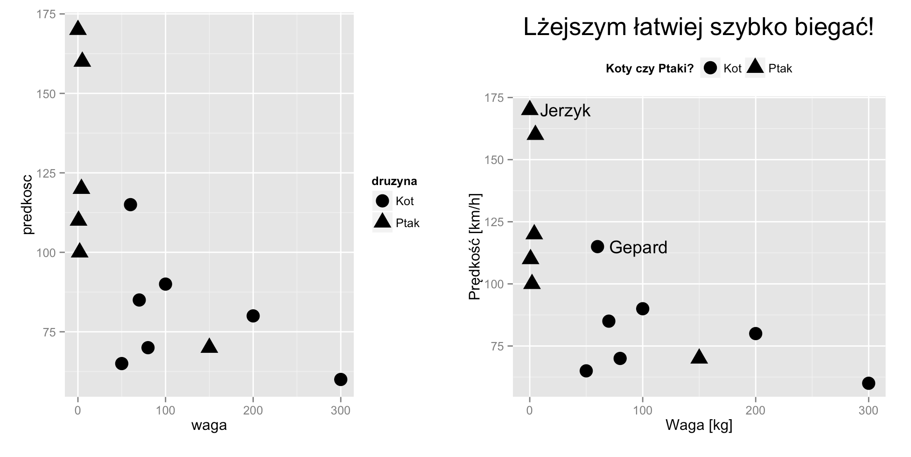
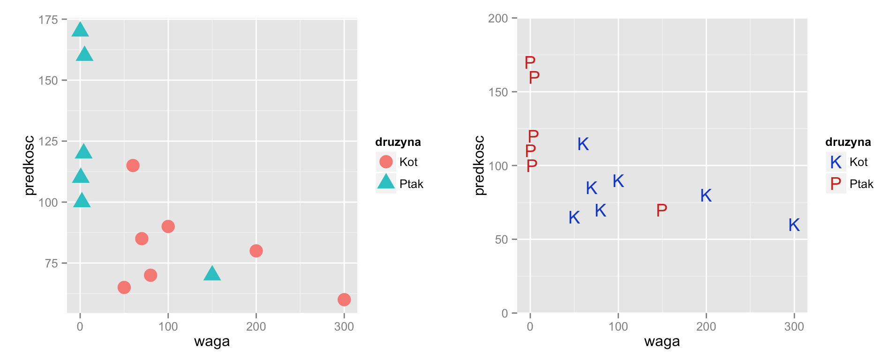
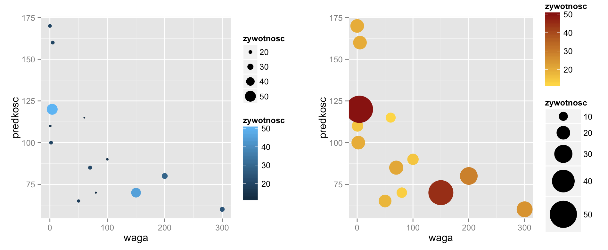
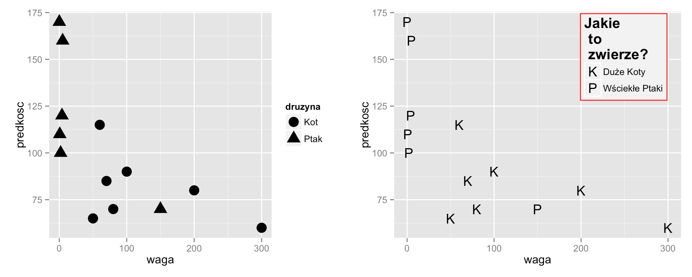
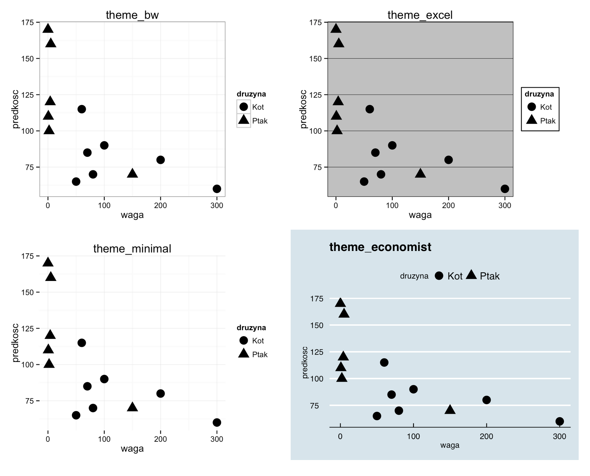

# O czym jest ten odcinek

Funkcje z pakietu ggplot2 wyglądają dobrze przy domyślnych ustawieniach.

Ale tworząc bardziej złożoną grafikę, często pojawia się potrzeba zmiany jakiegoś detalu.

W tym odcinku nauczymy się:

- Jak dodać adnotacje do wykresu?
- Jak kontrolować mapowanie dla cechy `shape` (kształt)?
- Jak kontrolować mapowanie dla cechy `color` (kolor)?
- Jak modyfikować legendę wykresu?
- Jak zmieniać motywy graficzne wykresu?

---

# Adnotacje, napisy na osiach i tytuły

Dobry tytuł wykresu i opisy osi to elementy, które znacznie ułatwiają poprawne odczytanie wykresu. Ich wkład jest umniejszany ale w rzeczywistości są to bardzo ważne elementy.

Dlaczego są one takie ważne? Ponieważ bez tytułu i opisu osi czytelnik może nie mieć pojęcia co wykres przedstawia. A jeżeli czytelnik nie wie co wykres przedstawia, to taki wykres jest bezużyteczny.

Dlaczego umniejszany? Ponieważ twórca wykresu zazwyczaj wie co wykres przedstawia i niekoniecznie ma ochotę i czas by dbać o czytelnika.

My będziemy tworzyć bardzo dobre wykresy, ponieważ na naszych wykresach wszystko będzie jasne i opisane.
Przyjrzyjmy się wykresowi z pierwszego odcinka i zastanówmy się, które elementy warto dodatkowo opisać?

Poświęć kilka minut by znaleźć przynajmniej pięć elementów, które warto lepiej opisać na tym wykresie.

```{r, fig.height=4, fig.width=5, message=FALSE, warning=FALSE}
library(PogromcyDanych)
ggplot(koty_ptaki, aes(x=waga, y=predkosc, shape=druzyna)) +
  geom_point(size=5) 
```

---

# Adnotacje, napisy na osiach i tytuły

Czy to było trudne zadanie? 

Mogło być, ponieważ widzieliśmy ten wykres już wiele razy i wiemy co on przedstawia. Jeżeli jednak udało Ci się znaleźć elementy, które warto dodatkowo opisać, to świetnie, jesteś na dobrej ścieżce by krytycznie patrzeć na wykresy.

Oto co ja znalazłem:

- W opisach osi brakuje jednostek. Jest informacja 'waga' ale w jakich to jednostkach? Kilogramach, funtach? 
- Podobny problem dotyczy prędkości, czy to kilometry na godzinę czy mile?
- Opis legendy 'druzyna' może i jest zabawny ale niewiele mówi. Jaka drużyna? Dla kogoś, kto nie skojarzy tych danych z wyścigami gatunków, ta nazwa nic nie mówi.
- O co chodzi z tym wykresem? Gdzie jest tytuł? Co on w ogóle przedstawia?
- Jakie gatunki reprezentują najbardziej skrajne punkty? Który kot i który ptak jest najszybszy?

Zobaczmy jak przygotować wykres z odpowiednimi adnotacjami.

---

# Adnotacje, napisy na osiach i tytuły

W poniższym przykładzie do wykresu dodajemy cztery linijki, każda zmieniająca określony element wykresu.

1. Funkcja `ggtitle()` dodaje tytuł do wykresu a funkcją `theme()` zmieniamy wielkość tytułu wykresu. Większy będzie wyraźniejszy. 

2. Funkcjami `xlab()` i `ylab()` dodajemy opisy dla osi. Do opisów osi dodaliśmy jednostki, warto też by opisy zaczynały się dużą literą i miały polskie znaki.

3. Aby zmienić tytuł legendy należy określić argument `name` (nazwa). Zrobimy to używając funkcji opisującej mapowanie na rozmiar (`scale_shape_discrete()`). Funkcją `theme()` przesuwamy tę legendę na górę wykresu (domyślnie jest po prawej stronie). 

4. Funkcją `geom_text()` dodajemy etykiety dla wybranych punktów na wykresie. Zaznaczyliśmy najszybszego kota i najszybszego ptaka.

# Adnotacje, napisy na osiach i tytuły

A oto i wykres po dodaniu tych modyfikacji

Przed [lewy]

```{r, fig.height=5, fig.width=5, message=FALSE, warning=FALSE, eval=FALSE}
ggplot(koty_ptaki, aes(x=waga, y=predkosc, shape=druzyna)) +
  geom_point(size=5)
```

Po [prawy]

```{r, fig.height=5, fig.width=5, message=FALSE, warning=FALSE, eval=FALSE}
ggplot(koty_ptaki, aes(x=waga, y=predkosc, shape=druzyna)) +
  geom_point(size=5) + 
  # większy i czytelny tytuł
  ggtitle("Lżejszym łatwiej szybko biegać!") + theme(plot.title = element_text(size=20)) + 
  # opisy osi
  xlab("Waga [kg]") + ylab("Prędkość [km/h]") + 
  # tytuł w legendzie
  scale_shape_discrete(name="Koty czy Ptaki?") + theme(legend.position="top") + 
  # dodatkowe napisy na wykresie
  geom_text(data=koty_ptaki[c(6,8),], aes(label=gatunek), hjust=-0.2)
```

<center></center>

```{r, fig.height=5, fig.width=5, message=FALSE, warning=FALSE, echo=FALSE, eval=FALSE}
# Przed
ggplot(koty_ptaki, aes(x=waga, y=predkosc, shape=druzyna)) +
  geom_point(size=5)
# Po
ggplot(koty_ptaki, aes(x=waga, y=predkosc, shape=druzyna)) +
  geom_point(size=5) + 
  # większy i czytelny tytuł
  ggtitle("Lżejszym łatwiej szybko biegać!") + theme(plot.title = element_text(size=20)) + 
  # opisy osi
  xlab("Waga [kg]") + ylab("Prędkość [km/h]") + 
  # tytuł w legendzie
  scale_shape_discrete(name="Koty czy Ptaki?") + theme(legend.position="top") + 
  # dodatkowe napisy na wykresie
  geom_text(data=koty_ptaki[c(6,8),], aes(label=gatunek), hjust=-0.2)
```

---

# Większa kontrola nad mapowaniami

Mapowania to jedne z najciekawszych rozwiązań w pakiecie `ggplot2`. Wystarczy, że wskażemy jakie zmienne mają być przedstawione na wykresie, oraz jakie cechy wykresu mają te zmienne opisać, a program R automatycznie dobiera sposób prezentacji uwzględniając typ zmiennej. Przy okazji sprawdzi czy przyjmuje ona kilka wartości czy wiele, czy jest zmienną ilościową czy jakościową itp. 

Czasem jednak, chcielibyśmy zmienić sposób reprezentacji zmiennych, a więc zmienić domyślne mapowanie. 

Możemy to zrobić korzystając z funkcji o nazwach zgodnych z szablonem `scale_xxx_yyy()`, gdzie `xxx` opisuje cechę na którą mapujemy (`shape`/`size`/`color`/`x`/`y`), a `yyy` opisuje sposób reprezentacji. 

Przykładowo, funkcja `scale_shape_manual()` pozwala na ,,ręczne'' zarządzanie mapowaniem zmiennej na kształty punktów. W tej funkcji argument `values=` pozwala na wskazanie jakimi kształtami mają być przedstawione poszczególne grupy, a argument `breaks=` pozwala wskazać wartości mapowanej zmiennej w legendzie. 

W podobny sposób `scale_color_manual()` pozwala na ręczne (manualne) wskazanie kolorów, które mają kodować poszczególne wartości.

A mapując na cechy `x` i `y` (współrzędne) interesującym parametrem jest `expand=`, który pozwala na określenie jak duże mają być marginesy na osi. 

# Większa kontrola nad mapowaniami

A oto i przykładowe zastosowanie wszystkich tych modyfikacji mapowań.

Przed [lewy]
```{r, fig.height=4, fig.width=5, message=FALSE, warning=FALSE, eval=FALSE}
ggplot(koty_ptaki, aes(x=waga, y=predkosc, shape=druzyna, color=druzyna)) +
  geom_point(size=5) 
```
Po [prawy]
```{r, fig.height=4, fig.width=5, message=FALSE, warning=FALSE, eval=FALSE}
ggplot(koty_ptaki, aes(x=waga, y=predkosc, shape=druzyna, color=druzyna)) +
  geom_point(size=5) +
  # określamy kształty poszczególnych grup K/P oraz etykiety w legndzie
  scale_shape_manual(values=c("K", "P"), breaks=c("Kot", "Ptak")) +
  # określamy kolory (ciemnoniebieski i ciemnoczerwony)
  scale_color_manual(values=c("blue3", "red3"), breaks=c("Kot", "Ptak")) +
  # dla osi OY usuwany marginesy poza zakresem 0-200
  scale_y_continuous(limits=c(0,200), expand=c(0,0)) 
```

<center></center>

```{r, fig.height=4, fig.width=5, message=FALSE, warning=FALSE, echo=FALSE, eval=FALSE}
# Przed
ggplot(koty_ptaki, aes(x=waga, y=predkosc, shape=druzyna, color=druzyna)) +
  geom_point(size=5) 
# Po
ggplot(koty_ptaki, aes(x=waga, y=predkosc, shape=druzyna, color=druzyna)) +
  geom_point(size=5) +
  # określamy kształty poszczególnych grup K/P oraz etykiety w legndzie
  scale_shape_manual(values=c("K", "P"), breaks=c("Kot", "Ptak")) +
  # określamy kolory (ciemnoniebieski i ciemnoczerwony)
  scale_color_manual(values=c("blue3", "red3"), breaks=c("Kot", "Ptak")) +
  # dla osi OY usuwany marginesy poza zakresem 0-200
  scale_y_continuous(limits=c(0,200), expand=c(0,0)) 
```

# Większa kontrola nad mapowaniami - zmienne ciągłe

Zobaczmy jak wygląda kontrolowanie mapowania zmiennych ciągłych. Jako przykład wykorzystamy zmienną `zywotnosc`. Będziemy ją mapować na kolor i wielkość punktu.

Jeżeli nie podoba nam się domyślny dobór kolorów (dla zmiennych ciągłych od czarnego do niebieskiego), to funkcją `scale_color_gradient()` możemy określić pomiędzy jakimi wartościami `low=` i `high=` ma rozpinać się skala kolorów. 

Dla wielkości punktu określamy jaki przedział żywotności ma być prezentowany `limits=` oraz na jaki zakres wielkości punktów ten przedział ma być przedstawiony `range=`.

Więcej informacji o możliwych dodatkowych parametrach znaleźć można w plikach pomocy dla funkcji `?scale_color_gradient` i `?scale_size_continuous`.

# Większa kontrola nad mapowaniami - zmienne ciągłe

A oto i przykładowe zastosowanie wszystkich tych modyfikacji mapowań.

Przed [lewy]

```{r, fig.height=4, fig.width=5, message=FALSE, warning=FALSE, eval=FALSE}
ggplot(koty_ptaki, aes(x=waga, y=predkosc, size=zywotnosc, color=zywotnosc)) +
  geom_point() 
```

Po [prawy]

```{r, fig.height=4, fig.width=5, message=FALSE, warning=FALSE, eval=FALSE}
ggplot(koty_ptaki, aes(x=waga, y=predkosc, size=zywotnosc, color=zywotnosc)) +
  geom_point() +
  # zmiana zakresu wartości dla wielkosci punktów
  scale_size_continuous(range=c(5,15), limits=c(10,50)) +
  # zmiana skali kolorów (ciągła skala, podaje się dwa skrajne kolory)
  scale_color_gradient(low="gold", high="red4")
```

<center></center>

```{r, fig.height=4, fig.width=5, message=FALSE, warning=FALSE, echo=FALSE, eval=FALSE}
# Przed
ggplot(koty_ptaki, aes(x=waga, y=predkosc, size=zywotnosc, color=zywotnosc)) +
  geom_point() 
# Po
ggplot(koty_ptaki, aes(x=waga, y=predkosc, size=zywotnosc, color=zywotnosc)) +
  geom_point() +
  scale_size_continuous(range=c(5,15), limits=c(10,50)) +
  scale_color_gradient(low="gold", high="red4")
```

---

# Modyfikacja legendy wykresu

Pakiet `ggplot2` automatycznie tworzy i rysuje legendę. W wielu przypadkach to domyślne zachowanie jest wystarczające i legenda jest wystarczająco czytelna. Ale czasem chcemy umieścić tę legendę w innym miejscu, inaczej ją zatytułować czy pokolorować.

To też można zmienić. Najczęściej wystarczy zmodyfikować poszczególne argumenty motywu graficznego, używając funkcji `theme()`.

W poniższym przykładzie funkcja `theme()` służy do określenia koloru tła i obramowania w legendzie, wielkości tytułu legendy oraz jej pozycji. Funkcja `scale_shape_manual()` określa elementy mapowania, tytuł legendy i nazwę kluczy na legendzie.

# Modyfikacja legendy wykresu

Przykład zmian w wyglądzie legendy.

Przed [lewy]

```{r, fig.height=4, fig.width=5, message=FALSE, warning=FALSE, eval=FALSE}
ggplot(koty_ptaki, aes(x=waga, y=predkosc, shape=druzyna)) +
  geom_point(size=5) 
```

Po [prawy]

```{r, fig.height=4, fig.width=5, message=FALSE, warning=FALSE, eval=FALSE}
ggplot(koty_ptaki, aes(x=waga, y=predkosc, shape=druzyna)) +
  geom_point(size=5) +
  # zmiana napisów w legendzie dotyczących mapowania na kształt
  scale_shape_manual(values=c("K", "P"), 
                     labels=c("Duże Koty", "Wściekłe Ptaki"), 
                     name="Jakie \n to \n zwierze?") +
  # dodanie szarego tła, większego tytułu oraz zmiana położenia legendy
  theme(legend.background = element_rect(color="red", fill="grey95"), 
        legend.title = element_text(size=15), 
        legend.position=c(0.8,0.8)) 
        # 0.8, 0.8 to współrzędne gdzie ma pojawić się legenda
```

<center></center>

```{r, fig.height=4, fig.width=5, message=FALSE, warning=FALSE, echo=FALSE, eval=FALSE}
# Przed [lewy]
ggplot(koty_ptaki, aes(x=waga, y=predkosc, shape=druzyna)) +
  geom_point(size=5) 
# Po [prawy]
ggplot(koty_ptaki, aes(x=waga, y=predkosc, shape=druzyna)) +
  geom_point(size=5) +
  scale_shape_manual(values=c("K", "P"), labels=c("Duże Koty", "Wściekłe Ptaki"), name="Jakie \n to \n zwierze?") +
  theme(legend.background = element_rect(color="red", fill="grey95"), 
        legend.title = element_text(size=15), 
        legend.position=c(0.8,0.8)) 
```

---

# Wiele wykresów w jednym oknie

Bardzo często chcemy umieścić kilka wykresów obok siebie. Poniżej pokażemy jak to zrobić.

W programie R wszystko jest obiektem. Oznacza to, że również wynik funkcji `ggplot()` jest obiektem, który można przypisać do zmiennej i później wielokrotnie wykorzystać.

Zilustrujmy to przykładem. Poniższa instrukcja przypisze definicje wykresu punktowego do zmiennej `pl_waga`. Żaden wykres nie będzie narysowany chyba, że wyświetlimy zawartość zmiennej `pl_waga`.

```{r, fig.height=4, fig.width=5, message=FALSE, warning=FALSE}
pl_waga <- ggplot(koty_ptaki, aes(x=waga, y=predkosc)) +
                geom_point(size=5)
```

Aby wyświetlić wykres `pl_waga` można wykorzystać funkcję `print()`. 

```{r, fig.height=4, fig.width=5, message=FALSE, warning=FALSE}
print(pl_waga)
```

# Wiele wykresów w jednym oknie - `vp=`

Jednym z argumentów funkcji `print()` dla wykresów, jest argument `vp=`. Pozwala on określić w którym miejscu ekranu wykres ma być rysowany. 

Domyślnie zarysowany jest cały obszar o współrzędnych [0,1]x[0,1], ale możemy zażyczyć sobie by wykres rysowany był w mniejszym obszarze. 

Jest to bardzo wygodne, jeżeli chcemy zmieścić kilka wykresów obok siebie. 

Poniższy przykład rysuje ten sam wykres trzykrotnie, za każdym razem w innym miejscu i z innym tytułem. Argumenty `x` i `y` określają środek zarysowanego obszaru, a `width` i `height` szerokość i wysokość zarysowanego prostokąta.

```{r, fig.height=5, fig.width=7, message=FALSE, warning=FALSE}
library(grid)
# rysujemy wykres w kwadracie o szerokości i wysokości 0.5 ekranu, 
# w lewym górnym rogu 
print(pl_waga + ggtitle("Wykres 1"), 
      vp=viewport(x=0.25, y = 0.75, width=0.5, height=0.5))
# rysujemy wykres w kwadracie o szerokości i wysokości 0.5 ekranu, 
# w lewym dolnym rogu 
print(pl_waga + ggtitle("Wykres 2"), 
      vp=viewport(x=0.25, y = 0.25, width=0.5, height=0.5))
# rysujemy wykres w prostokącie o szerokości 0.5 a wysokości pełnego ekranu, 
# po prawej stronie 
print(pl_waga + ggtitle("Wykres 3"), 
      vp=viewport(x=0.75, y = 0.5, width=0.5, height=1))
```

# Wiele wykresów w jednym oknie - `grid.layout`

Argument `vp=` pozwala na narysowanie wykresu w dowolnym miejscu na ekranie. 

Ale jeżeli chcemy rysować wykresy na regularnej siatce to wygodnie jest najpierw określić tę siatkę funkcją `grid.layout()`, a następnie wypełnić ją wykresami wskazując pozycje siatki do zarysowania. Zobaczmy jak to zrobić.

Tworzymy opis siatki o rozmiarze dwa wiersze i dwie kolumny. Następnie wklejamy wykresy, do wybranych komórek poprzednio zdefiniowanej siatki.

```{r, fig.height=5, fig.width=7, message=FALSE, warning=FALSE}
pushViewport(viewport(layout = grid.layout(2,2)))
# rysujemy w komórce o współrzędnych 1x1
print(pl_waga + ggtitle("Wykres 1"),
      vp = viewport(layout.pos.row=1, layout.pos.col=1))
# rysujemy w komórce o współrzędnych 2x1
print(pl_waga + ggtitle("Wykres 2"),
      vp = viewport(layout.pos.row=2, layout.pos.col=1))
# rysujemy w komórce o współrzędnych 1:2x2
print(pl_waga + ggtitle("Wykres 3"),
      vp = viewport(layout.pos.row=1:2, layout.pos.col=2))
```

# Wiele wykresów w jednym oknie - `grid.arrange`

Najprostszym sposobem na wyświetlenie kilku wykresów obok siebie (jeżeli tylko nie potrzebujemy żadnego wyrafinowano rozmieszczenia) jest użycie funkcji `grid.arrange()` z pakietu `gridExtra`.

Wystarczy jako kolejne argumenty podać wykresy, które mają być wyświetlone a funkcja `grid.arrange()` sama je uporządkuje. Argumentem `ncol` można określić w ilu kolumnach mają być wyświetlane wykresu.


```{r, fig.height=5, fig.width=7, message=FALSE, warning=FALSE}
library(gridExtra)

grid.arrange( pl_waga + ggtitle("Wykres 1"), 
              pl_waga + ggtitle("Wykres 2"), 
              pl_waga + ggtitle("Wykres 3"),
              ncol=2)
```

---

# Motywy graficzne

Do tego miejsca mogło nam trochę obrzydnąć szare tło na wykresach. 

Okazuje się, że w prosty sposób można zmienić wygląd całego wykresu, używając tzw. motywów, czyli kompletów ustawień graficznych. Wiele takich motywów dostępnych jest w pakiecie `ggthemes`. 

Aby zmienić wygląd wykresu wystarczy dodać funkcję z motywem. Nazwy funkcji z motywami graficznymi zazwyczaj rozpoczynają się od `theme_`. 

Poniżej przykład dla czterech motywów graficznych. Zachęcam do samodzielnego sprawdzenia jak wyglądają inne.

Przygotowujemy wykres punktowy, do którego dodamy motywy.
```{r, fig.height=4, fig.width=5, eval=FALSE}
pl <- ggplot(koty_ptaki, aes(x=waga, y=predkosc, shape=druzyna)) +
  geom_point(size=5) 
```
Włączamy pakiet z dodatkowymi motywami. Jeżeli nie jest zainstalowany, należy go wcześniej zainstalować funkcją `install.packages()`.
```{r, fig.height=4, fig.width=5, eval=FALSE}
library(ggthemes)
# białe tło i szare linie pomocnicze
pl + theme_bw()
# wykres stylizowany na wykresy z Excela
pl + theme_excel()
# wykres z usuniętymi dodatkowymi elementami
pl + theme_minimal()
# wykres stylizowany na gazecie Economist
pl + theme_economist()
```

<center></center>

```{r, fig.height=4, fig.width=5, echo=FALSE, message=FALSE, warning=FALSE, eval=FALSE}
library(ggthemes)
pl <- ggplot(koty_ptaki, aes(x=waga, y=predkosc, shape=druzyna)) +
  geom_point(size=5) 
pl + theme_bw() + ggtitle("theme_bw")
pl + theme_excel() + ggtitle("theme_excel")
pl + theme_minimal() + ggtitle("theme_minimal")
pl + theme_economist() + ggtitle("theme_economist")
```

---

# Ciekawostki

Elastyczność pakietu `ggplot2` jest olbrzymia. Można robić bardzo niestandardowe rzeczy.

Przykładowo, możliwe jest tworzenie wykresów w stylu popularnych komiksów z serii XKCD http://xkcd.com/

```{r, fig.height=4, fig.width=5, message=FALSE, warning=FALSE}
# aby można było rysować wykresy jak w komiksach XKCD potrzebny jest pakiet xkcd. 
# Jeżeli go jeszcze nie masz, najpierw zainstaluj.
library(xkcd)
ggplot(koty_ptaki, aes(x=waga, y=predkosc)) +
  geom_point(size=5) + xkcdaxis(c(0,300),c(50,200))

```

A bazując na motywie `theme_bw()` można uzyskać inwersję domyślnych wykresów z pakietu `ggplot2`. Nie są to być może codziennie używane możliwości, ale pokazują, że zgłębiając pakiet `ggplot2` nie natkniemy się na barierę w stylu ,,tego się nie da zrobić''.

```{r, fig.height=4, fig.width=5, echo=FALSE}
pl <- ggplot(koty_ptaki, aes(x=waga, y=predkosc, shape=druzyna)) +
  geom_point(size=5) 
```
```{r, fig.height=4, fig.width=5,  message=FALSE, warning=FALSE}
pl + theme_bw() + theme(plot.background = element_rect(fill = "gray80"))
```


---

# Co dalej

- Informację o różnych nakładkach dla pakietu `ggplot2` znaleźć można na `easyGgplot2` 
http://www.sthda.com/english/wiki/easyggplot2

- Niezła ściągawka jak korzystać z pakietu *,,ggplot2''* file:///Users/pbiecek/Downloads/ggplot2-cheatsheet.pdf

- Wklejając wykresy do Excela lub Worda może nam zależeć na wykresach, które można edytować. In a to jest metoda http://www.sthda.com/english/wiki/create-an-editable-graph-from-r-software

- Wiele przydatnych wskazówek można również znaleźć w internetowej książce *,,Cookbook for R''* http://www.cookbook-r.com/Graphs/ oraz w dokumencie *Effective tables and graphs in official statistics, Government Statistical Service*
https://gss.civilservice.gov.uk/wp-content/uploads/2014/12/Effective-graphs-and-tables-in-official-statistics-version-1.pdf

- W internecie znaleźć można wiele stron z poradami, jak robić dobre wykresy. Wybrane ciekawe listy takich porad to:
    * *Do’s and Don’ts* http://stat545-ubc.github.io/block015_graph-dos-donts.html
    * *Ten Simple Rules for Better Figures*  http://www.ploscompbiol.org/article/info:doi/10.1371/journal.pcbi.1003833
    * *Twenty rules for good graphics* http://robjhyndman.com/hyndsight/graphics/

# Zadanie, sezon 2, odcinek 9

+ Podobnie jak w poprzednim odcinku, wybierz samochody marki Volkswagen model Passat a następnie narysuj jak średnia cena zależy od roku produkcji za pomocą geometrii `geom_smooth()`. Następnie zobacz jak ten wykres będzie wyglądał z motywami `theme_bw()`, `theme_excel()` i `theme_economist()`.

+ Zmień poniższy wykres, zamieniając skalę kolorów na od zielonego do czerwonego, kropki zamień na kwadraty a do wykresu dodaj tytuł (i odpowiednie etykiety osi).

```{r, eval=FALSE}
ggplot(koty_ptaki, aes(x=waga, y=predkosc, size=zywotnosc, color=zywotnosc)) +
  geom_point() 
```

Przykładowe odpowiedzi znajdują się na stronie http://pogromcydanych.icm.edu.pl/materials/1_przetwarzanie/9_zadania_sezon2.html

