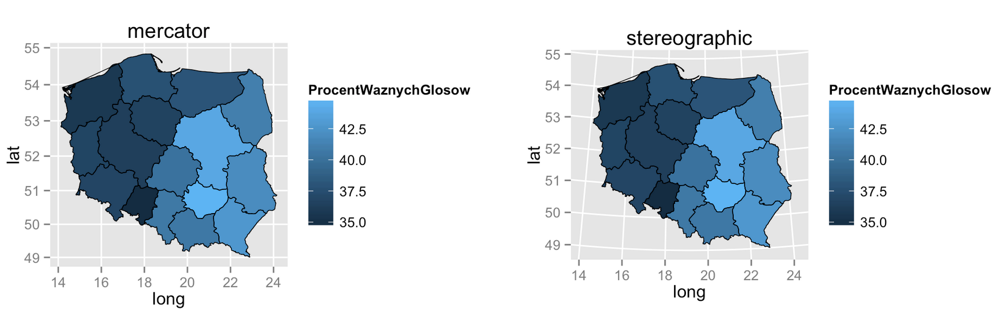

# O czym jest ten odcinek

Jednym z bardzo atrakcyjnych wizualnie sposobów prezentacji danych są kartogramy, czyli popularne ,,mapki''.

W tym odcinku nauczymy się

- Jak wczytywać dane o mapach?
- Jak przedstawiać na mapach informacje za pomocą koloru wypełnienia?
- Jak przedstawiać na mapach informacje za pomocą wielkości punktów lub słupków?

W tym odcinku będziemy pracować ze zbiorem danych `mandatySejmik2014`, który jest dostępny w pakiecie `PogromcyDanych`.

---

# Zbiór danych

W tym odcinku będziemy pracować na zbiorze danych o wynikach wyborów samorządowych z roku 2014 do sejmików.

Zbiór danych `mandatySejmik2014` dla każdego z 16 województw pokazuje ile mandatów zdobyli kandydaci pod sztandarami SLD, PiS, PO, SLD i innymi.

W kolumnie `ProcentWaznychGlosow` przedstawiono procent ważnych oddanych głosów (w stosunku do osób uprawnionych do głosowania) a ostatnie dwie kolumny przedstawiają długość i szerokość geograficzną środka województwa.

```{r, fig.height=4, fig.width=5, message=FALSE, warning=FALSE}
# jeżeli pakiet nie jest zainstalowany, należy go najpierw zainstalować 
# funkcją install.packages("PogromcyDanych")
library(PogromcyDanych)
# pierwsze sześć wierszy ze zbioru danych
head(mandatySejmik2014)
```

---

# Pliki z mapami / kształtami - shape files

Aby przedstawiać informacje na mapach w programie R, należy wpierw wczytać obrysy map.

Takie dane są udostępnione w plikach o rozszerzeniu `.shp`, nazywanych z angielska *shape files* i z tej nazwy będę korzystał poniżej. 

Pliki z kształtami województw Polski, które wykorzystam w tym odcinku, pochodzą z bazy danych GADM http://www.gadm.org i mają pewne niewielkie błędy w kodowaniu, które ręcznie naprawimy. 

Po pobraniu danych, w katalogu `dane/POL_adm` znajdują się kształty obszarów na różnych poziomach szczegółowości. Plik `POL_adm0.shp` to obrys całego kraju, `POL_adm1.shp` to obrysy województw a `POL_adm2.shp` to obrysy gmin. 

Funkcją `readShapePoly()` wczytamy dane o obrysach województw do zmiennej `shp1`. 
Ale zanim zaczniemy pracować z tą funkcją, potrzebujemy wczytać kilka bibliotek. Jeżeli ich nie ma, należy je zainstalować.
```{r, fig.height=4, fig.width=5, message=FALSE, warning=FALSE}
library(maptools)
library(rgdal)
library(gpclib)
gpclibPermit()
```
Wczytujemy dane o kształtach województw z plików *shape files*.
```{r, fig.height=4, fig.width=5, message=FALSE, warning=FALSE}
shp1 <- readShapePoly("../dane/POL_adm/POL_adm1.shp") 
```

Obiekt `shp1` to obiekt klasy `SpatialPolygonsDataFrame` i więcej o jego elementach, można dowiedzieć się z pliku pomocy `?SpatialPolygonsDataFrame`.

Przykładowo, zmienna `shp1@data` zawiera zbiór danych dołączony do kształtów, a w tym konkretnym pliku `shp1@data$VARNAME_1` zawiera nazwy województw.

Z uwagi na błąd w kodowaniu musimy w nim poprawić nazwę dla województwa Łódzkiego.

```{r, fig.height=4, fig.width=5, message=FALSE, warning=FALSE}
# W zmiennej VARNAME_1 znajdują się nazwy województw
shp1@data$VARNAME_1 <- as.character(shp1@data$VARNAME_1)
shp1@data$VARNAME_1
```
Poprawiamy kodowanie polskich znaków w województwie Łódzkim.
```{r, fig.height=4, fig.width=5, message=FALSE, warning=FALSE}
shp1@data$VARNAME_1[4] <- "Lodzkie"
```

---

# Rysowanie mapy województw

Dane wczytane przez funkcję `readShapePoly()` mają specyficzną strukturę - listy wektorów, będących obrysami obszarów. Jedno województwo to nie zawsze obrys jednego obszaru, jeżeli mamy województwa nadmorskie, oraz chcemy uwzględnić wyspy, to na jedno województwo będą się składały też obrysy każdej z wysp.

Aby można było takie dane narysować w pakiecie `ggplot2` należy je wpierw przetransportować do formatu tabelarycznego. Najłatwiej to zrobić funkcją `fortify()`. Zmienia ona format danych na tabelaryczny. W poniższym przykładzie nowy format dla obrysów województw jest zapisany w zmiennej `shp1f`. 

Pierwsze dwie kolumny tej tabeli to współrzędne geograficzne punktów na obrysie każdego województwa. 

```{r, fig.height=4, fig.width=5, message=FALSE, warning=FALSE}
library(ggplot2)
# fortify zmienia format danych na zgodny z pakietem ggplot2
shp1f <- fortify(shp1, region = "VARNAME_1")
head(shp1f, 4)
```

Mając dane w formacie tabelarycznym, możemy je narysować, np. używając geometrii `geom_path`. Tak jak na poniższym przykładzie.

```{r, fig.height=4, fig.width=5, message=FALSE, warning=FALSE}
ggplot() +
  geom_path(data=shp1f, aes(x=long, y=lat, group=id), colour="black", size=0.25)
```

---

# Rysowanie mapy województw - `geom_map()`

Geometrii `geom_path()` będziemy używać do rysowania obrysów województw. 

Ale do zaznaczenia wartości liczbowych na mapie za pomocą koloru wypełnienia użyjemy geometrii `geom_map()`. 

Argument `map=` tej geometrii wskazuje obiekt przedstawiający województwa (tutaj `shp1f`). Argument `data=` wskazuje na obiekt z danymi liczbowymi, czyli nasze dane o mandatach w sejmikach. W mapowaniach dla geometrii `geom_map()` określa się też cechę `map_id=` aby wskazać nazwy województw oraz `fill=` by wskazać która zmienna ma być przedstawiona kolorem wypełnienia.

Poniższy przykład rysuje kartogram, w którym informacja o procencie oddanych ważnych głosów przedstawiamy kolorem wypełnienia

```{r, fig.height=4, fig.width=7, message=FALSE, warning=FALSE}
# pusty zrąb wykresu
ggplot() +
  # rysowanie wypełnień
    geom_map(data=mandatySejmik2014, aes(map_id=Wojewodztwo, fill=ProcentWaznychGlosow), 
             map=shp1f) +
  # rysowanie obrysów na czarno
    geom_path(data=shp1f, aes(x=long, y=lat, group=id), colour="black", size=0.25)
```

---

# Rysowanie mapy

Z rysowaniem map związane jest pojęcie projekcji, czyli sposobu odwzorowania trójwymiarowej powierzchni globu na dwuwymiarowej powierzchni wykresu.

Mapy można rysować w różnych projekcjach, nie ma jednej idealnej. Niektóre zachowują lepiej pola, inne kąty, inne długości odcinków. Listę projekcji z opisem właściwości można znaleźć pod adresem http://en.wikipedia.org/wiki/List_of_map_projections.

W programie R, w pakiecie `ggplot` możemy korzystać z większości popularnych projekcji.
Aby wybrać którąś z nich, wystarczy dodać wywołanie funkcji `coord_map()`. 

Poniżej dwa przykładowe wykresy, różniące się projekcjami. Ponieważ w skali globu obszar Polski nie jest duży, różnice pomiędzy mapami są raczej subtelne.

Przygotowujemy wykres i wczytujemy go do zmiennej `mapka`.

```{r, fig.height=4, fig.width=7, message=FALSE, warning=FALSE, eval=FALSE}
mapka <- ggplot() +
    geom_map(data=mandatySejmik2014, aes(map_id=Wojewodztwo, fill=ProcentWaznychGlosow), 
             map=shp1f) +
    geom_path(data=shp1f, aes(x=long, y=lat, group=id), colour="black", size=0.25) 
```
Przekształcamy mapę, stosując różne projekcje
```{r, fig.height=4, fig.width=7, message=FALSE, warning=FALSE, eval=FALSE}
# projekcja mercator (odwzorowanie walcowe równokątne)
# zachowuje kąty pomiędzy równoleżnikami a południkami
mapka + coord_map(projection="mercator") + ggtitle("mercator")
# projekcja stereographic (rzut stereograficzny)
mapka + coord_map(projection="stereographic") + ggtitle("stereographic")
```

<center></center>

```{r, fig.height=4, fig.width=5, message=FALSE, warning=FALSE, echo=FALSE, eval=FALSE}
mapka <- ggplot() +
    geom_map(data=mandatySejmik2014, aes(map_id=Wojewodztwo, fill=ProcentWaznychGlosow), 
             map=shp1f) +
    geom_path(data=shp1f, aes(x=long, y=lat, group=id), colour="black", size=0.25) 

mapka + coord_map(projection="mercator") + ggtitle("mercator")
mapka + coord_map(projection="stereographic") + ggtitle("stereographic")
```

---

# Rysowanie mapy - pracujemy nad szczegółami

Narysowaliśmy już kilka kartogramów. Ale nie są one jeszcze najpiękniejsze. Jak je modyfikować?

Mapy wykonane z pakietem `ggplot2` modyfikuje się podobnie jak inne wykresy w pakiecie `ggplot2`. 

Na poniższym przykładzie przedstawiamy kilka przykładowych zmian. Funkcją `theme_bw()` zmieniamy domyślny motyw wykresu, funkcją `scale_fill_gradient()` zmieniamy sposób reprezentacji zmiennej za pomocą koloru wypełniania, a dodatkowymi argumentami funkcji `theme()` usuwamy wszystkie dodatkowe elementy wykresu.

```{r, fig.height=4, fig.width=7, message=FALSE, warning=FALSE}
ggplot() +
    geom_map(data=mandatySejmik2014, aes(map_id=Wojewodztwo, fill=ProcentWaznychGlosow), 
             map=shp1f) +
    geom_path(data=shp1f, aes(x=long, y=lat, group=id), colour="white", size=1) +
  # określamy projekcje mercator
  coord_map(projection="mercator") +
  # zmieniamy motyw graficzny, usuwając szare tło
  theme_bw() +
  # zmienną ilościową będziemy prezentować na skali kolorów od szarości po czerń
  scale_fill_gradient(low = "grey90", high = "black") +
  # dodatkowe elementy motywu usuwają wszystko co zbędne z wykresu, linie pomocnicze, osie
  theme(axis.ticks = element_blank(),     panel.border = element_blank(),
        axis.text.x = element_blank(),    axis.text.y = element_blank(),
        panel.grid.minor=element_blank(), panel.grid.major=element_blank(),
        axis.title.x = element_blank(),   axis.title.y = element_blank())
```

---

# Rysowanie mapy - zmienna jako wielkość punktu.

Nie zawsze przedstawianie danych za pomocą koloru wypełnienia to dobry pomysł.

Alternatywny sposób prezentacji informacji na mapie to np. wielkość punktu. 

Do rysowania punktów można wykorzystać geometrię `geom_point()`, wskazując jako współrzędne punktu środki województw, a wielkość punktu uzależniamy od zmiennej `ProcentWaznychGlosow`. 

Aby punkty były bardziej widoczne powiększamy je modyfikując mapowanie za pomocą funkcji `scale_size_continuous()`. 

Należy być ostrożnym z takimi zmianami, w tym przypadku różnica w wielkości punktów przerysowuje rzeczywiste różnice wynikające z liczb, które te wielkości prezentują.

```{r, fig.height=4, fig.width=7, message=FALSE, warning=FALSE}
ggplot() +
  geom_point(data=mandatySejmik2014, aes(x=long, y=lat, size=ProcentWaznychGlosow)) +
  geom_path(data=shp1f, aes(x=long, y=lat, group=id), colour="black", size=0.25) +
  # określamy projekcje mercator
  coord_map(projection="mercator") +
  # zmieniamy motyw graficzny, usuwając szare tło
  theme_bw() +
  # zmienną ilościową będziemy prezentować na skali wielkości punktów od 1 do 20
  scale_size_continuous(range=c(1,20)) +
  theme(axis.ticks = element_blank(),     panel.border = element_blank(),
        axis.text.x = element_blank(),    axis.text.y = element_blank(),
        panel.grid.minor=element_blank(), panel.grid.major=element_blank(),
        axis.title.x = element_blank(),   axis.title.y = element_blank())
```

---

# Rysowanie mapy - zmienna jako długość paska

Jeszcze innym sposobem prezentacji danych liczbowych na mapach są długości słupków. 

Aby dorysować informację o mandatach zdobytych przez PO wykorzystamy geometrię `geom_rect()`. 

Należy do niej podać współrzędne `xmin` i `xmax` oznaczające początek i koniec słupka oraz `ymin` i `ymax` zależne od wartości zmiennej `PO`.

```{r, fig.height=4, fig.width=5, message=FALSE, warning=FALSE}
ggplot() +
  geom_path(data=shp1f, aes(x=long, y=lat, group=id), colour="grey", size=0.25) +
  geom_rect(data=mandatySejmik2014, aes(xmin=long-0.3, xmax=long-0.1, 
                                        ymin=lat, ymax=lat + PO/15), fill="orange3", color="white") +
  # określamy projekcje mercator
  coord_map(projection="mercator") +
  # zmieniamy motyw graficzny, usuwając szare tło
  theme_bw() +
  theme(axis.ticks = element_blank(),     panel.border = element_blank(),
        axis.text.x = element_blank(),    axis.text.y = element_blank(),
        panel.grid.minor=element_blank(), panel.grid.major=element_blank(),
        axis.title.x = element_blank(),   axis.title.y = element_blank())
```

---

# Rysowanie mapy - zmienna jako długość paska

Jeżeli udało się narysować na mapie wyniki dla jednej partii, możemy dodać kolejne warstwy z wynikami dla kolejnych partii.

Na poniższym wykresie realizujemy ten pomysł. Dodajemy słupki prezentujące liczbę zdobytych mandatów przez PiS, PSL i SLD, każdą partię oznaczamy innym kolorem. Łatwiej dzięki temu zauważyć, która partia wygrała w którym województwie i z jaką przewagą.

```{r, fig.height=4, fig.width=5, message=FALSE, warning=FALSE}
ggplot() +
  geom_path(data=shp1f, aes(x=long, y=lat, group=id), colour="grey", size=0.25) +
  # warstwa z paskami, prezentująca liczbę mandatów zdobytych przez PO
  geom_rect(data=mandatySejmik2014, aes(xmin=long-0.3, xmax=long-0.1, 
                                        ymin=lat, ymax=lat + PO/15), fill="orange3", color="white") +
  # warstwa z paskami, prezentująca liczbę mandatów zdobytych przez PiS
  geom_rect(data=mandatySejmik2014, aes(xmin=long-0.1, xmax=long+0.1, 
                                        ymin=lat, ymax=lat + PiS/15), fill="blue3", color="white") +
  # warstwa z paskami, prezentująca liczbę mandatów zdobytych przez PSL
  geom_rect(data=mandatySejmik2014, aes(xmin=long+0.1, xmax=long+0.3, 
                                        ymin=lat, ymax=lat + PSL/15), fill="green3", color="white") +
  # warstwa z paskami, prezentująca liczbę mandatów zdobytych przez SLD
  geom_rect(data=mandatySejmik2014, aes(xmin=long+0.5, xmax=long+0.3, 
                                        ymin=lat, ymax=lat + SLD/15), fill="red", color="white") +
  # inne graficzne parametry, tak jak w poprzednim przykładzie
  coord_map(projection="mercator") +
  theme_bw() +
  scale_size_continuous(range=c(1,20)) +
  theme(axis.ticks = element_blank(),     panel.border = element_blank(),
        axis.text.x = element_blank(),    axis.text.y = element_blank(),
        panel.grid.minor=element_blank(), panel.grid.major=element_blank(),
        axis.title.x = element_blank(),   axis.title.y = element_blank())
```
---

# Co dalej

- Świetne omówienie możliwości prezentowania danych na mapach zaprezentowanie jest w tym artykule *ggmap: Spatial Visualization with ggplot2* http://journal.r-project.org/archive/2013-1/kahle-wickham.pdf

- Krótkim streszczeniem, z ciekawymi przykładami będzie ten blog *Making Maps in R* http://www.kevjohnson.org/making-maps-in-r/

- Wiele przydatnych wskazówek można również znaleźć w internetowej książce *,,Cookbook for R''* http://www.cookbook-r.com/Graphs/


