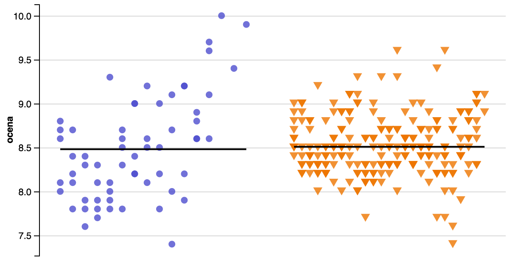
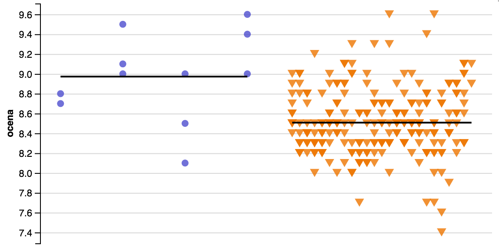

# O czym jest ten odcinek?

Analizując dane, często natrafiamy na sytuację, gdy mamy do porównania dwie grupy obserwacji i chcemy sprawdzić, czy te grupy różnią się między sobą.

W przypadku danych medycznych to mogą być pacjenci biorący lek A i lek B, a pytanie, które nas może nurtować to czy skuteczność obu leków jest porównywalna czy też jedne z nich jest istotnie skuteczniejszy. Analizując uprawę zbóż możemy mieć dwie odmiany i pytanie czy jedna uprawa daje wyższe plony niż druga. Podobne przykłady można mnożyć.

Zazwyczaj gdy w jednej grupie policzymy średnią określonej cechy i w drugiej grupie policzymy średnią tej cechy, to któraś z tych średnich jest większa. Ale czy różnica pomiędzy tymi średnimi jest istotna? A może jej wielkość jest pomijalna?

Jako przykład wyobraźmy sobie następującą sytuację. Przypuśćmy, że porównuje średnie dzienne temperatury we Wrocławiu i średnie dzienne temperatury w Warszawie, i będę robił to dzień w dzień przez kolejnych 30 dni. Przypuśćmy, że średnia we Wrocławiu jest wyższa o około 0,5 stopnia Celsjusza od średniej w Warszawie. Ale czy ta różnica wynika z losowych fluktuacji temperatury czy też jest odzwierciedleniem pewnej ogólnej prawidłowości, że we Wrocławiu jest średnio cieplej?

W odpowiedzi na podobnie sformułowane pytania pojawia się statystyka. Używając takich narzędzi jak testy dla dwóch prób możemy pomóc sobie w odpowiedzi na pytanie, czy obserwowane różnice są czysto przypadkowe, czy też nie.

W tym odcinku, na przykładzie danych z serwisu IMDB (Internet Movie Database), pokażemy jak działa test permutacyjny, uniwersalne narzędzie do porównywania dwóch grup.

---

# Baza danych o filmach i serialach

W bazie danych o filmach IMDB (Internet Movie Database) znaleźć można dane o serialach w tym średnie oceny użytkowników wystawione kolejnym odcinkom serialu.

Przykładowo, na stronie http://www.imdb.com/title/tt0108778/epdate?ref_=ttep_ql_4 znajdują się oceny serialu *Friends* a na stronie http://www.imdb.com/title/tt0903747/epdate?ref_=ttep_ql_4  oceny serialu *Breaking Bad*.

Dane te zostały pobrane z Internetu i przygotowane tak, że teraz są dostępne w zbiorze danych `serialeIMDB` w pakiecie `PogromcyDanych`, który towarzyszy temu kursowi.

```{r, warning=FALSE, message=FALSE}
library(PogromcyDanych)
head(serialeIMDB)
```

---

# Czy serial Friends jest lepszy niż serial Breaking Bed?

Mając zbiór danych o serialach, możemy porównać oceny odcinków dwóch seriali. 

Na początek wyciągnijmy ze zbioru danych o wszystkich serialach dwa podzbiory, osobno oceny dla serialu *Friends* i oceny dla serialu *Breaking Bad*

Oceny dla serialu Friends

```{r}
ocenyFriends     <- serialeIMDB[serialeIMDB$serial == "Friends", "ocena"]
summary(ocenyFriends)
```

Oceny dla serialu Breaking Bad

```{r}
ocenyBreakingBad <- serialeIMDB[serialeIMDB$serial == "Breaking Bad", "ocena"]
summary(ocenyBreakingBad)
```

Średnia w jednym serialu to `8.508` a w drugim `8.481`. 

Czy to duża różnica czy mała?

---

# Graficzne zestawienie

Pokażmy jak oceny dla obu seriali wyglądają gdy się je zestawi obok siebie porządkując oceny wzdłuż wspólnej osi.

Po lewej *Breaking Bad* po prawej *Friends*. Każdy punkt to ocena jednego odcinka.

Czy obserwowana różnica jest duża? A czy jest istotna statystycznie?

```{r, echo=FALSE, message=FALSE, warning=FALSE, fig.width=8, fig.height=6}
library(dplyr)
library(ggvis)
  tmp <- serialeIMDB[serialeIMDB$serial %in% c("Friends", "Breaking Bad"), ]
  tmp$col <- c("#4d4dce", "#EE7600")[as.numeric(droplevels(tmp$serial))]
  tmp <- tmp %>% 
    group_by(serial) %>%
    mutate(serialx = as.numeric(as.character(odcinek))/(1.2*max(as.numeric(as.character(odcinek)))))
  tmp$serialx <- as.numeric(droplevels(tmp$serial)) + tmp$serialx
pp <- tmp  %>%
  ggvis(x = ~serialx, y = ~ocena, fill := ~col) %>%
  group_by(serial) %>%
  layer_text(text := ~nazwa, opacity=0, fontSize:=1) %>%
  layer_points(fillOpacity:=0.8, shape = ~serial) %>%
  hide_axis("x") %>%
  set_options(width = 640,padding = padding(10, 10, 50, 50)) %>%
  add_legend(c("fill", "shape")) %>%
  layer_model_predictions(model = "lm", formula = ocena ~ I(serialx*0))
```
<center></center>


# Testowanie średnich - algorytm

Statystycy opracowali wiele testów aby porównać wartości w dwóch grupach. W większości przypadków te testy dają zbliżone wyniki, więc zamiast przedstawiać ich listę wyjaśnimy sposób działania na jednym przykładzie. Przedstawimy tak zwany test permutacyjny do porównywania średnich.

Pomysł na porównanie dwóch grup składa się z trzech kroków. Przedstawmy je jeden po drugim.

### Krok 1: Postaw hipotezę, określ co chcesz porównać

Będziemy testować hipotezę (=przypuszczenie), czy wartości w jednym zbiorze są istotnie większe niż wartości w drugim zbiorze. 

Tę hipotezę, sformujmy w następujący sposób: *Czy obserwowana różnica pomiędzy średnimi ocenami jest wystarczająco duża, by uznać ją za istotną (mieć pewność, która grupa jest większy)?*

### Krok 2: Określ miarę wielkości różnic

Ustalmy, że wielkość różnicy pomiędzy grupami będziemy mierzyć za pomocą wartości bezwzględnej z różnicy pomiędzy średnimi w obu grupach.

```{r}
mean(ocenyBreakingBad)
mean(ocenyFriends)
# moduł różnicy średnich
(obserwowana_roznica <- abs(mean(ocenyBreakingBad) - mean(ocenyFriends)))
```

# Testowanie średnich - algorytm

### Krok 3: Porównaj zaobserwowaną wielkość różnicy z różnicą w sytuacji gdyby grupy nie były różne

Wciąż nie wiemy, czy `0.026` to duża różnica czy mała. Musimy ją z czymś porównać.
Najlepiej by było porównać ją z wartościami, które byśmy obserwowali gdyby te dwie grupy się nie różniły. 

Ale skąd wiadomo jakie byłyby różnice gdyby obie grupy się nie różniły? 
Możemy to oszacować w następujący sposób

* [I] Wymieszamy losowo wartości w obu grupach zachowując liczebność grup. Dzięki temu otrzymamy dwie grupy o których wiemy, że się nie różnią istotnie (są losowo wymieszane) a jedyne różnice wynikają z losowych fluktuacji,
* [II] Policzymy jak duża jest różnica dla tych nowo wylosowanych grup,
* [III] Powtórzymy kroki [I] i [II] wielokrotnie (np. 99 999 razy) aby zobaczyć jak duże wartości może przyjmować ta różnica w sytuacji gdy obie grupy nie różnią się od siebie.

Liczenie różnic na próbach różniących się jedynie losową fluktuacją jest realizowane przez poniższy kod.

```{r}
# połączony wektor ocen z obu seriali
ocenyRazem <- c(ocenyFriends, ocenyBreakingBad)
# ile pierwszych ocen pochodzi z Friends
liczbaFriends <- length(ocenyFriends)
# wynikiem funkcji replicate będzie 99999 wartości, modułów różnic średnich po wymieszaniu obserwacji pomiędzy grupami
roznice <- replicate(99999, {
  # wymieszaj losowo wartości pomiędzy grupami
  wymieszane <- sample(ocenyRazem)
  # losowo dobrane próby, pierwsze 'liczbaFriends' wartości to grupa pierwsza, reszta to druga
  oceny1 <- wymieszane[1:liczbaFriends]
  oceny2 <- wymieszane[-(1:liczbaFriends)]
  # różnica pomiedzy losowymi grupami
  abs(mean(oceny1) - mean(oceny2))
})
# jedną z permutacji jest brak permutacji, dodajemy więc obserwowaną różnicę
roznice <- c(roznice, obserwowana_roznica)
# wyświetl 20 różnic zaobserowanych w przypadku losowego podziału na grupy
head(roznice,20)
```

# Czy serial Friends jest lepszy niż serial Breaking Bed?

Możemy teraz wartość `obserwowana_roznica` porównać z wektorem wartości `roznice`. 

Wektor `roznice` opisuje jakich różnic spodziewać się możemy, gdy próby różnią się wyłącznie losowymi fluktuacjami. Gdyby `obserwowana_roznica` była znacząco większa niż wartości z wektora różnice, to byłby to silny argument za tym, że różnica w średnich nie jest przypadkowa.

Porównajmy na wykresie wielkości różnic dla losowych fluktuacji (na szaro) z obserwowaną różnicą (na czerwono).

```{r}
# wektor referencyjnych różnic po losowym podziale na grupy
hist(roznice, 50, col="grey", main="", las=1, border="white")
# obserowana różnica w średnich pomiędzy Friends a Breaking Bad
abline(v=obserwowana_roznica, col="red", lwd=5)
```

# Czy serial Friends jest lepszy niż serial Breaking Bed? - p-wartość

Wykres pomaga w zrozumieniu na ile obserwowana różnica średnich różni się od tych, wygenerowanych przez losowe fluktuacje.

Ale aby podjąć decyzje lepiej mieć jedną liczbę. Policzmy jaka część różnic dla losowych fluktuacji jest większa lub równa niż obserwowana różnica. Taka częstość jest nazywana p-wartością.

```{r}
# p-wartość
mean(roznice >= obserwowana_roznica) 
```

Gdy próby są losowo wymieszane, a więc ich średnie, teoretycznie są równe.
Czy wiedząc, że w wyniku losowych przypisać aż w 64\% przypadków obserwuje się większą różnicę niż ta pomiędzy *Friends* a *Breaking Bad*, czy uznamy różnicę pomiędzy tymi dwoma serialami za istotną?

Pewnie nie. To jaki próg przyjmiemy zależy od konkretnego zastosowania, ale często za próg wybiera się 0.05. Z powodów historycznych.

W każdym razie, jeżeli otrzymana p-wartość jest mniejsza niż 0.05, to przyjmiemy, że obserwowana wartość jest istotnie różna od przypadkowej (=0). Jeżeli otrzymana p-wartość jest większa równa 0.05 to przyjmiemy, że nie ma istotnych statystycznie różnic.

W przypadku part Friends i Breaking Bad, ta różnica była niewielka i raczej uznamy, że nie istotna statystycznie.


# Czy serial Friends jest lepszy niż serial Sherlock?

Porównajmy teraz dwa inne seriale. 

Zacznijmy od wykresu, po lewej prezentujemy serial Sherlock po prawej Friends.

```{r, echo=FALSE, warning=FALSE, message=FALSE}
tmp <- serialeIMDB[serialeIMDB$serial %in% c("Friends", "Sherlock"), ]
tmp$col <- c("#4d4dce", "#EE7600")[as.numeric(droplevels(tmp$serial))]
tmp <- tmp %>% 
  group_by(serial) %>%
  mutate(serialx = as.numeric(as.character(odcinek))/(1.2*max(as.numeric(as.character(odcinek)))))
tmp$serialx <- as.numeric(droplevels(tmp$serial)) + tmp$serialx
pp <- tmp  %>%
  ggvis(x = ~serialx, y = ~ocena, fill := ~col) %>%
  group_by(serial) %>%
  layer_text(text := ~nazwa, opacity=0, fontSize:=1) %>%
  layer_points(fillOpacity:=0.8, shape = ~serial) %>%
  hide_axis("x") %>%
  set_options(width = 640,padding = padding(10, 10, 50, 50)) %>%
  add_legend(c("fill", "shape")) %>%
  layer_model_predictions(model = "lm", formula = ocena ~ I(serialx*0))
```
<center></center>

# Czy serial Friends jest lepszy niż serial Sherlock?

Różnica średnich pomiędzy tymi dwoma serialami wynosi 0.48. Wygląda na dużo, ale czy mamy jakiś argument, że jest to więcej niż przypadkowa fluktuacja?

```{r}
ocenyFriends     <- serialeIMDB[serialeIMDB$serial == "Friends", "ocena"]
ocenySherlock    <- serialeIMDB[serialeIMDB$serial == "Sherlock", "ocena"]
# moduł różnicy średnich
(obserwowana_roznica <- abs(mean(ocenyFriends) - mean(ocenySherlock)))
```

Powtórzmy test permutacyjny dla tych dwóch seriali. Tym razem obserwowana różnica jest wyższa niż praktycznie wszystkie wartości wygenerowane przez test permutacyjny.

```{r}
# połączony wektor ocen z obu seriali
ocenyRazem <- c(ocenyFriends, ocenySherlock)
# ile pierwszych ocen pochodzi z Friends
liczbaFriends <- length(ocenyFriends)
# permutacyjny test
liczbaFriends <- length(ocenyFriends)
roznice <- replicate(99999, {
  wymieszane <- sample(ocenyRazem)
  oceny1 <- wymieszane[1:liczbaFriends]
  oceny2 <- wymieszane[-(1:liczbaFriends)]
  # różnica pomiedzy losowymi grupami
  abs(mean(oceny1) - mean(oceny2))
})
# dodajemy obserowaną różnicę
roznice <- c(roznice, obserwowana_roznica)
```

# Czy serial Friends jest lepszy niż serial Sherlock? - p-wartość

Policzywszy różnice dla losowych fluktuacji, możemy zestawić je graficznie z różnicą średnich dla Sherlocka i Friends. 

Tym razem p-wartość jest bardzo mała, obserwowana różnica średnich pomiędzy serialami jest znacznie większa niż te, które widać dla losowego podziału na grupy.

Uznamy więc, że Sherlock ma istotnie wyższą średnią ocen niż Friends.

```{r}
# p-wartość dla różnicy średnich
mean(roznice >= obserwowana_roznica)
```
```{r}
# wektor referencyjnych różnic po losowym podziale na grupy
hist(roznice, 50, col="grey", main="", las=1, border="white", xlim=c(0,0.5))
# obserwowana różnica w średnich pomiędzy Friends a Sherlock
abline(v=obserwowana_roznica, col="red", lwd=5)
```

---

# Które dwa seriale różnią się istotnie?

Używając poniższej aplikacji można porównać dowolne dwa seriale oraz ocenić, czy różnica jest statystycznie istotnie różna.

<center><iframe width="870" height="700" frameborder="0" src="http://beta.icm.edu.pl/IMDB2/"></iframe></center>

---

# Zadania

* Znajdź dwa seriale (inne niż Friends i Sherlock), które różnią się istotnie, przyjmując za próg istotności 0.05.

* Znajdź dwa seriale (inne niż Friends i Breaking Bad), które nie różnią się istotnie, przyjmując za próg istotności 0.05.


