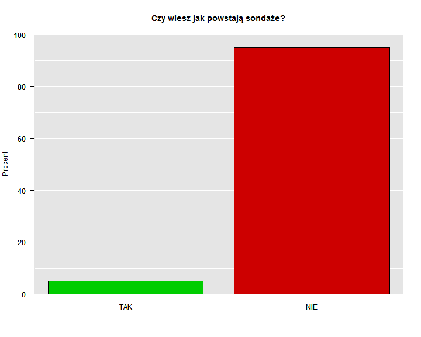
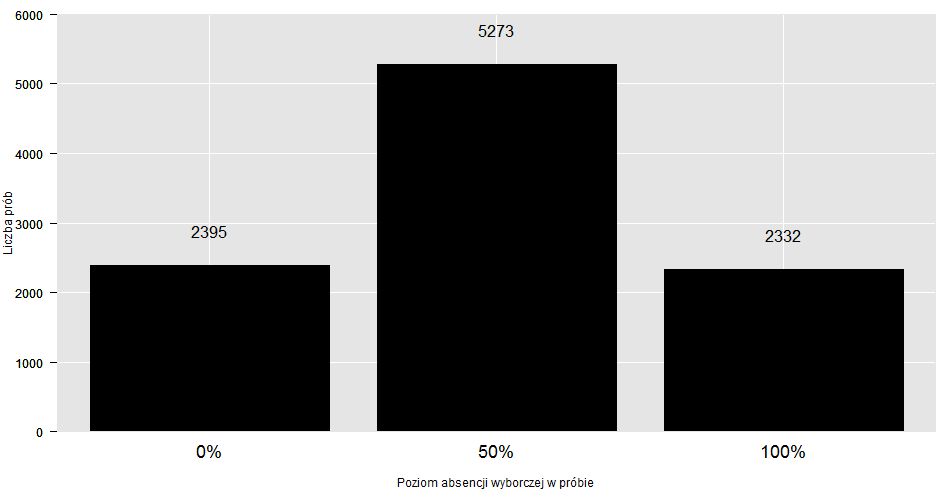
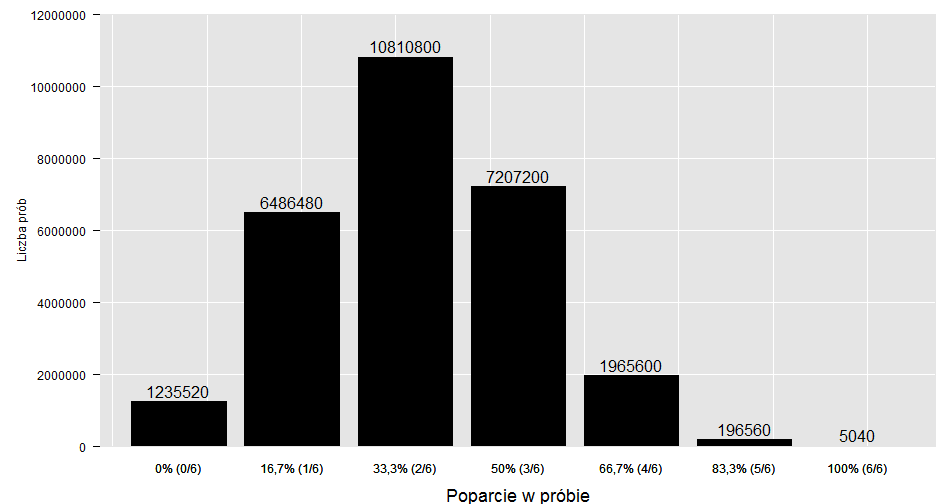
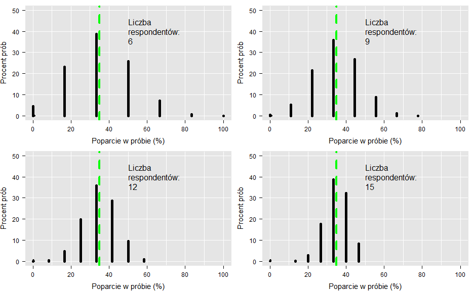
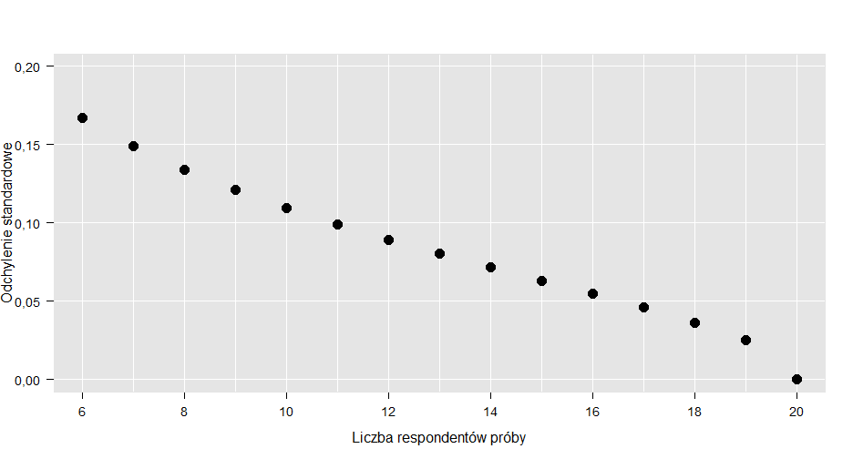
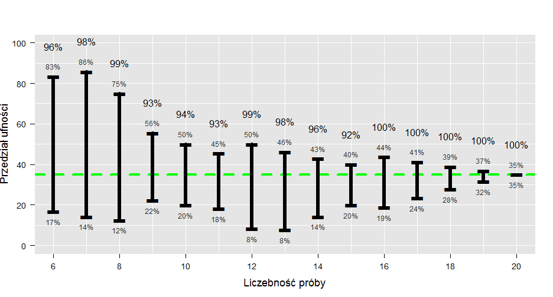
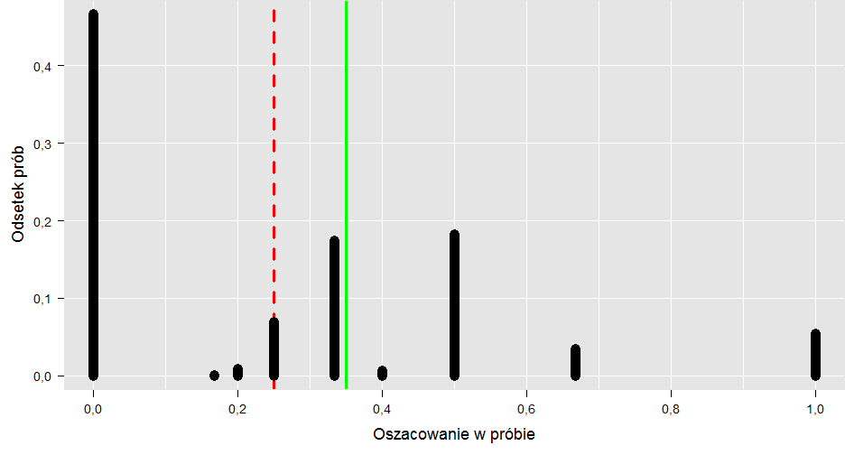

# 1. Wstęp
Z badań przeprowadzonych przez zespół Na Straży Sondaży w 2014 r. wynika, że 95%
Polaków nie wie jak powstają sondaże!

Jak interpretować ten wynik? Co on oznacza? Odpowiedź jest prosta. Praktycznie nic, bo ta informacja nie ma żadnej wartości. Dlaczego? Nie tylko dlatego, że jest zmyślona. Podstawowy problem stanowi brak jakiejkolwiek noty metodologicznej: nie powiedziałem dokładnie kiedy zorganizowano badanie, jaką techniką je przeprowadzono (telefonicznie czy bezpośrednio), jak zadano pytanie - co to znaczy, że ktoś wie jak powstają sondaże, a także nie zdefiniowałem kim są Polacy - czy są to obywatele, czy mieszkańcy Polski, w jakim byli wieku. Nie podałem również jakim błędem mogą być obarczone wyniki (tzw. błąd statystyczny), ani ile osób wzięło udział w badaniu. Codziennie w prasie i innych mediach pojawiają się podobne “dane sondażowe”. Czy mają one jakąkolwiek wartość? Czy można im zaufać? Jak odróżnić “dobry” sondaż od “złego”.
Na te oraz inne pytania postaramy się udzielić odpowiedzi w trakcie naszego kursu. Pokażemy na czym polega sondaż, z jakich elementów się składa, jakie są jago ograniczenia - czego nie powie nam nawet najlepsze badanie. Zaczniemy od przykładów łatwych, a skończymy na bardziej zaawansowanych próbując wcielić się na chwilę w rolę “sondażysty”. W imieniu zespołu Na Straży Sondaży zapraszamy do odkrywania niezwykłych możliwości, ale także pewnych ograniczeń metody zwanej reprezentacyjną, metody która stoi za wszystkimi sondażami.

__Zadania 1:__  

  1. Wymień trzy artykuły prasowe z 2014 r., w których powołano się na wyniki badań społecznych (sondaży). Napisz ile osób wzięło udział w badaniu oraz kiedy je zrealizowano, o ile w artykule podano tego rodzaju informacje. 

L.p.          | Tytuł artykułu| Link do strony z artykułem | Czy podano wielkość próby? Zapisz ją jeżeli została podana | Czy podano dokładną datę realizacji badania? Jaką?
------------- | --------------|----------------------------|----------------------------------------------------------------|-----------------------------------------------------
1.            |               |                            |
2.            |               |                            |
3.            |               |                            |

# 2. Metoda reprezentacyjna

Na pierwszy rzut oka badanie sondażowe, badanie na próbie, może się wydawać zadaniem karkołomnym. Oto na podstawie niewielkiej liczby obserwacji np. 1000 respondentów, staramy się opisać dużo większą, czasami nawet o kilka rzędów, populację. Czy ma to jakikolwiek sens? Czy da się wyznaczyć na tej podstawie przeciętną wagę, wzrost, miesięczne wydatki, liczbę przeczytanych książek albo czas spędzany dziennie na Facebooku przez dorosłych mieszkańców Polski. Trzeba wiedzieć, że oficjalnie mieszka około 31 mln ludzi w wieku 18 i więcej lat. W tej sytuacji 1000 osób stanowi w zaokrągleniu trzy dziesięciotysięczne PROCENTA populacji (1 000 /31 000 000 = 0,000032)!!! To bardzo mało. Trudno uwierzyć, że taka garstka obserwacji może dostarczyć nam wiarygodnych informacji o całej badanej zbiorowości. Dla porównania zastanówmy się, czy na podstawie jednego kilometra drogi da się powiedzieć, jak będzie wyglądała cała podróż mierząca 300 000 km (Ziemia w obwodzie liczy tylko 40 000 km). Na pierwszy rzut oka nie. Okazuje się jednak, że nauka, pod postacią statystyki, daje nam pewne narzędzia, które pozwalają trafnie wnioskować o dużych “obiektach” nawet na podstawie ich niewielkiego wycinka. W przypadku podróży kluczem do sukcesu byłoby umiejętne wybranie takich małych odcinków z całej drogi, które ułożą się w próbny kilometr.
Statystycy i badacze społeczni wiedzą doskonale, że dobrze dobrana próba stanowi świetny opis całej populacji. Jak to możliwe? Co trzeba zrobić, żeby przy użyciu małego kamyka dowiedzieć się czegoś o wielkiej "górze"?

__Zadania 2:__      

  1. Wymień trzy badania na próbach przeprowadzone przez instytucje państwowe  i podaj link do ich wyników lub raportu. Mogą to być badania z roku 2014, ale także wcześniejszych lat. 

L.p.          |Nazwa instytucji publikującej wyniki | Tytuł badania  | Link do strony z raportem 
--------------|-------------------------------------|----------------|----------------------------
1.            |                                     |                |
2.            |                                     |                |
3.            |                                     |                |

# 3. Przykłady prób

Zacznijmy od naszych codziennych doświadczeń. Wbrew pozorom większość naszej wiedzy o świecie czerpiemy z prób. I nie chodzi tu o metodę prób i błędów. Przyjrzyjmy się naszemu zdrowiu. Czasami zdarza się, że lekarz każe nam zrobić badanie krwi. Ale czy to oznacza, że trzeba zbadać całą krew w organizmie, wszystkie komórki? Na szczęście nie. Wystarczy mała próbka. Lekarz pobiera od nas zaledwie 10 ml krwi. W całym organizmie mamy jej aż 4,5l (4500ml). Tak więc próba stanowi 1/450. całej objętości krwi. To bardzo bardzo mało. Mimo to lekarz potrafi określić, co dzieje się w całym organizmie, a nie tylko w pobranej próbce. 
Weźmy inny, mniej dramatyczny przykład. Wyobraźmy sobie, że chcemy ugotować zupę i lubimy, gdy jest ona odpowiednio słona. Jak to sprawdzamy? Czy musimy wypić całą zupę z garnka? Absolutnie nie. Wystarczy jedna łyżeczka, która zawiera 15ml zupy i stanowi zaledwie 3/1000 pięciolitrowego garnka. Znowu dobraliśmy niewielką próbkę, żeby zbadać większą całość. Ale przypadek zupy jest szczególny. Żeby przekonać się, czy zupa jest odpowiednio słona, musimy ją najpierw dobrze WYMIESZAĆ. Tylko wtedy proporcja soli w łyżce zupy, będzie taka sama jak proporcja w całym garnku - łyżka zupy będzie dobrze reprezentować całą zupę. Kluczową kwestią jest więc REPREZENTATYWNOŚĆ PRÓBY.  Na pewno niektórzy słyszeli już to pojęcie. Zapamiętajmy je na chwilę, chociaż później będziemy musieli z niego zrezygnować. Reprezentatywność można rozumieć na różne sposoby. Często mówi się, że tak jak w przypadku łyżki zupy, próba musi być “miniaturą” populacji. Innymi słowy powinna odtwarzać strukturę i zależności obserwowane w całej zbiorowości. W przypadku badania krwi lub zupy brzmi to sensownie. Zauważmy jednak, że badane substancje są “jednorodne”. Każda porcja zupy czy krwi jest właściwie identyczna (dla uproszczenia, bo specjaliści z pewnością powiedzą, że to nie jest takie proste). A co jeśli badana zbiorowość nie jest i nie może być jednorodna? To problem, z którym bardzo często mierzą się nauki społeczne.

__Zadania 3:__      

  1. Podaj przykład badania na próbie, które można przeprowadzić w naszym codziennym życiu (np. badanie ilości soli w zupie). 

L.p.          |Czego dotyczy badanie? | Co jest próbą?  
--------------|-----------------------|----------------
1.            |  Opis badania         | Opis próby          
2.            |  Opis badania         | Opis próby      
3.            |  Opis badania         | Opis próby      

# 4. Sondaż 

Przejdźmy do badań społecznych i tzw.  sondaży politycznych. Ich wyniki często pojawiają się w prasie i mają duże znaczenie dla polityków oraz pewnie trochę mniejsze dla wyborców.  Wyobraźmy sobie, że chcemy zmierzyć poziom poparcia dla wybranej partii X w wyborach do parlamentu. Dla naszych celów odsłońmy kilka faktów dotyczących badanej zbiorowości:

### Tabela 4.1. Rozkład preferencji politycznych w (fikcyjnej) populacji dorosłych obywateli Polski (%)

|       | Nie biorę udziały w wyborach | NIE |  Tak | Razem |
|-------|------------------------------|-----|------|-------|
|Miasto | 30                           | 5   | 25   | 60    |
|Wies   | 20                           | 10  | 10   | 40    |
|RAZEM  | 50                           | 15  | 35   | 100   |

W powyższej tabeli umieściliśmy procentowy rozkład dwóch cech w populacji pełnoletnich  mieszkańców Polski (dane fikcyjne). Pierwszą cechą jest miejsce zamieszkania (w wierszach), a drugą poparcie dla partii X (w kolumnach). Widzimy, że w miastach mieszka 60% ludności, a na wsi 40%. Łącznie w całej zbiorowości (RAZEM) 35% obywateli zagłosowałoby na partię X, 15% na inną partię, a 50% w ogóle nie wzięłoby udziału w wyborach. Możemy również powiedzieć, że osoby mieszkające w mieście i popierające partię X stanowią 25% ogółu  uprawnionych do głosowania, a także że osoby które mieszkają na wsi i nie biorą udziału w wyborach stanowią 20% populacji. Oczywiście, w normalnych warunkach tego typu informacje są niedostępne dla badacze. My je “odsłaniamy” potrzeby kursu. 
 
Zastanówmy się jak z powyższej populacji dobrać próbę reprezentatywną, aby móc trafnie na jej podstawie ocenić, jaki procent mieszkańców Polski popiera partię X?
I tu pojawia się pierwszy problem. Nie da się bowiem “wymieszać” obywateli tak jak zupy. Zbiorowość nie jest jednorodna. Preferencje wśród mieszkańców miast i wsi nie są identyczne. Nie ma więc gwarancji, że jeśli idąc ulicą w mieście lub na wsi zapytamy dowolnych 10 osób o ich preferencje partyjne to będziemy mogli powiedzieć jakie jest poparcie w całym kraju. W uproszczeniu w mieście 4 na 10 osób zagłosowałoby na  (bo 25%/60%???0,4), a na wsi 1 na 4 (bo 10%/40%=0,25). W pierwszym przypadku poparcie będzie zawyżone, a w drugim zaniżone, w stosunku do ogólnokrajowych wyników (35%). Widać więc, że nie każda próba będzie “REPREZENTATYWNA”. I tu zatrzymajmy się znowu przy definicji REPREZENTATYWNOŚCI. Zauważmy, że zależy nam na tym, aby wynik z próby był zgodny z tym co obserwujemy w populacji. Czyli w zasadzie nie musi być tak, że próba jest miniatura populacji. Ważniejsze jest to, że na jej podstawie prawidłowo odgadujemy wyniki dla całej zbiorowości.
Żeby przeprowadzić nasz polityczny sondaż musimy zrealizować badanie zarówno na wsi jak i w mieście. Każda osoba należąca do populacji musi mieć szansę znalezienia się w próbie. To bardzo ważne. Sposób dobierania próby, zwany schematem, nie może uniemożliwiać nikomu znalezienia się w próbie. 
W dalszej części kursu pokażemy jak prawidłowo zdefiniować populację, jak błędy w kwestionariuszu mogą wpłynąć na zachowanie respondentów, jak dobrać, a dokładnie wylosować próbę reprezentatywną, 

__Zadania 4:__      

  1. Czy w przypadku badania populacji mieszkańców Polski, wyniki sondy ulicznej przeprowadzonej w Warszawie, Krakowie lub Poznaniu można uznać za wiarygodne (dające się uogólnić na całą populację)?    
    + TAK
    + NIE     
  2. Na podstawie danych z Tabeli 1. POPULACJA WYBORÓW odpowiedz na poniższe pytania:     
    a. Jaki procent mieszkańców wsi popiera ?    
    b. Jaki procent mieszkańców miasta nie pójdzie na wybory?    
    c. Jaki procent osób które nie popierają partii X mieszka w mieście?

# 5. Problem badawczy -> populacja -> technika realizacji badania
Co powinien zrobić każdy prawdziwy sondażysta przed rozpoczęciem badania? Powienien odpowiedzieć sobie na  trzy podstawowe pytania.   

1.  **Jak zdefiniować problem badawczy?**     

W przypadku badań sondażowych to pytanie możemy uściślić w następujący sposób: jaką cechę naszej zbiorowości chcemy zmierzyć. Co rozumieć przez cechę w tym przypadku? Opisując duża zbiorowość musimy zdecydować się na jakiś kompromis i uogólnienia. Sondaż nie odpowie nam na pytanie, jak zachowują się poszczególni mieszkańcy Polski. Możemy natomiast za jego pomocą określić, jak zachowują się przeciętnie albo jak zachowuje się większość z nich. Sondaż pozwala więc badać parametry, cechy, populacji takie jak średnia (np. waga) lub odsetek osób w pewien sposób wyróżnionych(np. odsetek osób uczestniczących w wyborach).     
Najczęściej sondaże realizuje się, aby poznać preferencje wyborcze obywateli. Problemem badawczym może być jednak także coś innego. Wiele sondaży służy ocenie  przeciętnych dochody, wydatków, a także preferencji konsumenckich w danej grupie społecznej.   
Określenie problemu badawczego stanowi punkt wyjścia do następego pytania.

2.  **Jak zdefiniować badaną populację? O jakiej zbiorowości chcemy wnioskować?**   

Załóżmy, że interesuje nas populacja Polaków. Czy to znaczy, że będziemy badać wszystkich ludzi na świecie posiadających obywatelstwo polskie albo mówiących po polsku? A może tylko tych spośród nich, którzy mieszkają w kraju? Albo ogólnie mieszkańców Polski niezależnie od tego, czy posiadają obywatelstwo czy też nie?    
Musimy również zadecydować, czy interesują nas ludzie w każdym wieku, czy może tylko pełnoletni z prawem do głosowania (18+)? Lub też osoby w wieku produkcyjnym i poprodukcyjnym (15+)?       
Najczęściej sondaże w Polsce obejmują populację pełnoletnich obywateli zamieszkałych na terenie kraju. Istnieją jednak badania społeczne dla których, ze względu na poruszaną problematykę, populacje definiuje się zupełnie inaczej. I tak istnieją badania zbiorowości osób w wieku 15 lat, zbiorowości pełnoletnich obywateli województwa małopolskiego itp.      
Określenie problemu badawczego i zdefiniowanie populacji to nie wszystko. Trzeba bowiem jeszcze dostosować do nich sposób w jaki pozyskiwane będą dane od respondentów.

3.  **Jaką techniką zrealizować badanie?**   

Trudno sobie bowiem wyobrazić badanie dochodów mieszkańców Polski przeprowadzone przy pomocy ankiety internetowej. Dalece bowiem nie wszyscy członkowie tej zbiorowości są w łączności z "globalną siecią". Bywają oczywiście sytuacje, w których stosowanie takiej metody jest uzasadnione i z pewnością w przyszłości, wraz z poprawą dostępu do sieci, zdominuje ona badania sondażowe.  Jak na razie jednak ankiety internetowe funkcjonują w cieniu dwóch innych częściej stosowanych metod zbierania danych. Ogólnie możemy więc wyróżnić trzy następujące grupy technik realizowania badań sondażowych:     

  1. Wywiady bezpośrednie;   
  2. Wywiady telefoniczne;    
  3. Ankiety internetowe. 

Wywiady "bezpośrednie" są realizowane w "terenie", najczęściej w miejscu zamieszkania losowo dobranych respondentów. Pozwalają on dotrzeć do największej grupy ludności, nieosiągalnej poprzez połączenie telefoniczne, bądź przez Internet. Tego typu technikę często stosuje się w badaniach ogólnopolskich, dotyczących populacji mieszkańców całego kraju. Metoda bezpośrednia wiąże się z dużymi kosztami oraz długim okresem realizacji. Ankieterzy musza bowiem dotrzeć osobiście do wszystkich respondentów. Czasami pokonują w tym celu kilkadziesiąt kilometrów. Zdarza się bowiem, że  odległości między poszczególnymi respondentami są bardzo duże. Co więcej, respondenci bywają nieuchwytni i w związku z tym, aby się z nimi skontaktować, trzeba wielokrotnie ponawiać wizyty. Sondaże bezpośrednie wymagają więc dużych nakładów pracy. Mają one jednak jedną poważną zaletę. Są nią ankieterzy. Dzięki nim respondenci chętniej biorą udział w badaniu. Odsetkiem odmów wzięcia udziału w sondażach realizowanych metodą bezpośrednią jest stosunkowo niski. Respondentom trudniej jest odmówić ankieterowi, który odwiedza ich bezpośrednio, niż takiemu który kontaktuje się z nimi telefonicznie.       

Wywiady telefoniczne to zupełnie inna bajka. Obecnie jest to jedna z najczęściej wykorzystywanych metod zbierania danych. Jej popularność wynika  przede wszystkim z niskich kosztów oraz krótkiego czasu realizacji. Łatwiej jest bowiem przeprowadzić 1000 rozmów telefonicznych niż zorganizować 1000 spotkań z respondentami. Sami jednak wiemy, jak takie badania wyglądają w praktyce: „przepraszam, nie mam czasu” albo „już brałem udział w tym badaniu” przychodzi nam przez telefon dużo łatwiej, niż podobne zachowanie w bezpośredniej konfrontacji z ankieterem. Nic więc dziwnego, że w tego rodzaju badaniach tylko co dziesiąty telefon kończy się zrealizowanym wywiadem. Dla porównania technika bezpośrednia pozwala zrealizować wywiad z co trzecią dobraną do próby osobą.      
Poważnym ograniczeniem badań telefonicznych jest to, że mogą one być realizowane tylko w odniesieniu do populacji, której członkowie posiadają telefony. Co więcej wywiady telefoniczne  musza być w miarę krótkie ponieważ respondenci nie lubią długo "wisieć" na telefonie. W związku z tym konieczne jest również ograniczenie liczby pytań w ankiecie, a co za tym idzie ograniczenie liczby możliwych do przeprowadzenia analiz.    

Ostatnia grupa technik to wspomniane wcześniej ankiety internetowe. Nie chodzi tu o sondy umieszczane na stronach WWW, ale o badania, w których sondażysta wybiera respondentów np. wysyłając im maile z kluczem do ankiety umieszczonej w sieci. Tego typu techniki budzą wiele kontrowersji, szczególnie gdy są wykorzystywane do wnioskowania o populacjach, takich jak mieszkańcy Polski. Wiadomo bowiem, że nie wszyscy członkowie takiej zbiorowości posiadają komputer i wiedzą jak korzystać z Internetu. Innymi słowy jest to technika wykluczająca duże grupy społeczne, prawdopodobnie większe niż w przypadku badania telefonicznego. W związku z tym trudno jest mówić o reprezentatywności wyników w tym przypadku. Powodem dla którego realizuje się tego rodzaju badania jest koszt, niewątpliwie niższy niż w przypadku wywiadów bezpośrednich czy telefonicznych.   

Aby łatwiej rozróżniać poszczególne metody zbierania danych sondażyści, nadali im specjalne oznaczania. Można się na nie natknąć w artykułach prasowych lub w notach metodologicznych różnych badań. Poniżej znajduje się tabela z objaśnieniami oznaczeń czterech najczęściej stosowanych technik zbierania danych wraz z ich oznaczeniem.      

### Tabela 5.1. Techniki realizacji badań

| Technika | PAPI (Paper And Pencil Interviewing)                                                                                                         | CAPI,(ComputerAssisted Personal Interviewing)                                                                                                                                                | CATI (Computer Assisted Telephone Interviewing)                                                                                                                                                                  | CAWI (Computer Assisted Web Interviewing)                                                                             |
|----------|----------------------------------------------------------------------------------------------------------------------------------------------|----------------------------------------------------------------------------------------------------------------------------------------------------------------------------------------------|------------------------------------------------------------------------------------------------------------------------------------------------------------------------------------------------------------------|-----------------------------------------------------------------------------------------------------------------------|
| Opis     | Wywiad bezpośredni - respondent dostaje od ankietera kartkę z pytaniami, bierze ołówek lub długopis i zapisuje (zaznacza) swoje odpowiedzi;   | Wywiad bezpośredni - ankieter przychodzi do respondenta z laptopem (lub innym urządzeniem mobilnym) i odczytuje ze specjalnego programu pytania, a następnie zapisuje w nim odpowiedzi.        | Wywiad telefoniczny - ankieter dzwoni pod losowo wybrany numer telefonu i osobie, która odbierze, zadaje pytania z przygotowanego kwestionariusza. Odpowiedzi są zapisywane w specjalnym programie komputerowym. | Ankieta internetowe - brak ankietera, respondent wypełnia kwestionariusz samodzielnie na stronie internetowej. |
| Zalety   | * możliwość stosowania techniki do bardzo różnych populacji; * stosunkowo niski odsetek odmów wzięcia udziału w badaniu;                     | * możliwość stosowania techniki do bardzo różnych populacji; * stosunkowo niski odsetek odmów wzięcia udziału w badaniu; * możliwość gromadzenia danych bezpośrednio w systemie komputerowym | * bardzo szybka realizacja; * stosunkowo niskie koszty; * możliwość gromadzenia danych bezpośrednio w systemie komputerowym                                                                                      | * bardzo niskie koszty; * możliwość gromadzenia danych bezpośrednio w systemie komputerowym                           |
| Wady     | * wysokie koszty; * długi czas realizacji; * konieczność przepisywania wyników z ankiety papierowej do systemu komputerowego - możliwe błędy | * wysoki koszt; * długi czas realizacji;                                                                                                                                                     | * duży odsetek odmów wzięcia udziału w badaniu; * ograniczone zastosowanie techniki                                                                                                                              | * bardzo ograniczone zastosowanie techniki;                                                                                                                     |

Szczególnie istotną cechą różnicującą opisane powyżej techniki jest tak zwany poziom realizacji próby (nazywany również poziomem response-rate), czyli odsetek osób wytypowanych przez nas do udziału w badaniu, z którymi faktycznie udało się przeprowadzić wywiad. Warto wiedzieć, że praktycznie nigdy nie występuje sytuacja, w której sondażystom udaje się zapytać o opinię wszystkie osoby dobrane przez nich do próby. Dzieje się tak z kilku powodów. Po pierwsze, nie do wszystkich osób udaje się dotrzeć/dodzwonić. Powodem mogą być choroby, wakacje, delegacje służbowe itp. Ponadto część osób, do których uda się dotrzeć, z różnych przyczyn odmawia wzięcia udziału w badaniu.  Oba te czynniki są dodatkowym źródłem błędu w badaniu i celem każdego dobrego badacza jest ich zminimalizowanie. Jest to kolejny powód dla które technika zbierania danych ma tak istotne znacznie.     

Problem poprawnego zdefiniowania populacji oraz dobrania do niej odpowiedniej techniki badawczej dobrze ilustruje przykład historyczny. W 1936 roku „Literary Digest”, popularny magazyn informacyjny przeprowadził w USA badanie przedwyborcze. Do ludzi wybranych z książek telefonicznych i list rejestracyjnych samochodów wysłano DZIESIĘĆ MILIONÓW kart pocztowych, pytając, na kogo zamierzają oddać głos w wyborach prezydenckich – na republikanina Alfa Landona czy demokratę Franklina Roosevelta? Odpowiedziało ponad dwa miliony ludzi, wskazując że nowym prezydentem wybrany zostanie Alf Landon (57%), a nie Franklin Roosevelt (43%). Mogłoby się wydawać, że przebadanie tylu osób jest dużo bardziej wiarygodne i miarodajne niż przeprowadzenie badania na niewielkim wycinku populacji. Nic bardziej mylnego. Realne wybory dość drastycznie zweryfikowały wnioski z tych badań – nowym prezydentem został Franklin Roosevelt, mając największą przewagę głosów w historii – otrzymał 61%.        
Dla porównania, w tym samym czasie, przedwyborczy sondaż przeprowadził również  George Gallup, który trafnie przewidział wyniki wyborów. W swoim badaniu posłużył się on jednak niewielką próbą kwotową (czyli opartą na znajomości określonych cech populacji, np. płeć, dochód, wiek, miejsce zamieszkania itp.) zrealizowaną technika bezpośrednią.     
Na czym więc polegał problem „Literary Digest”? Na całkowitym braku kontroli nad próbą. Na pytanie zadane przez magazyn odpowiedziało zaledwie 22% wszystkich zapytanych osób. Jak się okazało karty w większości odsyłali republikanie. Drugi problem polegał na nieprawidłowym zdefiniowaniu populacji. Respondenci do badania zostali dobrani na podstawie spisu abonentów telefonicznych i właścicieli samochodów. Taka konstrukcja próby dawała nadreprezentację zamożnych wyborców, czyli pominięcie ludzi biednych, którzy w większości głosowali na „New deal” Roosevelta.     
Przykład ten ilustruje, jak dobór nawet dużej próby z niepoprawnie zdefiniowanej populacji może doprowadzić do zupełnie nietrafnych wniosków.  Analizując wyniki badań sondażowych należy zawsze zwracać uwagę na technikę realizacji oraz sposób definiowania populacji. Prawidłowa definicja zbiorowości generalnej powinna zawierać informacje o:

* położeniu w przestrzeni zbiorowości (mieszkańcy Polski, mieszkańcy Poznania itp.)  
* wieku respondentów (pełnoletni Polacy, osoby w wieku 15 i więcej ukończonych lat itp.)   
* inne cechy (osoby posiadające obywatelstwo polskie, osoby z wykształceniem wyższym itp.)

__Zadania 5:__      

  1. Wymień trzy firmy zajmujące się badaniem rynku i opinii społecznej, które w 2014 r. prowadziły badania sondażowe w Polsce. Podaj link do strony, na której firmy te publikują swoje raporty.     

L.p.          | Nazwa firmy badawczej| Link do strony z raportem?  
--------------|----------------------|----------------
1.            |  Nazwa firmy         | Raport          
2.            |  Nazwa firmy         | Raport     
3.            |  Nazwa firmy         | Raport     

  2. Odpowiedz na pytania związane z następującym problemem badawczym. Zamierzasz zmierzyć poziom czytelnictwa tygodnika "_Na Straży Sondaży_". Ukazuje się on wyłącznie w formie drukowanej w miastach wojewódzkich (siedzibach wojewody). Pismo jest przeznaczone dla wszystkich, niezależnie od wykształcenia czy wieku.   
    a. Jak zdefiniujesz czytelnictwo? ( Pytania pomocnicze: Kiedy ktoś staje się czytelnikiem? Jak często trzeba czytać żeby stać się czytelnikiem? Ile trzeba przeczytać żeby stać się czytelnikiem?)   
    b. Jak zdefiniujesz populację czytelników? (Pytania pomocnicze: jaki jest minimalny wiek czytelnika? czy czytelnicy mieszkają tylko w miastach wojewódzkich czy także w innych miejscach?)    
  3. W 2013 r. Dom Badawczy Maison przygotowała na zlecenie Polskiej Fundacji Pomocy Dzieciom „Maciuś” raport pt.:“Głód i niedożywienie dzieci w Polsce”. Został on przygotowany na podstawie badanie przeprowadzono telefonicznie (technika CATI) na ogólnopolskiej próbie 800 przedstawicieli instytucji zajmujących się dziećmi i ich sytuacją życiową. Z raportu wynika, że pracownicy szkół i pracownicy OPS/PCPR szacują, że co dziesiąte dziecko z klas 1–3 dotyka problem niedożywienia.   
    a. Zdefiniuj badaną populację:      
      ......................................................................................................................................................................................;     
      ......................................................................................................................................................................................;   
      ......................................................................................................................................................................................;     
    b. Podaj liczbę uczniów klas 1-3 w Polsce w 2015 r.(mogą to być dane zgodne ze stanem na 1 czerwca 2014 r. lub dla późniejszej daty przed końcem 2013 r.):
      ......................................................................................................................................................................................;          
    c. Maksymalnie w trzech zdaniach napisz co rozumiesz przez niedożywienie:      
      ......................................................................................................................................................................................      
      ......................................................................................................................................................................................;       
    d. Czy z danych przedstawionych w raporcie może wynikać, że w Polsce z głodu cierpi około 800 000 dzieci? Odpowiedź uzasadnij.  
      + Tak  .......................................................................................................................................................................;     
      + Nie  .......................................................................................................................................................................;   
  4. Uniwersytecki Zespół Na Straży Sondaży zamówił badanie dotyczące popularności strony internetowej “www.nastrazysondazy.uw.edu.pl”. Chodziło oszacowanie odsetka osób w wieku 18-35 lat zamieszkałych w Polsce, które w ciągu ostatniego miesiąca zapoznały się z treścią (przeczytały cały lub prawie cały) przynajmniej jednego artykułu na stronie. Badanie zostało przeprowadzone metoda CAWI przez firmę “Polski Panel Internetowy” na próbie 917 osób w wieku 18-35 lat spośród 50 tys. osób które dobrowolnie zarejestrowały się do bazy internetowej firmy i za drobna opłatą zgadzają się odpowiadać na pytania w różnych ankietach. Wiadomo również, ze osoby do badania zostały dobrane w ten sposób, aby rozkład płci wieku oraz wielkości miejscowości deklarowanego zamieszkania był zgodny z danymi podawanymi przez GUS na temat mieszkańców Polski. Odpowiedz na pytania związane z tym badaniem:
    a) Czy populacja osób z posiadających dostęp do Internetu (korzystających z Internetu do celów prywatnych w domu, bibliotece, pracy lub szkole/uczelni) obejmuje wszystkich mieszkańców Polski?     
      + Tak  .......................................................................................................................................................................;     
      + Nie  .......................................................................................................................................................................;              
    b) Czy próba badawcza 917 osób została dobrana z populacji polskich internautów - osób korzystających z Internetu do celów prywatnych (nie związanych z praca zarobkowa, ale np. komunikacją ze znajomymi i rodziną, nauką, czytaniem prasy, graniem, oglądaniem filmów, robieniem zakupów itp.)  w domu, kawiarence internetowej, bibliotece, pracy lub szkole/uczelni?   
      + Tak  .......................................................................................................................................................................;     
      + Nie  .......................................................................................................................................................................;       
    c) Czy badanie zlecone przez Na Straży Sondaży obejmuje populację polskich internautów.    
      + Tak  .......................................................................................................................................................................;     
      + Nie  .......................................................................................................................................................................; 
    d) Czy badanie zrealizowane przez “Polski Panel Internetowy” obejmuję populacje;   
    e) Czy rozkład płci, wieku i wielkości miejscowości zamieszkania w próbie jest zgodny z rozkładem tych cech w populacji mieszkańców Polski?    
      + Tak  .......................................................................................................................................................................;     
      + Nie  .......................................................................................................................................................................;      
    
# 6. Kwestionariusz

Mając wybrany problem badawczy i dobraną do niego odpowiednią technikę zbierania danych możemy przejść do kolejnego elementu sondażu, a więc kwestionariusza. Choć rzadko się o tym mówi jego konstrukcja ma ogromne znaczenie dla wyników badania. Ilustruje to dobrze klasyczny już przykład eksperymentu opisanego przez Schumana, zrealizowanego w 1986 roku w Stanach Zjednoczonych. Badacze z Uniwersytetu Michigan zapytali o najważniejsze wydarzenia lub zmiany, jakie zaszły w ostatnich 50 latach i wydają się respondentom najbardziej istotne. Połowa ankietowanych miała do dyspozycji następującą listę odpowiedzi:  

* II wojna światowa, 
* podbój kosmosu, 
* zabójstwo J. F. Kennedy’ego, 
* wynalezienie komputera, 
* wojna w Wietnamie, 
* inne, 
* nie wiem. 

Pozostali otrzymali pytanie otwarte, a więc sami musieli zaproponować odpowiedzi. W pierwszej grupie aż 30% respondentów wybrało wynalezienie komputera jako najbardziej istotne wydarzenie lub zmianę ostatnich 50 lat. Wśród pozostałych osób podobnej odpowiedzi udzielił zaledwie 1% ankietowanych. Ta ogromna różnica najlepiej pokazuje, jak wiele zależy od formy zadawanych pytań.     

To jednak nie wszystko. Na sposób udzielania odpowiedzi przez respondentów wpływ ma nie tylko konstrukcja pytań ale także użyty w nich język. Dlatego kwestionariusz powinien odnosić się do rzeczywistości w sposób neutralny, bez sądów czy sugerowania, które odpowiedzi są "dobre".   

Czasami jednak kontrowersje są nie do uniknięcia. Dotyczy to tzw. [kwestii drażliwych](http://nastrazysondazy.uw.edu.pl/know-how-pytan-o-kwestie-drazliwe-czyli-jak-zachecic-badanych-do-szczerych-odpowiedzi/). Stanowią one poważny problem dla sondażystów. Respondenci raczej niechętnie udzielają odpowiedzi na pytania dotyczące ich intymnych spraw.  Trudno im się przyznać do problemów z nałogami, do niewierności w związku czy popełnionych przestępstw. Zazwyczaj w takich sytuacjach nawet gwarancja anonimowości nie jest wystarczającą "zachętą", aby udzielać szczerych odpowiedzi. Czasami, aby przełamać niechęć respondentów do opowiadania o swoich intymnych sprawach, stosuje się [techniki niebezpośrednie](http://nastrazysondazy.uw.edu.pl/know-how-pytan-o-kwestie-drazliwe-cz-2-techniki-niebezposrednie/). 

Problemy związane z budowaniem kwestionariusza i interpretacją otrzymanych na jego podstawie wyników przeanalizujemy na przykładzie zadań.

__Zadania 6:__      

  1.  Odpowiedz na pytania związane z następującym badaniem: Firma EkstraSondaż przygotowała w 2015 r. raport „Młodzież kpująca substancje psychoaktywne przez internet” dla Państwowego Zakładu Badań nad sieciami komputerowymi. Dane zostały zebrane od respondentów przez Internet. W badaniu wzięli udział uczniowie wybranych szkół w całej Polsce, którzy dostali adres internetowy oraz indywidualne hasło do strony z ankietą. Łącznie próba badawcza liczyła 1050 nastolatków - osób w wieku 13-16 lat. Spośród nich  560  zdeklarowało, że robi zakupy przez internet. W tej grupie 15 osób zadeklarowało, że zdarzyło im się kupić substancje psychotropowe (Pytanie brzmiało: „Czy zdarzyło Ci się kupić przez internet  substancje psychotropowe, w tym leki wpływające na funkcjonowanie mózgu?” ). Wiadomo również, że w badaniu wzięło udział 180 szesnastolatków, z czego 110 robi zakupy przez internet, a 10 deklaruje zakup substancji psychotropowych. 
    a. Czy uważasz, że respondenci generalnie (a wiec przytłaczająca większość z nich) udzielali szczerych  odpowiedzi na pytanie o to, czy kupują substancje psychotropowe - zarówno Ci którzy przyznali się do tego typu zachowań jak i ci którzy ich nie potwierdzili?  
      * Tak - generalnie odpowiadali szczerze;   
      * Nie - generalnie odpowiadali nieszczerze;   
      * Nikt tego nie wie. Może część tak, a część nie.   
      * Mam własne zdanie: .................................................................................................................................................................       
      ......................................................................................................................................................................................;         
    b. Czy uważasz, że badanie przez Internet daje większe poczucie anonimowości niż klasyczne badania prowadzone przez telefon lub twarzą w twarz z ankieterem? Uzasadnij maksymalnie w trzech zdaniach.    
      * Tak, ponieważ .................................................................................................................................................................            
      ......................................................................................................................................................................................          
      ......................................................................................................................................................................................;        
      * Nie, ponieważ .................................................................................................................................................................      
      ......................................................................................................................................................................................          
      ......................................................................................................................................................................................;               
    c. Czy w badaniu przeprowadzonym przez Internet byłabyś / byłbyś skłonny odpowiadać szczerze na pytania dotyczące seksualności, chorób intymnych lub łamania prawa? Dlaczego? (Pytania pomocnicze: zastanów się, czy ważna w tych kwestiach jest anonimowość i poufność danych, a także, czy w ogóle mówienie na ten temat sprawia Ci jakieś problemy):
      + Tak, ponieważ .................................................................................................................................................................     
      ......................................................................................................................................................................................          
      ......................................................................................................................................................................................;             
      + Nie, ponieważ .................................................................................................................................................................     
      ......................................................................................................................................................................................          
      ......................................................................................................................................................................................;              
    d. Jaki procent nastolatków, którzy wzięli udział w powyższym badaniu zadeklarował, że robi zakupy przez internet i kupuje w ten sposób środki psychotropowe?
    e. Jaki procent osób, które zadeklarowały w badaniu, że kupują środki psychotropowe to szesnastolatkowie?    
    f. Jaki procent nastolatków, którzy kupują coś przez internet, kupuje substancje psychotopowe? ……………………     
    h. Czy znając wyniki badania zgodziłabyś/zgodziłbyś się z następującymi określeniami:    
      i. „Nowa plaga w sieci. Nastolatki kupują narkotyki przez internet" - TAK / NIE    
      ii. „Gimnazjalistki kupują psychotropy w sieci. Nowa plaga w internecie" - TAK / NIE    
      iii. “Nowe zjawisko w internecie. Gizmazjaliści kupują narkotyki w sieci" - TAK / NIE     
      i.v “Uwaga na zakupy przez internet. Niektóre nastolatki kupują w ten sposób narkotyki" - TAK / NIE     
  2.  Poniżej znajdują się dwa sondaże. Wypełnił je i odpowiedz na pytania:   
    a. Sondaż 1:    
      i. Czy gdyby wybory odbyły się w najbliższą niedzielę to wziąłby(ęłaby) Pan(i) w nich udział? - TAK / NIE     
      ii. Jeżeli tak, to na jaką jedną partię oddałby Pan(i) głos?   
        1. oddam pusty/nieważny głos;    
        2. na partię X;   
        3. na partię Przyjaciół Demokracji;   
        4. na partię Przyjaciół Otwartości;    
        5. na partię Przyjaciół Społeczeństwa;    
        6. na partię Przyjaciół Środowiska;    
        7. na partię Przyjaciół Uczciwości;    
    b. Sondaż 2.     
      i. Proszę określić, czy zgadza się Pan/Pani z następującymi stwierdzeniami:      
        1. Podatki w Polsce są za wysokie i należy je niezwłocznie obniżyć - TAK / NIE     
        2. ZUS jest organizacją drogą, nieefektywną i marnującą publiczne pieniądze - TAK / NIE     
        3. Obywatele lepiej będą zarządzać swymi pieniędzmi niż urzędnicy w ich imieniu - TAK / NIE     
        4. każda rodzina powinna móc liczyć na wsparcie ze strony państwa. - TAK / NIE     
      ii. Czy słyszał(a) Pan(i) o powstaniu nowej partii X, której programem jest m. in. obniżenie podatków, ograniczenie obciążeń biurokratycznych, zmniejszenie liczby urzędników oraz wsparcie dla rodzin? - TAK / NIE          
      iii. Czy gdyby partia “X” brała udział w najbliższych wyborach do Sejmu to na jaką jedną partię oddałby Pan(i) głos?        
        1. oddam pusty/nieważny głos;    
        2. na partię X;    
        3. na partię Przyjaciół Demokracji;      
        4. na partię Przyjaciół Otwartości;       
        5. na partię Przyjaciół Społeczeństwa;      
        6. na partię Przyjaciół Środowiska;      
        7. na partię Przyjaciół Uczciwości;      
    c. Pytanie do sondaży 1. oraz 2.:     
      + Czy w obu sondażach wybrałeś taką samą partię? ” - TAK / NIE    
      + Czy twoim zdaniem kolejność pytań w sondażu 1. 2. może mieć wpływ na odpowiedzi respondentów? - TAK / NIE      
     
 
# 7. Dobór próby

Mając już określony problem badawczy, wybraną technikę zbierania danych oraz przygotowany, odporny na kwestie wrażliwe, kwestionariusz, możemy przejść do dobierania respondentów. W branży sondażowej korzysta się w tym zakresie z różnych rozwiązań, ale tylko jedno jest dobrze opracowane od strony teoretycznej i przy odpowiedniej staranności wykonania pozwala rzetelnie wnioskować o populacji. Dlatego też zajmiemy się tylko nim – mowa o doborze losowym.         

Zacznijmy od tego, że aby dobrać próbę z populacji w sposób losowy potrzebujemy spisu wszystkich osób do niej należących. Musimy mieć z czego wybierać. Taka listę nazywamy [operatem losowania](http://nastrazysondazy.uw.edu.pl/metodologia-badan/metodologia/populacja-operat-losowania-i-podstawa-procentowania/). Aby był on użyteczny musi zawierać nie tylko informację o tym, ile osób znajduje się w populacji, ale także jak można się z nimi skontaktować, czyli np. gdzie mieszkają. W Polsce istnieją przynajmniej dwa takie operaty, które umożliwiają dobieranie prób sondażowych w sposób losowy. Pierwszy z nich to rejestr __PESEL__ ([Powszechny Elektroniczny System Ewidencji Ludności](http://pl.wikipedia.org/wiki/PESEL)) zawierający spis wszystkich obywateli Polski oraz osób posiadających prawo do pobytu na terenie kraju wraz z danymi o miejscu ich zameldowania. Rejestr ten jest zarządzany przez _Ministerstwo Spraw Wewnętrznych_. Drugim operatem jest __TERYT__ ([Krajowy Rejestr Urzędowy Podziału Terytorialnego Kraju](http://pl.wikipedia.org/wiki/TERYT)) zawierający informację o wszystkich mieszkaniach w Polsce. Za jego pomocą, dobierając mieszkania, można dobierać próby mieszkańców Polski. Rejestr ten prowadzi _Główny Urząd Statystyczny_.       

Wiemy już czego potrzebujemy, żeby dobrać próbę więc możemy się zastanowić, jak to zrobić. Pomoże nam w tym uproszczony przykład. Załóżmy, że chcemy oszacować poziom absencji wyborczej w (fikcyjnej) populacji pełnoletnich obywateli Polski zamieszkałych w kraju, składającej się z 20 osób (korzystaliśmy już z niej wcześniej).  Będziemy chcieli na podstawie próby oszacować, jaki odsetek obywateli nie pójdzie na wybory. Skorzystamy przy tym z techniki wywiadu bezpośredniego. Naszym respondentom zdamy pytanie: "__Gdyby w najbliższą niedzielę odbywały się wybory do Sejmu i Senatu, to czy wziął(ęła)by Pan(i) w nich udział?__". Zakładamy, że pytanie to nie jest drażliwe i wszyscy respondenci odpowiedzą na nie zgodnie ze swoimi przekonaniami.       

### Tabela 7.1. Absencja wyborcza w (fikcyjnej) populacji mieszkańców Polski

|Miejsce zamieszkania| Nie, nie pójdę na wybory | Tak, pójdę na wybory | RAZEM|
|--------------------|------------------------- | ---------------------|----- |
|Miasto              |6                         |6                     |12    |
|Wieś                |4                         |4                     |8     |
|Razem               |10                        |10                    |20    |  

Powyższa tabela zawiera rozkład odpowiedzi na nasze pytanie wśród mieszkańców wsi oraz miast.  Widzimy, że w miastach mieszka 12 osób, na wsi 8. Głosować nie zamierza łącznie 10 osób, co oznacza, że absencja wyborcza w populacji wynosi 50%. W normalnych warunkach rozkład ten byłby dla nas zupełną tajemnicą. Odkrywamy go zeby zobaczyć jaki ma on wpływ na to co będzie się działo w dobieranych przez nas próbach.

Teraz potrzebujemu operatu losowania. W naszym przypadku wygląda on następująco:
  
### Tabela 7.2. Operat losowania 

|  L.p.|Miejsce zamieszkania  |Preferencje wyborcze          |
|-----:|:---------------------|:-----------------------------|
|     1|MIASTO                |Głosuję na partię X           |
|     2|MIASTO                |Głosuję na partię X           |
|     3|MIASTO                |Głosuję na partię X           |
|     4|MIASTO                |Głosuję na partię X           |
|     5|MIASTO                |Głosuję na partię X           |
|     6|MIASTO                |Głosuję na inną partię niż X  |
|     7|MIASTO                |Nie idę na wybory             |
|     8|MIASTO                |Nie idę na wybory             |
|     9|MIASTO                |Nie idę na wybory             |
|    10|MIASTO                |Nie idę na wybory             |
|    11|MIASTO                |Nie idę na wybory             |
|    12|MIASTO                |Nie idę na wybory             |
|    13|WIEŚ                  |Głosuję na partię X           |
|    14|WIEŚ                  |Głosuję na partię X           |
|    15|WIEŚ                  |Głosuję na inną partię niż X  |
|    16|WIEŚ                  |Głosuję na inną partię niż X  |
|    17|WIEŚ                  |Nie idę na wybory             |
|    18|WIEŚ                  |Nie idę na wybory             |
|    19|WIEŚ                  |Nie idę na wybory             |
|    20|WIEŚ                  |Nie idę na wybory             |

Operat można również pobrać ze strony:

https://docs.google.com/spreadsheets/d/1iSt2ZD9F8DhEh8UonnYqZ71wG7gqm5MSlpiZM2vL-Gw/pubhtml?gid=1189066294&single=true

Dla wyjaśnienia ustalmy, że kolejne kolumny w powyższym zbiorze oznaczaj:   

  * L.p.- oznaczenie obywatela - jego liczba porządkowa;
  * Miejsce zamieszkania - miasto lub wieś;
  * Preferencje wyborcze - czy i jak zagłosowałby, gdyby 
  
Nasz problem badawczy dotyczy absencji wyborczej, co oznacza, że interesuje nas odsetek osób, które na pytanie o preferencje wyborcze (kolumna "Preferencje wyborcze") odpowiadają, że "Nie idę na wybory". Pozostałe odpowiedzi są dla nas bez znaczenia.

Określiliśmy problem badawczym, zdefiniowaliśmy populację, wybraliśmy technikę realizacji badania, stworzyliśmy kwestionariusz, mamy operat losowania więc możemy wreszcie zająć się losowaniem respondentów.

Skorzystamy z bardzo uproszczonego __schematu doboru próby__ ( w ten sposób sondażyści nazywają zasady wg których dobierają respondentów). Z naszej 20 osobowej populacji będziemy losowali 2 różne osoby w następujących krokach:      

  1. Do próby losujemy jedną osobę spośród 20. Każdy obywatel w populacji ma takie samo prawdopodobieństwo znalezienia się w próbie - wynosi ono 1/20;   
  2. Spośród pozostałych 19 osób losujemy drugiego respondenta. Ponownie wszystkie osoby pozostające w popuacji mają takie samo prawdopodobieństwo znalezienia się w próbie - wynosi ono 1/19;    
  3. Otrzymujemy próbę, w której znajdują się dwie osoby. Poza próbą zostaje 18 obywateli.   

Powyższy schemat losowania nazwiemy: __losowaniem prostym bez zwracania__. Jest ono proste ponieważ na każdym etapie wszyscy obywatele pozostający w populacji mają takie samo prawdopodobieństwo dostania się do próby. Bez zwracania ponieważ po wylosowaniu jednej osoby do próby nie zwracamy jej do populacji. Każdy może zostać wylosowany tylko raz. Ten uproszczony schemat doboru zaledwie dwóch respondentóW ułatwi nam analizę podstawowych zagadnień związanych z metodą reprezentacyjną.        

Zacznijmy od tego, jak będą wyglądały próby dobierane wg naszego schematu. Ustalmy, że respondentów będziemy identyfikować na podstawie ich liczby porządkowej, czyli liczby z kolumny L.p. w naszym operacie. Zapis (1,2) oznaczać będzie, że do próby wylosowaliśmy najpierw osobę o liczbie porządkowej 1, a następnie osobę o liczbie porządkowej 2. Wszystkie możliwe próby możemy wiec rozpisać korzystając z  prostej reguły. Jeżeli w pierwszym kroku dobierzemy osobę o liczbie porządkowej 1 to w drugim kroku, do pary, możemy dobrać osoby z liczbą porządkową 2, 3, 4, 5, …lub 20. W ten sposób otrzymamy próby: (1,2), (1,3), (1,4), (1,5), ... lub (1,20). Jeżeli do próby w pierwszym kroku dobierzemy osobę o liczbie porządkowej 2 to w drugim kroku do pary możemy dobrać osoby z liczbą porządkową 1, 3, 4, 5, …lub 20. W ten sposób otrzymamy próby: (2,1), (2,3), (2,4), (2,5), ... lub (2,20). Widzimy więc, że dla każdej z 20 osób w populacji możemy dobrać 19 różnych par, czyli łącznie możemy stworzyć w ten sposób 20x19=380 różnych dwuosobowych prób. Rozpiszmy je, żeby zobaczyć jak wyglądają.     

(1,2);  (1,3);  (1,4);  (1,5);  (1,6);  (1,7);  (1,8);  (1,9);  (1,10);  (1,11);  (1,12);  (1,13);  (1,14);  (1,15);  (1,16);  (1,17);  (1,18);  (1,19);  (1,20);  (2,1);  (2,3);  (2,4);  (2,5);  (2,6);  (2,7);  (2,8);  (2,9);  (2,10);  (2,11);  (2,12);  (2,13);  (2,14);  (2,15);  (2,16);  (2,17);  (2,18);  (2,19);  (2,20);  (3,1);  (3,2);  (3,4);  (3,5);  (3,6);  (3,7);  (3,8);  (3,9);  (3,10);  (3,11);  (3,12);  (3,13);  (3,14);  (3,15);  (3,16);  (3,17);  (3,18);  (3,19);  (3,20);  (4,1);  (4,2);  (4,3);  (4,5);  (4,6);  (4,7);  (4,8);  (4,9);  (4,10);  (4,11);  (4,12);  (4,13);  (4,14);  (4,15);  (4,16);  (4,17);  (4,18);  (4,19);  (4,20);  (5,1);  (5,2);  (5,3);  (5,4);  (5,6);  (5,7);  (5,8);  (5,9);  (5,10);  (5,11);  (5,12);  (5,13);  (5,14);  (5,15);  (5,16);  (5,17);  (5,18);  (5,19);  (5,20);  (6,1);  (6,2);  (6,3);  (6,4);  (6,5);  (6,7);  (6,8);  (6,9);  (6,10);  (6,11);  (6,12);  (6,13);  (6,14);  (6,15);  (6,16);  (6,17);  (6,18);  (6,19);  (6,20);  (7,1);  (7,2);  (7,3);  (7,4);  (7,5);  (7,6);  (7,8);  (7,9);  (7,10);  (7,11);  (7,12);  (7,13);  (7,14);  (7,15);  (7,16);  (7,17);  (7,18);  (7,19);  (7,20);  (8,1);  (8,2);  (8,3);  (8,4);  (8,5);  (8,6);  (8,7);  (8,9);  (8,10);  (8,11);  (8,12);  (8,13);  (8,14);  (8,15);  (8,16);  (8,17);  (8,18);  (8,19);  (8,20);  (9,1);  (9,2);  (9,3);  (9,4);  (9,5);  (9,6);  (9,7);  (9,8);  (9,10);  (9,11);  (9,12);  (9,13);  (9,14);  (9,15);  (9,16);  (9,17);  (9,18);  (9,19);  (9,20);  (10,1);  (10,2);  (10,3);  (10,4);  (10,5);  (10,6);  (10,7);  (10,8);  (10,9);  (10,11);  (10,12);  (10,13);  (10,14);  (10,15);  (10,16);  (10,17);  (10,18);  (10,19);  (10,20);  (11,1);  (11,2);  (11,3);  (11,4);  (11,5);  (11,6);  (11,7);  (11,8);  (11,9);  (11,10);  (11,12);  (11,13);  (11,14);  (11,15);  (11,16);  (11,17);  (11,18);  (11,19);  (11,20);  (12,1);  (12,2);  (12,3);  (12,4);  (12,5);  (12,6);  (12,7);  (12,8);  (12,9);  (12,10);  (12,11);  (12,13);  (12,14);  (12,15);  (12,16);  (12,17);  (12,18);  (12,19);  (12,20);  (13,1);  (13,2);  (13,3);  (13,4);  (13,5);  (13,6);  (13,7);  (13,8);  (13,9);  (13,10);  (13,11);  (13,12);  (13,14);  (13,15);  (13,16);  (13,17);  (13,18);  (13,19);  (13,20);  (14,1);  (14,2);  (14,3);  (14,4);  (14,5);  (14,6);  (14,7);  (14,8);  (14,9);  (14,10);  (14,11);  (14,12);  (14,13);  (14,15);  (14,16);  (14,17);  (14,18);  (14,19);  (14,20);  (15,1);  (15,2);  (15,3);  (15,4);  (15,5);  (15,6);  (15,7);  (15,8);  (15,9);  (15,10);  (15,11);  (15,12);  (15,13);  (15,14);  (15,16);  (15,17);  (15,18);  (15,19);  (15,20);  (16,1);  (16,2);  (16,3);  (16,4);  (16,5);  (16,6);  (16,7);  (16,8);  (16,9);  (16,10);  (16,11);  (16,12);  (16,13);  (16,14);  (16,15);  (16,17);  (16,18);  (16,19);  (16,20);  (17,1);  (17,2);  (17,3);  (17,4);  (17,5);  (17,6);  (17,7);  (17,8);  (17,9);  (17,10);  (17,11);  (17,12);  (17,13);  (17,14);  (17,15);  (17,16);  (17,18);  (17,19);  (17,20);  (18,1);  (18,2);  (18,3);  (18,4);  (18,5);  (18,6);  (18,7);  (18,8);  (18,9);  (18,10);  (18,11);  (18,12);  (18,13);  (18,14);  (18,15);  (18,16);  (18,17);  (18,19);  (18,20);  (19,1);  (19,2);  (19,3);  (19,4);  (19,5);  (19,6);  (19,7);  (19,8);  (19,9);  (19,10);  (19,11);  (19,12);  (19,13);  (19,14);  (19,15);  (19,16);  (19,17);  (19,18);  (19,20);  (20,1);  (20,2);  (20,3);  (20,4);  (20,5);  (20,6);  (20,7);  (20,8);  (20,9);  (20,10);  (20,11);  (20,12);  (20,13);  (20,14);  (20,15);  (20,16);  (20,17);  (20,18);  (20,19); 

        
Widzimy, że niektóre pary się powtarzają. Możemy bowiem wylosować najpierw osobę o numerze 1, a potem numerze 2. Otrzymujemy wtedy próbę (1,2). Ale może być też na odwrót. Najpierw wylosujemy osobę o numerze 2. a potem osobę o numerze 1. Otrzymujemy wtedy próbę (2,1). W taki razie nasuwa się pytanie, w ilu próbach występuje każdy obywatel.     

### Tabela 7.3. Liczba wystąpień obywateli w próbach dwuosobowych

|L.p.  |  Liczba wystąpień|
|:-----|-----------------:|
|1     |                38|
|2     |                38|
|3     |                38|
|4     |                38|
|5     |                38|
|6     |                38|
|7     |                38|
|8     |                38|
|9     |                38|
|10    |                38|
|11    |                38|
|12    |                38|
|13    |                38|
|14    |                38|
|15    |                38|
|16    |                38|
|17    |                38|
|18    |                38|
|19    |                38|
|20    |                38|

Sprawdżmy teraz jakie wyniki generuje nasz schemat losowania respondentów. Policzmy dla wszystkich wymienionych wcześniej prób odsetek osób, które nie chcą iść na wybory. Ponieważ za każdym razem mamy tylko dwóch respondentów więc możliwe są tylko trzy rodzaje wyników:   

 * (ABSENCJA, ABSENCJA)  => (100%) - żadna z dwóch osób NIE ZAMIERZA pójść na wybory;      
 * (ABSENCJA, GŁOSOWANIE) lub (GŁOSOWANIE, ABSENCJA) => (50%) - jedna z dwóch osób NIE ZAMIERZA pojść na wybory.
 * (GŁOSOWANIE, GŁOSOWANIE) =>  (0%) -  obie osoby zamierzają pójść na wybory;  
 
Skoro wiemy już czego możemy się spodziewać, to rozpiszmy poziomy absencji we wszystkich próbach (z zachowaniem wcześniejszej kolejność prób):

(%); 

Na pierwszy rzut oka widać, że nie wszystkie wyniki są zgodne z tym, co obserwujemy w całej populacji. W wielu próbach szacowana ABSENCJA jest zaniżona (0%) lub zawyżona (100%). Ale to nas nie dziwi, bo wynika to z wybranego przez nas schematu losowania próby. Sprawdźmy ile dokładnie wyników każdego rodzaju występuje w naszej zbiorowości prób.     

### Wykres 7.1. Poziom absencji wyborczej w próbach dwuosobowch

Na powyższym wykresie widzimy, że w 90 próbach absencja wynosi 0%, w 200 próba 50%, a w 90 próbach 100%. To całkiem logiczny rezultat. Jeżeli w populacji połowa obywateli będzie głosować w wyborach, a połowa nie, to możemy się spodziewać, że najczęściej jedna z dwóch osób w próbie będzie zwiększać absencję, a druga zmniejszać.   

Wiemy teraz dokładnie czego możemy się spodziewać po naszym schemacie losowania próby - które wynika generuje najczęściej, a które najrzadziej. Ale jakie to ma dla nas znaczenie skoro badanie sondażowe polega na wylosowaniu tylko jednej próby? Żeby się przekonać załóżmy na chwilę, że jednak możemy nasz eksperyment powtarzać wielokrotnie. Wyobraźmy sobie, że dobieramy naszą dwuosobową próbę nie raz ale 10000 razy. Dla każdej z nich będziemy obliczać poziom absencji wyborczej, a potem "zwracać" respondentów do populacji. W ten sposób otrzymamy 10000 niezależnych wyników naszego badania. Czy da się przewidzieć, jaki będzie ich rozkład? Okazuje się, że tak. Na 10000 przypadków w około 2368 (90/380\*10000) absencja wyniesie 0%, podobnie w 5263 (200/380\*10000) 50%, a w 2368 (90/380\*10000) 100%, Czyli rozkład wyników powinny być podobne do tego na wykresie słupkowym powyżej, ilustrującym rozkład wyników wśród zbiorowości prób losowanych naszym schematem doboru. Zobaczmy więc teraz jak będą się kształtowały wyniki z naszej symulacji     

### Wykres 7.2. Symulacja - rozkład oszacowania absencji z 10 000 prób

Jak widać wyniki symulacji nie odbiegają od tego, co przewidywaliśmy. w 2395 próbach absencja wyborcza wyniosła 0%, w 5273 wyniosła 50%, a w 2332 wyniosła 100%. Różnice są niewielkie. Widzimy więc teraz, że schemat losowania próby determinuje szansę uzyskania poprawnego oszacowania. W przypadku naszego badania wynoszą one 200/380, a więc około 53%.

Dla ponad połowy wszystkich możliwych prób oszacowanie poziomu absencji jest prawidłowe. Wciąż jednak istnieje  spore ryzyko, że się pomylimy. Czy to znaczy, że nasz schemat losowania jest “zły”? Jak w ogóle sprawdzić, czy jest “dobry” i nasze wnioski z badania mogą być trafne?  Spójrzmy na ten problem w następujący sposób: wiadomo, że poszczególne próby dobierane do badania sondażowego mogą dawać trochę inne wyniki. Najlepiej gdyby oszacowania te, jeżeli nie trafiały w punkt, to przynajmniej oscylowały wokół prawidłowego wyniki. Schemat doboru próby powinien być tak zaprojektowany, aby wyniki z generowanych przy jego użyciu prób “ciążyły” w kierunku wartości obserwowanej w populacji. Co to znaczy? Zastanówmy się jaki wynik przeciętnie dają próby generowane przez nasz schemat losowania. Zastosujemy przy tym zasadę często stosowaną w szkole, gdy chcemy się czegoś dowiedzieć o wynikach dane ucznia w skali całego roku. W takim przypadku liczmy średnią arytmetyczną jego ocen. Podobnie zróbimy z naszymi próbami. Policzmy czego możemy się po nich przeciętnie spodziewać. W tym celu dodajemy do siebie wszystkie 380 możliwych oszacowań, a następnie dzielimy je przez liczbę wszystkich prób, czyli 380 - zupełnie jak średnią ocen w szkole. Możemy sobie uprościć to zadanie i zsumować wyniki w następujący sposób: 0%\*90+100%\*90+50%\*200=19000%. Chwilowo rezultat jest absurdalny, ale to minie, gdy podzielimy go przez łączną liczbę prób: 19000% / (90\+90\+200) = 19000% / 380 =50% !!! I tu docieramy do sedna sprawy. Oto okazuje się, że “przeciętnie” na próbę przypada 50% absencja wyborcza!!! To jest dokładnie tyle, ile wynosi ono w całej populacji!!! Odkryliśmy w ten sposób podstawową "prawo" dotyczące metody reprezentacyjnej - przeciętny wynik z próby powinien być równy wynikowi dla całe populacji. Jest to najważniejsza zasada badań sondażowych, ale także ogólnie wszystkich badań prowadzonych na próbach. Dzięki temu wiemy, że przeciętnie trafiamy w punkt, czyli próba nie jest "obciążona" i wyniki z próby nie "odbiegają" od rzeczywistej wartości w populacji. Osiągnęliśmy to dzięki nadaniu wszystkim obywatelom równych szans dostania się do próby lub inaczej równe prawo do swobodnego wyrażenia swojej opinii.     

### Tabela 7.4. Podsumowanie obliczeń 

 Absencja w próbie (A) | Liczba prób z daną absencją (B) | Iloczyn absencji i liczby prób z daną absencją (A*B) 
---------------------- | ------------------------------- | ---------------------------------------------------- 
 0%                    | 90                              | 0%\*90=0%                                            
 50%                   | 200                             | 50%\*200=10000%                                      
 100%                  | 90                              | 100%\*90=9000%                                       
 RAZEM                 | 380                             | 19000%                                               

Oczywiście to, że nasz schemat doboru respondentów generuje próby, które przeciętnie się nie mylą, nie rozwiązuje problemu błędów, czyli przeszacowań i niedoszacowań. Zauważmy, że w przypadku losowania prób dwuosobowych i badania problemu absencji wyborczej prawie co druga próba daje wynik poważnie "obciążone", czyli odbigające od rzeczywistych. 
Dlatego w następnej części naszego odcinka przyjrzymy się sposobom wnioskowania na podstawie próby i sposobom radzenia sobie z błędami oszacowań generowanymi dla danego schematu losowania próby.     

__Zadania 7:__   

  1. Odpowiedz na pytania związane ze schematem losowania __4__ respondentów w sposób prosty bezzwrotny z omawianej populacji 20 obywateli (załączonej do rozdziału):       
  
    a) jakie są możliwe poziomy absencji wyborczej w próbie:        
          ......................................................................................................................................................................................;      
          ......................................................................................................................................................................................;      
    b) ile różnych prób można wylosować na podstawie podanego schematu losowania:     
          ......................................................................................................................................................................................;       
    c) napisz w ilu różnych próbach może się pojawić każdy obywatel:     
              ......................................................................................................................................................................................;       
    d) jaki będzie przeciętny poziom absencji w próbie wylosowanej wg podanego schematu:       
              ......................................................................................................................................................................................;       
    e) czy próba otrzymana z podanego schematu jest obciążona: TAK / NIE.
  
  2. Wylosuj w sposób prosty bez zwracania próbę 15 osób z populacji załączonej do rozdziału, a następnie:
    a) podaj liczby porządkowe (L.p.) osób wybranych do próby;
    b) napisz poziom absencji wyborczej w otrzymany wylosowanej próby:       
              ......................................................................................................................................................................................;       
    c) napisz jaki jest przeciętnych poziom absencji w próbach losowanych wg takiego schematu:      
              ......................................................................................................................................................................................;       
    d) napisz o ile punktów procentowych różni się poziom absencji wyborczej w twojej próbie od poziomu w całej populacji (50%):      
              ......................................................................................................................................................................................;       

# 8. Błąd oszacowania

Omówiliśmy już wstępnie dobór losowy respondentów do badania sondażowego i wiemy, że wyniki z prób przeciętnie powinny "trafiać w punkt". Pozostaje jednak problem błędów. Jak zauważyliśmy na przykładzie sondażu dotyczącego absencji wyborczej, duża część prób może dawać nieprawidłowe oszacowania. Cóż z tego więc, że nasz schemat losowania średnio rzecz biorąc daje dobre wyniki skoro my dobierzemy jedną próbę i ona właśnie chybi?!       
Przeciętnie dobra celność to za mało. Schemat losowania powinien dodatkowo gwarantować, że dla przeważającej większości prób oszacowania badanego parametru populacji będą bardzo bliskie rzeczywistym wartościom. Innymi słowy ryzyko popełnienia dużego błędu powinno być jak najmniejsze. Próby uzyskane przy pomocy schematu spełniającego powyższe warunki nazwiemy reprezentatywnymi __(?)__.           
Zagadnienie błędu oszacowań uzyskiwanych z prób losowych omówimy na nowym przykładzie badania sondażowego. Będzie ono dotyczyło poziomu poparcia dla partii X.      
W stosunku do badania absencji wyborczej zmienimy niewiele. Po prostu w kolumnie “Preferencje wyborcze” zamiast odpowiedzi "Nie idę na wybory"  teraz będziemy analizowali występowanie wartości "Głosuję na partię X". Zwiększymy również liczbę respondentów - z 2 do 6. Tak samo jak wcześniej zastosujemy jednak losowanie proste bez zwracania i technikę CAPI. Pytanie w kwestionariuszu będzie natomiast brzmiało: "__Gdyby wybory do sejmu odbywały się w najbliższą niedzielę to czy zagłosowałby/ałaby Pan/i na partię X?__". Odpowiedzi "nie chodzę na wybory" oraz "zagłosuję na inną partię" liczymy razem, jako brak poparcia dla X.    

### Tabela 8.1. Rozkład poparcia dla partii X w (fikcyjnej) populacji dorosłych obywateli Polski

|Miejsce zamieszkania | Nie biorę udziały w wyborach | NIE |  Tak | Razem |
|---------------------|------------------------------|-----|------|-------|
|Miasto               | 6                            | 1   | 5    | 12    |
|Wies                 | 4                            | 2   | 2    | 8     |
|RAZEM                | 10                           | 3   | 7    | 20    |

Zacznijmy od sprawdzenia, jakie poparcie dla partii X mogą generować próby dobrane przy użyciu naszego nowego schemat losowania. Ponieważ będziemy dobierali 6 respondentów więc możliwych jest 7 wyników:   

  1. (X, X, X, X, X, X) => 100% (6/6)    
  2. (X, X, X, X, X, nX) => 83% (5/6)   
  3. (X, X, X, X, nX, nX) => 67% (4/6)    
  4. (X, X, X, nX, nX, nX) => 50% (3/5)    
  5. (X, X, nX, nX, nX, nX) => 33% (2/6)     
  6. (X, nX, xX, nX, nX, nX) => 17% (1/6)  
  7. (nX, nX, nX, nX, nX, nX) => 0% (0/6)  

gdzie X oznacza "tak, oddałabym/łbym głos na partię X", a nX oznacza "nie, oddałabym/łbym głos na inną partię lub w ogóle nie posza/edł na wybory".     

Zwróćmy uwagę, że nasze oszacowania dotyczą poparcia wśród wszystkich obywateli, a nie tylko wyborców. Takie rozwiązanie zastosujemy dla uproszczenia naszych rozważań. Zazwyczaj jednak [podstawę procentowania](http://nastrazysondazy.uw.edu.pl/metodologia-badan/metodologia/populacja-operat-losowania-i-podstawa-procentowania/) w polskich sondażach politycznych stanowi zbiorowość wyborów, więc tylko osób deklarujących udział w wyborach. My nie zastosujemy się jednak do tej regułu ponieważ utrudniłaby ona nam prowadzenie niektórych analiz.        

Wróćmy do naszego nowego schematu losowania respondentów. Ogólnie rzecz biorąc generuje on aż 20\*19\*18\*17\*16\*15=27907200 różnych prób. To jest znacznie, znacznie więcej niż w przypadku badania absencji wyborczej, gdzie dobieraliśmy 2 respondentów. Niestety nie mamy miejsca, żeby rozpisać wszystkie próby. Możemy natomiast opisać ich zbiorowość wykonując pewne obliczenia. Zacznijmy od tego, w ilu próbach pojawi się każdy obywatel. W przypadku schematu doboru dwóch respondentów każdy obywatel mógł utworzyć 19 par z innymi osobami z populacji i dodatkowo zająć pierwsze lub drugie miejsce w próbie. W konsekwencji występował w 19\*2=38 próbach. A co by się stało, gdybyśmy dobierali trzyosobowe próby? W tym przypadku dla każdego obywatela można dobrać najpierw jedną osobę spośród 19, a później drugą spośród pozostałych 18. Obywatel mógłby przy tym zajmować pierwsze, drugie lub trzecie miejsce w próbie. W efekcie każdy występowałby w 19\*18\*3=1026 trzyosobowych próbach. Analogicznie w przypadku sześcioosobowej próby najpierw do każdego obywatela można dobrać jedną z 19 osób, potem jedną z 18 pozostałych osób, potem jeszcze jedną z pozostałych 17 osób itd., aż wreszcie ostatnią z pozostałych 15. Dodatkowo nasz obywatel może zając 1,2,3,4,5 lub 6 miejsce w próbie. Ostatecznie więc występuje w 19\*18\*17\*16\*15\*6=8372160 sześcioosobowych próbach.      

### Tabela 8.2. Liczba prób, w których występują poszczególni obywatele

  Obywatel | Liczba wystąpień
  -------- | ----------------
          1|          8372160
          2|          8372160
          3|          8372160
          4|          8372160
          5|          8372160
          6|          8372160
          7|          8372160
          8|          8372160
          9|          8372160
         10|          8372160
         11|          8372160
         12|          8372160
         13|          8372160
         14|          8372160
         15|          8372160
         16|          8372160
         17|          8372160
         18|          8372160
         19|          8372160
         20|          8372160

Wiemy już w ilu próbach wystąpi każdy obywatel. Teraz zastanówmy się, z jaką częstotliwością występują poszczególne wyniki, czyli ile jest takich prób, w których poparcie dla partii X wyniesie  100% (6/6), ile takich, w których poparcie dla partii X wyniesie 83% (5/6) itd. Odpowiedź na to pytanie można uzyskać na dwa sposoby. Albo stosując proste, ale wymagające dużego skupienia, obliczenia na papierze albo stosując mniej obciążające i szybsze obliczenia na komputerze.           
Zacznijmy od obliczeń na papierze. Zastanówmy się, ile może być takich prób, w których poparcie dla partii X wyniesie 83,3% (5/6). Przykładowo preferencje w nich mogą się ułożyć w następującej kolejności (X, X, X, X, X, nX). Losowanie tego rodzaju próby przeprowadzimy w następujący sposób. Pierwszego respondenta X dobieramy spośród wszystkich osób popierających partię X w populacji - łącznie jest ich 7. Potem drugiego respondenta dobieramy spośród pozostałych 6 osób popierających X, potem trzeciego respondenta dobieramy spośród pozostałych 5 osób popierających X, itd aż dochodzimy do szóstego respondenta. Dobierzemy go z innej grupy, osób nie popierających X (nX). W populacji jest ich 13. Ostatecznie więc liczba prób, dla których preferencje układają się w kolejności (X, X, X, X, X, nX), jest równa 7\*6\*5\*4\*3\*13=. No tak, ale my chcemy wiedzieć, ile jest dokładnie wszystkich prób, w  których poparcie wynosi 83,3%, nie tylko takich, w których osoba nX została wylosowana jako ostatnia. Żeby się tego dowiedzieć musimy zauważyć, że obywatel deklarujący nX może zostać wylosowany, jako szósty, piąty, czwarty, … lub jako pierwszy. Czyli może on zostać ustawiony na sześć sposobów w próbie. Innymi słowy każda próba typu (X, X, X, X, X, nX) ma swoich pięć odpowiedników, w których występują ci sami obywatele X w tej samej kolejności i tylko obywatel nX "przeskakuje" między nimi. Ostatecznie więc liczba prób dających 83,3% (5/6) poparcia dla partii X wyniesie (7\*6\*5\*4\*3\*13)\*6=32760\*6=.          
A ile będzie prób, w których poparcie dla partii X wynosi 66,7% (4/6)? Podobnie jak poprzednio, zacznijmy od przykładowej kombinacji odpowiedzi (X, X, X, X , nX, nX). Dokładnie w tej kolejności preferencje możemy mieć w 7\*6\*5\*4\*13\*12=131040 próbach. Teraz zastanówmy się, na ile sposobów możemy “ustawić” dwie preferencje nX na sześciu miejscach (alternatywnie można się zastanawiać, na ile sposobów ustawić 4 preferencje X, ale wynik będzie dokładnie taki sam).          
Załóżmy, że preferencje nX otrzymaliśmy od obywatela 7 i 8 - dokładnie w tej kolejności. Mamy więc próbę (X,X,X,X,7,8). Na ile sposobów obywatele 7 i 8 mogą "przeskoczyć" innych respondentów, jednocześnie pozostając w takim samym układzie względem siebie? Jeżeli 7 zajmie pierwsze miejsce to 8 może zająć drugie, trzecie, czwarte, ..., szóste. Czyli jeżeli 7 zajmie pierwsze miejsce to 8 może zając 5 pozostałych. Idąc dalej tym tokiem myślenia  możemy napisać, że:            

  * jeżeli 7 zajmuje pierwsze miejsce to 8 może zająć 5 pozostałych;
  * jeżeli 7 zajmuje drugie miejsce to 8 może zająć 4 pozostałych;
  * jeżeli 7 zajmuje trzecie miejsce to 8 może zająć 3 pozostałych;
  * jeżeli 7 zajmuje czwarte miejsce to 8 może zająć 2 pozostałych;
  * jeżeli 7 zajmuje piąte miejsce to 8 może zająć 1 pozostałe;     
 
Ostatecznie otrzymujemy więc 5\+4\+3\+2\+1=15 różnych wersji początkowego układu preferencji (X,X,X,X,7,8) Pamiętajmy, że 7,8 to tylko jedna z 13\*12=156 par dających dwie preferencje nX w próbie (inna może byc para 8,7). Dodatkowo na każdą z nich przypada 7\*6\*5\*4= 840 różnych układów respondentów tworzących preferencje (X,X,X,X). Ostatecznie więc prób, w których poparcie dla partii X wyniesie 66,7% (4/7) jest (7\*6\*5\*4)\*(13\*12)\*15=1965600       
Na powyższy problem można też popatrzeć inaczej. Wystarczy zauważyć, że dla dwóch preferencji X mamy do przydzielenia łącznie 6 miejsc. Pierwsza z preferencji może zając jedno miejsce z 6, a druga jedno z 5 pozostałych. Łącznie możemy więc wyróżnić 6\*5=30 różnych ich ustawień. Ale uwaga! Pamiętajmy , że kolejność respondentów musi pozostać niezmieniona. Jeżeli najpierw dobieramy obywatela 7, a potem 8 to znaczy, że akceptujemy próbę (7,..,..,..,..,8) a odrzucamy (8,..,..,..,..,7). Pozbywamy się więc wszystkich "duplikatów". W ten sposób otrzymujemy (6\*5)/2=15 różnych ustawień dla pary obywateli 7 i 8, przy zachowaniu ich kolejności. To jest dokładnie tyle ile otrzymaliśmy dla wcześniejszych obliczeń.      
A co z próbami, w których poparcie dla partii X wynosi 50% (3/6). Na podobnej zasadzie jak wcześniej możemy policzyć, że dla prób, w których preferencje występują w kolejności (X, X, X, nX, nX, nX) jest (7\*6\*5)\*(13\*12\*11)=360360 . Następnie liczmy na ile sposobów możemy "wymieszać" każdą taką próbę, nie burząc jednocześnie porządku wśród respondentów o preferencjach X oraz nX oddzielnie. Pierwsza z preferencji nX może zająć jedno z 6  miejsc, druga jedno z pozostałych 5, trzecia jedno z pozostałych 4 - łącznie 6\*5\*4=120. Musimy już tylko pozbyć się "duplikatów". Trzy preferencje nX można potencjalnie ustawić na 3\*2\*1=6 sposobów. Nas interesuje tylko jedna z nich, bo nie chcemy zmieniać kolejności preferencji. W związku z tym respondentów nX można "ustawić" nie na 6\*5\*4=120 tylko na (6\*5\*4)/6=20 sposobów. Szacowana poparcie dla partii X na poziomie 50% (3/6) wystąpi więc w (7\*6\*5)\*(13\*12\*11)\*(6\*5\*4)/6=7207200 próbach.      

Obliczenia dla pozostałych wyników otrzymywanych przy użyciu schematu losowania 6 respondentów zostały umieszczone w poniższej tabeli oraz na wykresie.

### Tabela 8.3. Liczba prób 6-osobowych z danym poparciem

| Poparcie w próbie | Liczba prób - obliczenia                     | 
|-------------------|----------------------------------------------|
| 1                 | (7\*6\*5\*4\*3\*2)=5040                      | 
| 5/6               | (7\*6\*5\*4\*3)\*(13)\*(6)=196560            | 
| 4/6               | (7\*6\*5\*4)\*(13\*12)\*(6\*5)/2=1965600     | 
| 3/6               | (7\*6\*5)\*(13\*12\*11)\*(6\*5\*4)/6=7207200 |
| 2/6               | (7\*6)\*(13\*12\*11\*10)\*(6\*5)/2=10810800  | 
| 1/6               | (7)\*(13\*12\*11\*10\*9)\*(6)=6486480        | 
| 0                 | (13\*12\*11\*10\*9\*8)=1235520               | 
| Razem             | 20\*19\*18\*17\*16\*15=27907200              |    

 
### Wykres 8.1. Poparcie dla partii X w próbach sześcioosobowych

Uporaliśmy się z rozkładem wyników z próby 6-osobowej. Wymagało to od nas trochę wysiłku, ale przynajmniej wiemy już, że nasz schemat losowania nie jest nieprzewidywalny. Widzimy teraz jak często generuje on poszczególne wyniki. Przyjrzyjmy się im dokładnie. Najwięcej prób zawiera poparcie dla partii X na poziomie 2/6. Dużo mniej 1/6 i 3/6. Wyniki 0 oraz 4/6 można nazwać rzadkimi, a 5/6 i 1 bardzo rzadkimi. Zauważmy również, że poparcia dla partii X nigdy nie jest równe 35% (7/20). Czy to oznacza, że nasz schemat jest wadliwy? Jak wiemy "celność" próby określa się na podstawie przeciętnej wartości oszacowania uzyskiwanego z w zbiorowości wszystkich prób. Gdy mierzyliśmy ten parametr dla sondażu dotyczącego absencji w wyborach, wiedzieliśmy, że przynajmniej część prób “trafia w punkt”. Tym razem tak nie jest. Żadna próba nie daje wyniku 35% (7/20) poparcia dla partii X. Jeżeli jednak sprawdzimy przeciętny wynik z próby to okaże się, że wynosi on dokładnie tyle ile w populacji. Zgodnie z tym, co mówiliśmy wcześniej, oznacza to, że nasz schemat losowania 6-osobowych prób jest poprawny. Ale co z tego skoro nie potrafi dokładnie “trafić” w wynik! Najwyraźniej potrzebujemy dodatkowej miary "jakości" schematu. Musi ona określać skalę błędu popełnianego przy korzystaniu z konkretnych schematów. Dzięki temu będziemy mogli porównywać różne schematy, a przede wszystkim określić, jak duże jest ryzyko, że się mylimy korzystają z jednej próby. Nasza miarą błędu będzie wielkość wymyślonym przez statystyków. Dla każdej próby policzmy, jak duży jest rozstęp między wynikiem z próby, a prawdziwym wynikiem w populacji (35%).   

### Tabela 8.4. Podsumowanie obliczeń       
    
 Poparcie dla partii X (A) | Liczba prób z danym poparciem dla partii X (B) | Różnica między wynikiem w próbie, a poparciem w populacji (A -35%) | Kwadrat różnicy (A-35%)^2 | Iloczyn kwadratu błędu i liczby prób ((A-35%)^2)*B 
 ------------------------- | ---------------------------------------------- | ------------------------------------------------------------------ | ------------------------- | -------------------------------------------------- 
 1                         | 5040                                           | 0,6500                                                             | 0,4225                    | 2129,4                                             
 5/6                       | 196560                                         | 0,4833                                                             | 0,2336                    | 45918,6                                            
 4/6                       | 1965600                                        | 0,3167                                                             | 0,1003                    | 197106                                             
 3/6                       | 7207200                                        | 0,1500                                                             | 0,0225                    | 162162                                             
 2/6                       | 10810800                                       | -0,0167                                                            | 0,0003                    | 3003                                               
 1/6                       | 6486480                                        | -0,1833                                                            | 0,0336                    | 218017,8                                           
 0                         | 1235520                                        | -0,3500                                                            | 0,1225                    | 151351,2                                          
 Razem                     | 27907200                                       | xxx                                                                | xxx                       | 779688                                             

Zaczynamy od rozpisania wszystkich możliwych wyników z próby (kolumna A). Następnie dopisujemy, ile prób w naszym schemacie daje konkretny wynik (kolumna B). Obliczenia błędy zaczniemy od wyznaczenia różnicy między wynikiem w próbie i wynikiem w populacji (kolumna A - 35%). Następnie wyznaczymy kwadrat tego błędu ((A-35%)^2). W ten sposób otrzymaliśmy kwadrat błędu popełnianego w danym rodzaju próby. Nas interesuje nie błąd dla konkretnej próby (choć to też jest interesujące), ale błąd przeciętnie popełniany dla danego schematu losowania prób. Czyli chcemy po prostu policzyć średnią z naszego błędu - średnią arytmetyczną. Potrzebujemy do tego iloczynu kwadratów błędów w poszczególnych rodzajach prób i liczby prób każdego rodzaju (((A-35%)^2)*B ). Następnie sumujemy otrzymane wartości (779688) i dzielimy przez ogólna liczbę prób. W efekcie otrzymujemy  779688/27907200 = 0,02793859649. To jest wartość przeciętnego błędu kwadratowego (statystycy nazywają go wariancją) popełnianego przy wnioskowaniu o poparcia dla partii X na podstawie prób generowanych przez nasz schemat losowania. Czy to dużo? Trudno powiedzieć. Zobaczym, co się stanie, gdy policzymy pierwiastek naszego błędu kwadratowego. W ten sposób otrzymamy jak gdyby przeciętny (nie kwadratowy) błąd  jaki popełniamy stosując nasz schemat losowania próby. Wynosi on 0,02793859649^(1/2) = 0,1671484265. W ten sposób otrzymujemy miarę, którą nazywamy __odchyleniem standardowym__. Trzeba podkreślić, że nie jest to przeciętny błąd popełniany przez próby tylko pierwiastek przeciętnego kwadratu błędu. Dla uproszczenia  traktuje się go jednak jako zwykły przeciętny błąd. Wiemy więc, że po naszej próbie możemy się spodziewać odchylenia standardowego na poziomie prawie 17% (0,167).  To bardzo dużo biorąc pod uwagę, że rzeczywiste poparcie w próbie wynosi 35%!!! 

Czy istnieje jakiś sposób żeby temu zaradzić? Na szczęście tak. Polega on na zwiększeniu liczebności próby. Ale czemu większa liczba respondentów pozwala zredukować błąd? W skrócie można powiedzieć, że zmniejsza ona ryzyko otrzymania skrajnych wyników w próbie. Jeżeli dobieramy tylko dwóch respondentów (tak jak w sondażu dotyczącym absencji wyborczej) to poparcie dla partii X możemy oszacować tylko na poziomie 0%, 50% oraz 100%. Wprowadzając trzeciego respondenta zwiększamy zakres możliwości do 0%, 30%, 60%, 90% i 100%. Widzimy więc, że zwiększając próbę zwiększamy różnorodność wyników i jednocześnie zmniejszamy ryzyko trafienia na wynik skrajny, najdalszy od 35%. Mniej skrajnych wyników oznacza mniejszy błąd. Możemy to zobaczyć na wykresie ilustrującym rokład wyników z próby dla schematów losowania od 6, 9, 12 oraz 15 respondentów w sposób prosty z naszej (fikcyjnej) populacji.    

### Wykres 8.1. Rozkłady wyników z prób składających się z 6,  9, 12 oraz 15 respondentów

Na osi poziomej znajduje się poziom poparcia dla partii X w próbach wygenerowanych przy użyciu danego schematu losowania. Na osi pionowej mamy oznaczony odsetek prób, w których poparcie dla partii X osiągnęło konkretny poziom. Przerywaną linią zieloną zaznaczono rzeczywisty poziom poparcia dla partii X w populacji (35%). Widzimy więc, że dla naszego schematu losowania 6 respondentów:    
  
  * w 4% wszystkich prób poparcie dla X wynosi 0 (0/6);    
  *	w 23% wszystkich prób poparcie dla X wynosi   17% (1/6);     
  *	w 38%  wszystkich prób poparcie dla X wynosi   33% (2/6);    
  *	w 26% wszystkich  prób poparcie dla X wynosi   50% (3/6);    
  *	w 7% wszystkich prób poparcie dla X wynosi   67% (4/6);    
  *	w 0,7% wszystkich  prób poparcie dla X wynosi   83% (5/6);    
  *	w 0,02% wszystkich  prób poparcie dla X wynosi   100% (6/6);    

Wiemy już teraz, że zwiększanie próby "przybliża" wyniki do prawidłowej wartości. Im więcej respondentów, tym większy odsetek prób daje oszacowania bliskie rzeczywistemu poparciu dla partii X. Jeżeli policzmy teraz błąd (odchylenie standardowe) poparcia dla partii X dla tych czterech schematów losowania również zauważymy, że maleje on wraz ze zwiększeniem liczby respondentów. Poniżej znajduje się wykres, który ilustruje jak wielkość błędu (odchylenia standardowego) zmniejsza się dla schematów losowania od 6 do 20 respondentów. Ten ostatni przypadek dotyczy sytuacji, w której dobierani są wszyscy obywatele z populacji i w związku z tym błąd oszacowania wynosi 0.   

### Wykres 8.2. Odchylenie standardowe poparcia dla partii X dla schematów losowania od 6 do 20 respondentów

Zwiększanie próby rzeczywiście działa! Na wykresie widzimy wyraźnie, jak błąd standardowy zmniejsza się wraz z przyrostem liczby respondentów. W ten sposób odkryliśmy sposób radzenia sobie z dużymi błędami generowanymi przez dobór losowy - duże próby. Dzięki nim nasze wyniki będą nie tylko przeciętnie zgodne z rzeczywistością, ale przede wszystkim będą przeciętnie obarczone niewielkim błędem. 

Pozostaje już tylko jedna kwestia do wyjaśnienia: [błąd statystyczny](http://nastrazysondazy.uw.edu.pl/metodologia-badan/metodologia/blad-statystyczny/). Wyniki sondaży często są opatrzone komentarzem: "błąd statystyczny wynosi +/-3%”. Co to oznacza? Żeby to zrozumieć musimy zacząć od małej dygresji dotyczącej sposobu postrzegania świata przez statystyków oraz sondażystów. Musimy wiedzieć, że przypisują oni bardzo duże znaczenie liczbie 95%. Często zakładają, że jeśli prawdopodobieństwo jakiegoś zdarzenia wynosi 95% to właściwie jest ono pewne. Skorzystajmy z tej zasady. Zauważmy, że spośród wszystkich sześcioosobowych prób w 95,6% z nich poparcie dla partii X jest nie większe niż 83%(5/6) i nie mniejsze niż 17%(1/5).   

### Tabela 8.5. Skumulowany odsetek prób sześcioosobowych  

 Poparcie w próbie | Procent prób | Skumulowany odsetek prób (przedział ufności) 
------------------ | ------------ | ---------------------------------------------
 100% (6/6)        |  0,02%       | 0,02%                                       
 83% (5/6)         |  0,70%       |                                             
 66% (4/6)         |  7,04%       |                                             
 50% (3/6)         |  25,83%      | 95,6%                                       
 33% (2/6)         |  38,74%      |                                             
 17% (1/6)         |  23,24%      |                                             
 0%  (0/6)         |  4,43%       | 4,43%                                      
 Razem             |  100%        | 100%                                         

Innymi słowy poparcie dla partii X w próbie dobieranej przy użyciu naszego schematu na 95,6%  będzie nie mniejsze niż 35%-18%=17% i nie większe niż 35%+48%=83%.  Statystycy oraz sondażyści powiedzieliby, że oszacowanie z próby „na pewno” będzie równe 35% (-18%, +48%).  Te różnice względem rzeczywistego wyniku nazywamy właśnie [błędem statystycznym](http://nastrazysondazy.uw.edu.pl/miedzy-proba-a-populacja/).  Niestety nie jest on ani mały ani symetryczny, tak jak to bywa zazwyczaj w dużych badaniach sondażowych, gdy wynosi (-3%, +3%). Dzieje się tak ponieważ rozkład wyników z prób dla naszego schematu losowania jest asymetryczny względem rzeczywistego wyniku w populacji (35% - zielona przerywana linia na Wykresie 8.1.) i dodatkowo obarczony dużym odchyleniem standardowym. Przyczyną takiego stanu rzeczy jest oczywiście niewielka liczebność próby.     
Skoro wiemy już czym jest błąd statystyczny to warto żebyśmy poznali również pojęcie __przedziału ufności__. W ten sposób określa się zakres 95% wartości otrzymywanych przy pomocy danego schematu losowania, które mieszczą się w granicach błędu statystycznego. Innymi słowy są to wyniki, które padną „na pewno”. Dla naszego schematu doboru sześciu respondentów przedział ufności ciągnie się od poparcia na poziomie 17% do poparcia na poziomie 83%, a więc jest okropnie szeroki. A co by się stało gdybyśmy zwiększyli liczbę respondentów w próbie? 

### Wykres 8.2. Zmiana szerokości przedziału ufności w zależności od liczby respondentów w próbie (od 6 do 20)

Powyższy wykres ilustruje wpływ wielkości próby na szerokość przedziału ufności. Na osi poziomej zaznaczono liczbę respondentów. Oś pionowa to poziom poparcia dla partii X w próbach generowanych przez kolejne schematy losowania. Przedziały ufności zaznaczono pionowymi czarnymi liniami. Ich granice są zaznaczone poziomymi kreskami poniżej i powyżej których podano skrajne wartości przedziałów. Nad każdym z nich dodatkowo opisano jaki procent prób obejmują. Zielona przerywana linia wyznacza rzeczywisty poziom poparcia dla partii X w populacji. Przykładowo przedział ufności dla pierwszego schematu losowania sześciu respondentów ciągnie się od 17% do 83% poparcia dla partii X i obejmuje 95,6% prób. Przedział ufności dla schematu losowania siedmiu respondentów ciągnie się od 14% do 86% poparcia dla partii X i obejmuje 98% prób itd. Od razu widać, że żaden przedział ufności nie obejmuje równo 95% prób. To dlatego, że wyników otrzymywanych dla poszczególnych schematów nie dało się skumulować dokładnie do takiego odsetka.  Stąd pewne niewielkie odchylenia. Nie maja one jednak większego znaczenia, bo nawet najmniejsza wartość 91,6% oznacza, że prawie wszystkie wyniki z prób mieszą się w wyznaczonym zakresie.  
Najważniejsze jest dla nas jednak to, że przedziały ufności mają tendencję do zwężania się wraz ze zwiększeniem liczby respondentów. Możemy obserwować pewne fluktuacje, ale ogólny trend jest jednoznaczny. Do tego stopnia, że dla schematów losowania 16 i więcej respondentów generowane przez nie poziomy poparcia dla partii X są już tak bliskie rzeczywistej wartości, że przedziały ufności obejmują wszystkie wyniki. W ostatnim przypadku, losowania 20 respondentów, przedział ufności ma zerową szerokość ponieważ  w istocie jest to badanie na całej populacji, a więc nie jest one obarczone żadną niepewnością.

Dowiedzieliśmy się już czym jest odchylenie standardowe, błąd statystyczny, przedział ufności, co zrobić żeby zwiększyć precyzję pomiaru. Nie wyjaśniliśmy tylko jednej kwestii. W jaki sposób obliczyć te wartości na podstawie jednej próby? Zauważmy, że do tej pory wszystkie wskaźniki obliczaliśmy znając dokładnie populację oraz generowane z niej próby. W prawdziwym badaniu nie mamy tego typu danych. Nie znamy rzeczywistej wartości poszukiwanego wskaźnika w populacji, ani wyników ze wszystkich prób generowanych przez dany schemat losowania.    
Niestety nie mamy tyle miejsca i czasu, żeby wyjaśnić, jak na podstawie jednej próby określa się wielkość błędu statystycznego dla danego schematu losowania. Warto jednak, żebyśmy wiedzieli, że to przede wszystkim zasługa procedur statystyczny. Z pomocą kilku twierdzeń można wnioskować nie tylko o populacji, ale również o rozkładzie wyników w próbach generowanych przez dany schemat losowania. Warto jeszcze na koniec dodać, że aparat statystyczny oraz wnioskowanie statystyczne najlepiej działają na dużych próbach. Dlatego większa próba przekłada się na większą dokładność wyników oraz większy zakres analiz, które można przeprowadzić.

W ten sposób zamknęliśmy rozważania dotyczące błędów oszacowania. Najważniejsze wnioski, które powinniśmy zapamiętać są następujące:
  1. Przeciętny wynik z próby to nie wszystko - liczy się także przeciętny błąd;
  2. Przeciętny błąd można zmniejszyć zwiększając liczebność próby;
  3. Określenie "błąd statystyczny" dotyczy granic przedziału, który zdaniem statystyków "na pewno" (czyli na 95%) obejmuje swym zasięgiem poszukiwany parametr.

__Zadania 8:__     
  1. Napisz, jak rozumiesz określenie "reprezentatywność próby":     
            ......................................................................................................................................................................................        
                      ......................................................................................................................................................................................;       
  2. Ile wynosi przeciętny poziom poparcia dla partii X w próbach składających się z 15 osób losowanych z naszej populacji w sposób prosty bez zwracania (ten sam schemat losowania jak w Zadaniach 7.):     
            ......................................................................................................................................................................................;                       
  3. Dla wylosowanej wcześniej próby (Zadania 7. ) oblicz błąd standardowy oszacowania poziomu poparcia dla partii X:     
            ......................................................................................................................................................................................;       
  4. Czy szacowany poziom poparcia dla partii X w twojej próbie jest nie mniejszy niż 20% i nie większe ni 40% - TAK / NIE          
  5. Jak rozumiesz stwierdzenie "poparcie dla partii X wynosi 35% (-15%, +5%)":     
            ......................................................................................................................................................................................         
            ......................................................................................................................................................................................       
            ......................................................................................................................................................................................;       
  

# 9. Błędy systematyczne 

Do tej pory zajmowaliśmy sie głównie teorią badań ankietowych. Czas przejść do praktyki, czyli realizacji wywiadów w "terenie". Zbieranie danych od respondentów, bo oni mowa, jest najważniejszą i zarazem najbardziej kosztowną częścią każdego badania sondażowego.   
Wcześniej (_5. Problem badawczy -> populacja -> technika realizacji badania_) mówiliśmy o tym, że nie zawsze udaje się nawiązać kontakt ze wszystkimi osobami dobranymi do próby. Nawet gdy to się uda to wciąż nie ma gwarancji, że wywiady rzeczywiście zostaną zrealizowane. Niestety nieuchwytność oraz odmowy respondentów towarzyszą wszystkim technikom zbierania danych. Oczywiście czasem zjawisko to jest mniejsze (badania CAPI), a czasem większe (badania CAWI), ale zawsze występuje. Dlatego też wymyślono wskaźnik do jego mierzenia , czyli __poziomem realizacji próby__. Oblicza się go wyznaczając stosunek liczby respondentów, którzy wzięli udział w badaniu, do ogólnej liczby wszystkich wylosowanych osób. Niższy poziom realizacji próby zwiąksza ryzyko, że nasze wnioski o populacji będą obarczone dużym błędem. Dzieje się tak nie tylko dlatego, że niedostępność respondentów zmniejszają liczbę osób w próbie, ale także dlatego, że przyczynia się ona do pojawienia się __błędów systematycznych__ i __obciążenia__ wyników z próby. Co to oznacza? Jak zwykle wyjaśnimy to na przykładzie.

### Tabela 9.1 Rozkład preferencji politycznych w (fikcyjnej) populacji dorosłych obywateli Polski

|Miejsce zamieszkania | Nie biorę udziały w wyborach | NIE |  Tak | Razem |
|---------------------|------------------------------|-----|------|-------|
|Miasto               | 6                            | 1   | 5    | 12    |
|__Wieś__                 | __4__                            | __2__   | __2__    |  __8__    |
|RAZEM                | 10                           | 3   | 7    | 20    |

Ponownie skorzystamy z naszej (fikcyjnej) populacji dorosłych obywateli Polski. Tak jak ostatnio (_8. Błąd oszacowania_) przeanalizujemy przykład badania sondażowego dotyczącego poparcia dla partii X. Wykorzystamy tą samą technikę zbierania danych (CAPI), ten sam kwestionariusz i znowu będziemy losować 6 respondentów w sposób prosty bezzwrotny. Cała metodologia badania pozostanie bez zmian. Inaczej natomiast będzie przebiegała realizacja. Tym razem będziemy musieli się zmierzyć z problemem niedostępnością niektórych respondentów. Okaże się, że osoby zamieszkałe w mieście konsekwentnie, pomimo próśb i gróźb naszych ankieterów, będą odmawiać udzielania odpowiedzi na pytania z naszego kwestionariusza. To oczywiście skrajny przypadek. W rzeczywistości nigdy nie jest aż tak źle. Prawdą jest jednak, że mieszkańcy miast, z różnych powodów, są trudniej uchwytni i sondażyści mają dużo problemów z dotarciem do tej grupy społecznej.    
Jakie konsekwencje dla naszego schematu losowania będzie miała niedostępność respondentów zamieszkałych w mieście? Niestety bardzo poważne. Po pierwsze zmienią się możliwe do uzyskania wyniki otrzymywane z 6-osobowych prób. Będa one bowiem zależały w znacznym stopniu od tego, którzy respondenci zgodzą się wziąć udział w badaniu. 

### Tabela 9.1 Niepełna realizacja próby - wyniki z próby sześcioosobowej, gdy osoby mieszkające w mieście są niedostępne      
      
6 dostępnych respondentów | 5 dostępnych respondentów | 4 dostępnych respondentów | 3 dostępnych respondentów | 2 dostępnych respondentów | 1 dostępnych respondentów | 0 dostępnych respondentów |
 ------------------------ | ------------------------- | ------------------------- | ------------------------- | ------------------------- | ------------------------- | ------------------------- |
-                         |-                          |-                          |-                          |1                          |1                          |-                          |
-                         |-                          |-                          |2/3                        |-                          |-                          |-                          |
-                         |-                          |2/4                        |-                          |1/2                        |-                          |-                          |
-                         |2/5                        |-                          |-                          |-                          |-                          |-                          |
2/6                       |-                          |-                          |1/3                        |-                          |-                          |-                          |
-                         |-                          |1/4                        |-                          |-                          |-                          |-                          |
-                         |1/5                        |-                          |-                          |-                          |-                          |-                          |
1/6                       |-                          |-                          |-                          |-                          |-                          |-                          |
0                         |0                          |0                          |0                          |0                          |0                          |-                          |
  
Zauważmy, że w naszej sytuacji, gdy mieszkańcy miast są niedostępni, maksymalna liczba zwolenników partii X w próbie jest równa  2. Tylu dokładnie jest mieszkańców wsi, którzy zamierzają głosować na to ugrupowanie. Co więcej, przy niepełnej realizacji próby może się okazać, że mimo, iż początkowo dobierzemy 6 respondentów, to praktycznie wywiady uda się przeprowadzić tylko z 5, 4, 3, 2 z nich lub z żadnym. W efekcie nasz schemat losowania, mimo iż nic w nim nie zmieniliśmy, zacznie generować zupełnie inne wyniki.
Łącznie jest ich 9 (tyle ile wierszy w powyższej tabeli) - od 0% poparcia do 100% poparcia. W znacznej mierze  są one kreowane przez liczbę dostępnych respondentów. W związku z tym rozkład wyników jest trochę trudniejszy do wyznaczenia niż wcześniej. Tym razem pominiemy jednak obliczenie (niewiel różnią się od tych przy pełnej realizacji - trzeba tylko uwzględnić fakt, że w próbie może być różna liczba respondentów, od 0 do 6, i że wszyscy są mieszkańcami wsi) i skupimy się na rozwiązaniach.     

### Tabela 9.2. Liczba dostępnych respondentów w próbach sześcioosobowych

|Liczba dostępnych respondentów  |  Liczba prób|  Procent prób|
|:-------------------------------|------------:|-------------:|
|0                               |       665280|          2,38|
|1                               |      4561920|         16,35|
|2                               |      9979200|         35,76|
|3                               |      8870400|         31,79|
|4                               |      3326400|         11,92|
|5                               |       483840|          1,73|
|6                               |        20160|          0,07|
|Razem                           |     27907200|        100,00|

Jak widać powyżej tylko dla znikomej części prób liczba dostępnych respondentów wyniesie 6. Jednocześnie łączna liczba prób, w których dostępnych jest przynajmniej jeden respondent wynosi 27241920, a więc wyraźnie mniej niż w przykładzie z pełną realizacją. Aż 665280 prób składa się wyłącznie z mieszkańców miast, a więc nie da się w nich przeprowadzić nawet jednego wywiadu. Zauważmy również, że w pondad połowie prób dostępnych respondentów jest nie więcej niż 3. W tej sytuacji oczywiste jest, że rozkład wyników z próby będzie inny niż gdy dostępni byli wszyscy respondenci. Zanim jednak przystąpimy do jego wyznaczania musimy ustalić kilka zasad. Po pierwsze, próby w których wszyscy respondenci odmówili wzięcia udziału w badaniu muszą zostać odrzucone. Nie da się bowiem w nich wyznaczyć poziomu poparcia dla partii X. Po drugie do analiz będziemy włączymy próby, w których dostępnych jest tylko jeden respondent. W takich przypadkach poparcie dla partii X może wynosić 0% lub 100%. Przekonajmy się teraz, jak wygląda rozkład uzyskiwanych wyników.

### Tabela 9.3. Liczba dostępnych respondentów w próbach sześcioosobowych
|Poparcie w próbie  |  Liczba prób|  Procent prób|
|:------------------|------------:|-------------:|
|0                  |     12700800|         46,62|
|16,67              |         8640|          0,03|
|20                 |       259200|          0,95|
|25                 |      1900800|          6,98|
|33,33              |      4762800|         17,48|
|40                 |       172800|          0,63|
|50                 |      4989600|         18,32|
|66,67              |       950400|          3,49|
|100                |      1496880|          5,49|
|Razem              |     27241920|        100,00|

W powyższej tabeli widzimy, że w prawie połowie wszystkich analizowanych prób poparcie dla partii X wynosi 0%!  Do tej grupy zaliczają się wszystkie próby 6, 5, 4, 3, 2 i 1 osobowe, w których żadeb respondent nie opowiada się za interesującym nas ugrupowaniem. Następną liczne grupy stanowią próby, w których poparcie dla partii X wyniosło 50% oraz 33%. Pozostałe wyniki pojawiają się sporadycznie. Może to zobaczyć wyraźnie na wykresie. 

### Wykres 9.1. Rozkład poparcia partii X w próbach 6 osobowych przy niepełnej realizacji (bez mieszkańców miast)  

Inaczej niż przy pełnej realizacji, tym razem wyniki z prób są bardzo rozproszone. Oczywiście jest to spowodowane odmowami mieszkańców miast. Powstaje pytanie, czy przy niepełnej realizacji nasz schemat losowania respondentów wciąż jest tak dobry jak wcześniej? Możemy się spodziewać, że wyniki są obarczone większym błedem (z powodu rozproszenia). Ale co z przeciętnym wynikiem z próby? 
Łatwo się domyślić, że nie jest on równy wartości obserwowanej w populacji (pionowa ciągła zielona linia). Przeciętny poziom poparcia dla partii X w 6-osobowych przy niepełnej realizacji wynosi 25% (pionowa przerywana czerwona linia). Oto ostateczny dowód na to, że niedostępność respondentów może się przyczynić do poważnego obciążenia wyników z próby, a więc do ich "odchylenia" względem rzeczywistej wartości. W tym przypadku obciążenie wynosi aż -10 (25%-30%=-10%) punktów procentowch. Ale to nie wszystko. Zauważmy, że przeciętny poziom poparcia dla partii X w próbach o niepełnej realizacji jest równy dokładnie poziomowi poparcia w populacji mieszkańców wsi! Okazuje się więc, że nasza próba, która w założeniu miała opisywać całą populację, w rzeczywistości opisuje wyłącznie mieszkańców wsi! 

Tak oto przekonaliśmy się, że wszystkie wysiłki włożone w przygotowanie koncepcji badania, wybranie techniki przeprowadzania wywiadów, napisanie kwestionariusza i wylosowanie próby mogą pójść na marne jeżeli etap realizacji nie zostanie przeprowadzony rzetelnie. 

Niski poziom realizacji próby, może sie przyczynić do obciążenia wyników. Będą one wtedy systematynie dążyły do innej wartośći niż ta w badanej zbiorowości. Właściwie będą one dazyły do wartości występującej w populacji dostępnych respondentów. W konsekwencji im bardziej dostępni respondenci różnią się od respondentów niedostępnych, tym większe obciążenie wyników. Na koniec kursu zapamiętajmy więc, że prawdziwi sondażyści robią wszystko co w ich mocy, żeby poziom realizacji próby był jak najwyższy. Pamiętajcie o tym, gdy ktoś zaprosi Was do udziału w badaniu sondażowy.

__Zadania 9:__      
  1. w wylosowanej wcześniej próby 15 osób wyłącz wszyskie osoby zamieszkałe w mieście. Podaj liczby porządkowe osób, kótre zostały w próbie.
  2. Jaki teraz jest poziom poparcia dla partii X w twojej próbie?
  3. Podaj błąd kwadratowy twojego wyniku względem poparcia dla partii X w populacji.
  4. Czy wynik z twojej próby mieści się w przedziale (17%, 83%)? - TAK / NIE
  5. Czy wiesz juz jak powstają sondaże? - TAK / NIE

  

