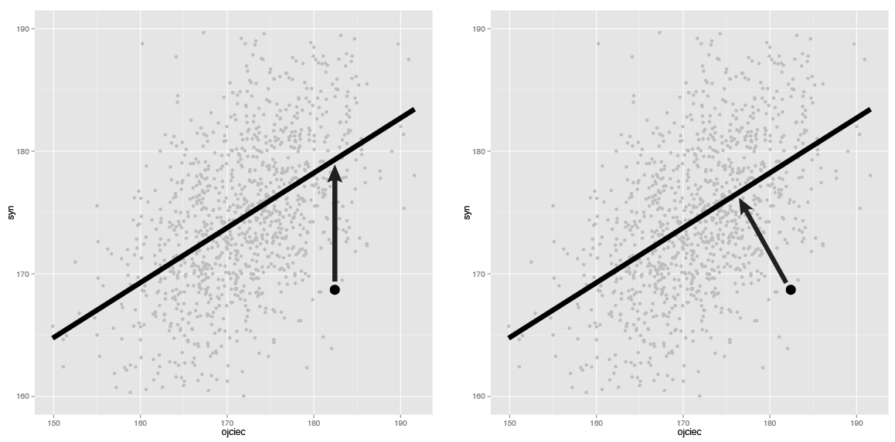

# Jak szacowane są współczynniki modelu regresji liniowej?

Przypomnijmy, że model liniowy, który opisywaliśmy w pierwszej części, zadany był wzorem

_średni.wzrost.dziecka = b0 + wzrost.rodziców * b1_

Powstaje pytanie w jaki sposób wyznaczyć _b0_ i _b1_.

Oczywiście najbardziej naturalną odpowiedzią jest, by wyznaczyć te dwie wartości tak 
by otrzymać linię najbliższą punktom, reprezentującym pomiary.

Ale w jakim sensie najbliższą?

## Kryterium

Uwaga, to ważne a większość osób źle to odczytuje.



W modelu regresji liniowej minimalizuje się kryterium sumy kwadratów reszt (RSS),

_RSS = suma (reszty)^2_

gdzie reszta to różnica pomiędzy obserowanym wzrostem syna a wzrostem opisanym przez model

_reszta = b0 + wzrost.rodziców * b1 - wzrost.syna_


## Jak wykonać tę optymalizację w R

```{r, warning=FALSE, width=8, height=8, message=FALSE}

library(SmarterPoland)

b0 = seq(50,80,1)
b1 = seq(.50,.75,.01)

RSS <- sapply(b0, function(a) {
  sapply(b1, function(b) {
    sum((galton$syn - b*galton$rodzic - a)^2)
  })
})
rownames(RSS) = b1
colnames(RSS) = b0
RSSmelted = melt(RSS)

wspolczynniki = lm(syn~rodzic, data=galton)$coef
wsp = data.frame(xx = wspolczynniki[2], yy = wspolczynniki[1], value=1)

ggplot(RSSmelted, aes(X1, X2, z = value)) + 
  geom_tile(aes(fill = value)) + stat_contour(size = 2) +
  geom_point(data = wsp, aes(x=xx, y=yy, z=value), size=5, color="red")

```

